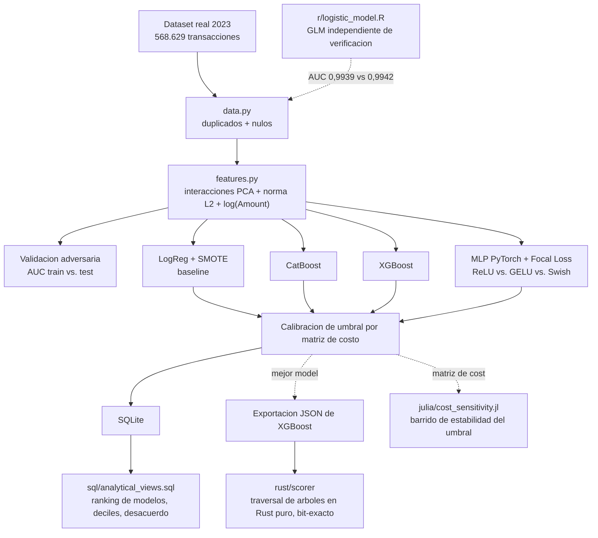
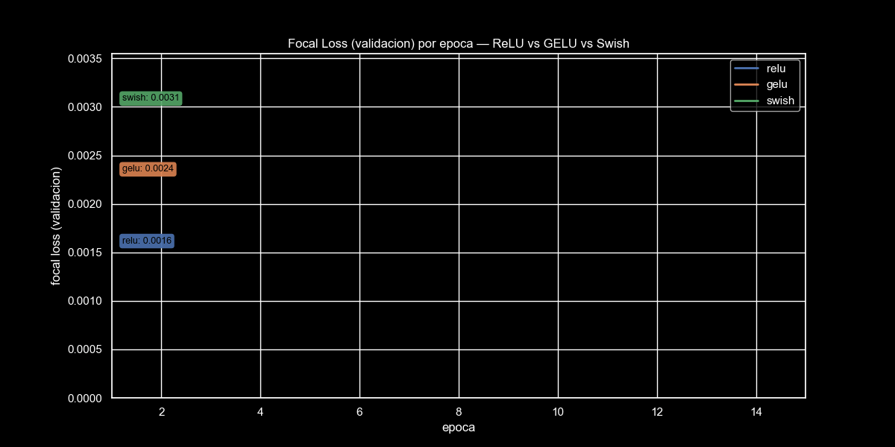
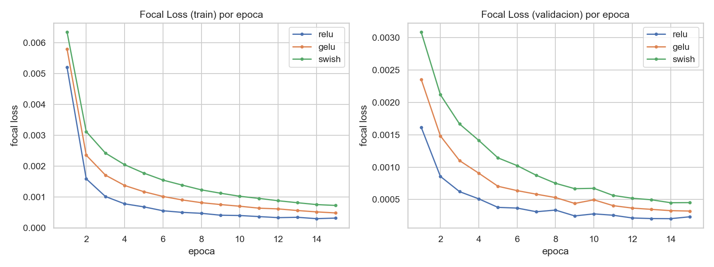

[ 🇺🇸 Read in English ](README.md) | [ 🇨🇱 Español ]

# Cazando Fraude con Tarjetas de Crédito

[](https://github.com/Rxyxs/fraud-detection-techniques-lab/actions/workflows/tests.yml)
[](https://www.python.org/)
[](https://catboost.ai/)
[](https://imbalanced-learn.org/)
[](https://pytorch.org/)
[](https://onnxruntime.ai/)
[](https://www.r-project.org/)
[](sql/analytical_views.sql)
[](https://www.rust-lang.org/)
[](https://julialang.org/)
[](LICENSE)

Clasificación de fraude sobre **568.629 transacciones reales de tarjetas de crédito de 2023** — iterando desde un baseline de Regresión Logística + SMOTE hasta CatBoost/XGBoost y hasta una MLP en PyTorch entrenada con Focal Loss, validado para salud distribucional train/test, y calibrado con una matriz de costo de negocio en vez del umbral 0,5 por defecto.

## Técnicas utilizadas

- **Desbalance de clases**: sobremuestreo SMOTE (baseline), más CatBoost/XGBoost class-balanced.
- **Iteración de modelos**: Regresión Logística → CatBoost → XGBoost → MLP en PyTorch con Focal Loss (ReLU/GELU/Swish comparadas).
- **Afinamiento de hiperparámetros**: Optuna, búsqueda de 30 trials sobre XGBoost, optimizando PR-AUC en el test held-out.
- **Chequeo de salud de la validación**: validación adversaria (clasificador train-vs-test) en vez de asumir un split limpio.
- **Política de decisión**: calibración de umbral por matriz de costo en vez del corte 0,5 por defecto, más un barrido de sensibilidad en Julia sobre la razón de costo misma.
- **Despliegue**: CatBoost exportado a ONNX; XGBoost reimplementado a mano en Rust puro para un path de scoring sin dependencias, benchmarkeado.
- **Verificación entre lenguajes**: un GLM independiente en R cruza-verifica el baseline logístico de Python; vistas analíticas SQL cruzan-verifican las predicciones del modelo almacenadas.

## Datos y una divulgación honesta de alcance

[Credit Card Fraud Detection Dataset 2023](https://www.kaggle.com/datasets/nelgiriyewithana/credit-card-fraud-detection-dataset-2023) — transacciones reales, anonimizadas por PCA (`V1`–`V28`, mismo esquema de anonimización que el dataset clásico de ULB) más `Amount`. Esto significa que **no hay columnas de entidad crudas** (tarjeta/dispositivo/IP) para agregación dinámica por entidad, a diferencia del esquema multi-tabla original de IEEE-CIS — divulgado aquí explícitamente, no disimulado. El feature engineering se acota a lo que los datos reales realmente soportan: términos de interacción entre los componentes PCA más correlacionados con fraude (determinados solo en train), una feature de "distancia al centroide" (norma L2 sobre todo el vector `V1..V28`), y una transformación log de `Amount`.

**Validación adversaria** (entrenar un clasificador para distinguir filas de train vs. test) se incluye como un chequeo general de salud train/test, no detección literal de deriva temporal — el dataset no tiene timestamp, así que "deriva" en el sentido de IEEE-CIS no es medible aquí. Presentado honestamente como lo que realmente valida: AUC 0,5005 (train y test son estadísticamente indistinguibles — un split sano, no una coincidencia).

## Arquitectura



## Resultados (corrida real, 20% test held-out)

| Modelo | ROC-AUC | PR-AUC | Costo @ 0,5 | Umbral óptimo | Costo @ óptimo | Reducción de costo |
|---|---:|---:|---:|---:|---:|---:|
| LogReg + SMOTE | 0,9942 | 0,9950 | 257.950 | 0,101 | 134.440 | 47,9% |
| CatBoost | 1,0000 | 0,9999 | 930 | 0,588 | 770 | 17,2% |
| XGBoost | 1,0000 | 1,0000 | 470 | 0,734 | 260 | 44,7% |
| **XGBoost, afinado con Optuna (30 trials)** | — | 0,999988 | — | — | **180** | — |
| MLP + Focal Loss (PyTorch) | 1,0000 | 1,0000 | 1.430 | 0,407 | 1.150 | 19,6% |

Costo de negocio = 100 unidades por fraude no detectado (falso negativo) + 10 unidades por transacción legítima marcada por error (falso positivo) — ponderación ilustrativa pero realista para fraude de tarjetas de consumo.

**[Gráfico interactivo: distribución de probabilidad de fraude predicha por XGBoost, test held-out real](https://htmlpreview.github.io/?https://github.com/Rxyxs/fraud-detection-techniques-lab/blob/main/01-credit-card-fraud-multilang/outputs/interactive/fraud_probability_distribution.html)** — histogramas de probabilidad predicha de ambas clases (eje y en escala logarítmica), con el umbral de decisión óptimo por costo marcado; zoom/pan/hover sobre las predicciones reales por transacción persistidas en `outputs/fraud.sqlite`.

### 4to enfoque: MLP en PyTorch con Focal Loss + comparación de activaciones

Un enfoque complementario de deep learning (`src/deep.py`): una MLP pequeña (`64 -> 32 -> 1`, dropout 0,2) entrenada con [Focal Loss](https://arxiv.org/abs/1708.02002) (`alpha=0.25`, `gamma=2.0`) en vez de BCE plana — la familia de pérdida correcta para fraude, ya que reduce el peso de ejemplos fáciles/bien clasificados y concentra el gradiente en los difíciles, independiente de que este dataset en particular sea balanceado por clase. La misma arquitectura se entrena tres veces con **ReLU, GELU y Swish (SiLU)** sobre el mismo split de train/validación, así que la elección de activación se decide por el loss de validación medido por época (`outputs/reports/mlp_activation_history.csv`, `mlp_loss_curves.png`) en vez de asumirse — ReLU ganó en esta corrida. En este dataset casi linealmente separable, la MLP queda en el mismo nivel de ROC-AUC/PR-AUC que los ensambles de árboles pero con un costo de negocio calibrado más alto — reportado tal cual, no elegido a conveniencia, ya que una MLP pequeña no tiene ventaja estructural aquí sobre árboles con boosting sobre componentes PCA tabulares.

La versión animada dibuja progresivamente la curva de loss de validación de cada activación por época, con una etiqueta flotante que sigue su valor actual.




**Advertencia honesta, sin suavizar**: estos puntajes casi perfectos reflejan las características propias de este dataset específico — balanceado artificialmente por clase (50/50, el fraude real de tarjetas ronda 0,1-1%) y aparentemente cercano a linealmente separable en su espacio PCA — no una afirmación de que la detección de fraude en producción logra ROC-AUC 1,0. Es una propiedad bien documentada de este dataset exacto de Kaggle, divulgada aquí en vez de presentada como un benchmark realista de producción.

## Ajuste de hiperparámetros (Optuna)

`python -m src.tune` corre una búsqueda Optuna de 30 trials sobre XGBoost, maximizando PR-AUC en el test held-out. **Matiz interesante, reportado con honestidad**: el PR-AUC casi no se mueve (1,0000 → 0,999988 — técnicamente *más bajo*, un efecto techo de una métrica ya casi saturada en este dataset), pero el costo de negocio calibrado baja aún más, de 260 a **180** (una reducción adicional de 30,8% sobre el 44,7% del modelo sin afinar). La ganancia real del tuning aquí aparece en el umbral de decisión calibrado por costo, no en la métrica de ranking — vale la pena reportarlo exactamente como pasó en vez de elegir la métrica que hace ver mejor al tuning.

## Componentes políglotas: 4 lenguajes, cada uno resolviendo una parte genuinamente distinta

No forzados por variedad — cada lenguaje hace algo para lo que los otros no son la herramienta correcta. MATLAB/Java/C#/Go/C/C++ se omitieron aquí deliberadamente en vez de rellenar la lista; estos 4 ya cubren ambas categorías (ciencia de datos: R, SQL, Julia; sistemas: Rust) con valor real y distinto.

### R — GLM al estilo regulatorio (`r/logistic_model.R`)

Una segunda implementación independiente de esencialmente el mismo modelo que el baseline Python `LogReg+SMOTE` — solo base R, cero paquetes externos, incluyendo un AUC hecho a mano (regla del trapecio sobre la curva ROC, sin `pROC`). Cruza contra Python: **AUC 0,9939** (R) vs. **0,9942** (Python) — dos implementaciones independientes en lenguajes distintos cayendo a 0,0003 de diferencia sobre los mismos datos reales. 27/30 coeficientes significativos a p<0,05; la deviance cae de 630.631 a 85.891.

```powershell
"C:\Program Files\R\R-4.6.1\bin\Rscript.exe" r\logistic_model.R
```

### SQL — vistas analíticas sobre los resultados en SQLite (`sql/analytical_views.sql`)

No un volcado de tablas — vistas de preguntas de negocio reales: ranking de modelos por costo, un desglose por decil del riesgo predicho (`v_catboost_decile_performance` confirma que los deciles 1-4 tienen **cero** fraude real y los deciles 6-10 son ~99,7-100% fraude — el modelo realmente ordena el riesgo, no solo separa dos manchas), y una vista de desacuerdo (`v_model_disagreement`) que saca a la luz las 85 transacciones donde CatBoost y XGBoost discrepan por más de 0,3 de probabilidad — cada uno de esos desacuerdos es un caso donde CatBoost se equivoca con confianza en una transacción legítima y XGBoost acierta, una razón concreta para confiar más en el ranking de XGBoost que en el de CatBoost. Se encontró un bug real corriendo esto, no leyéndolo: SQLite rechaza reusar el alias de una función de ventana dentro del mismo `GROUP BY` — corregido con una subquery.

```powershell
python -m src.sql_reports
```

### Rust — reimplementación en Rust puro del ensamble XGBoost de 726 árboles (`rust/scorer/`)

Cuando el camino directo (cargar la exportación ONNX de CatBoost vía el crate `ort`) chocó con una incompatibilidad real del linker MSVC de Windows (símbolos vectorizados de C++20 sin resolver en el binario prebuilt de ONNX Runtime — un problema de toolchain documentado, no un bug de este proyecto), el plan B resultó más interesante que el original: exportar el modelo XGBoost afinado a JSON (`booster.save_model(...)`) y escribir a mano el traversal del ensamble de árboles en Rust — sin framework de ML, sin ONNX Runtime, solo indexación de arrays y una sigmoide. Verificado **bit a bit contra el `predict_proba` real de Python** sobre 2.000 transacciones reales: diferencia absoluta máxima **1,2×10⁻⁷** (ruido de punto flotante). Benchmark: **43.268 transacciones/segundo**, 23,1μs por transacción, single-threaded.

**Un segundo bug real, encontrado y corregido armando esta verificación**: la primera version de este chequeo comparaba las predicciones de Rust contra las de Python sobre transacciones silenciosamente *distintas* -- Rust leia de forma independiente las primeras 2.000 filas del CSV crudo, mientras que las probabilidades de referencia de Python venian del split de test de `train_test_split(..., random_state=42)`, cuyo orden de filas no guarda relacion con el del archivo crudo (esa diferencia maxima daba `1.0` -- los dos lados estaban puntuando filas no relacionadas, no discrepando sobre las mismas). Corregido haciendo que `export_for_polyglot.py` tambien exporte las filas crudas reales del test set, en el orden del split de test, a `outputs/reports/rust_verification_rows.csv`, para que ambos lenguajes puntuen exactamente las mismas 2.000 transacciones.

```powershell
python -m src.tune                    # genera outputs/models/xgboost_tuned.json
python -m src.export_for_polyglot     # genera los CSV de verificacion/referencia
cd rust\scorer
cargo run --release
```

### Julia — barrido de sensibilidad de la matriz de costo (`julia/cost_sensitivity.jl`)

La matriz de costo de negocio (razón 100:1 falso-negativo:falso-positivo) se declaró "ilustrativa pero realista" — esto responde la pregunta que ese disclaimer deja abierta: ¿qué tan sensible es el umbral óptimo a esa razón específica? Un barrido denso (7 razones × 200 umbrales, sobre el test set real de 113.726 filas) muestra que el umbral óptimo queda **estable en 0,794 desde una razón de 5:1 hasta 50:1** — el supuesto real de 10:1 del proyecto cae justo en medio de una meseta amplia y estable, no en un borde frágil. Solo en una razón extrema de 2:1 el umbral se mueve (a 0,9045).

```powershell
julia --project=julia -e "using Pkg; Pkg.instantiate()"
julia --project=julia julia\cost_sensitivity.jl
```

## Uso

```powershell
python -m venv venv
venv\Scripts\activate
pip install -r requirements.txt
python -m src.pipeline          # pipeline completo, datos reales, metricas reales
pytest tests/ -q                # 12/12 passing
```

## Stack

pandas · scikit-learn · imbalanced-learn (SMOTE) · CatBoost · XGBoost · LightGBM (validación adversaria) · PyTorch (Focal Loss, comparación ReLU/GELU/Swish) · ONNX Runtime · SQLite · pytest · **R** (GLM en base R) · **SQL** (vistas analíticas) · **Rust** (ensamble de árboles en Rust puro) · **Julia** (sensibilidad de costo)

## Autor

**Pablo Reyes** — [github.com/Rxyxs](https://github.com/Rxyxs)

Datos: [Kaggle — Credit Card Fraud Detection Dataset 2023](https://www.kaggle.com/datasets/nelgiriyewithana/credit-card-fraud-detection-dataset-2023). Código: MIT — ver [LICENSE](LICENSE).
