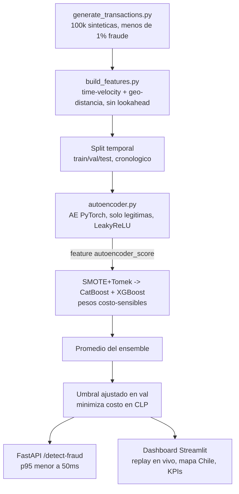
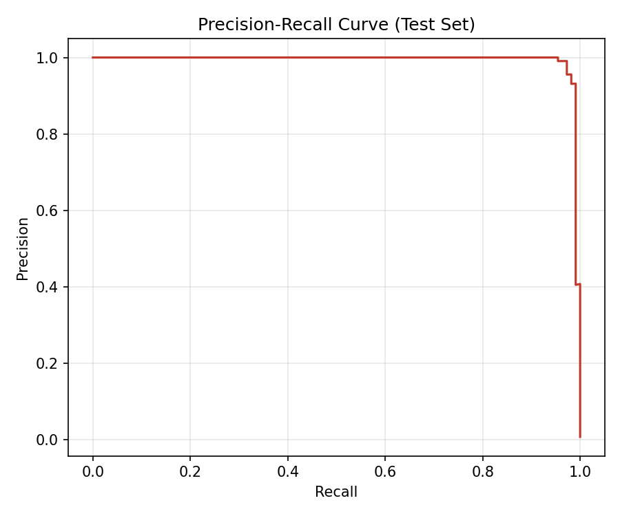
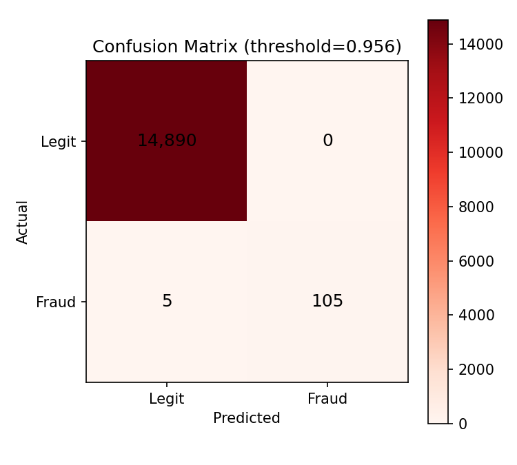
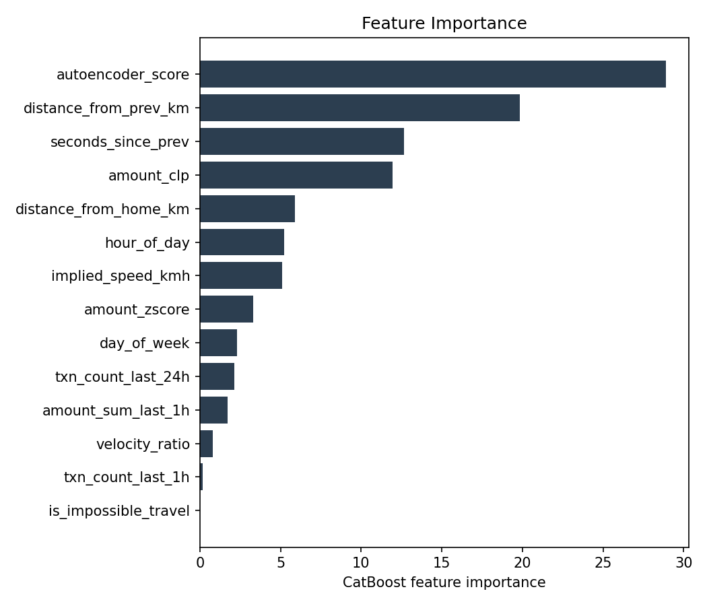
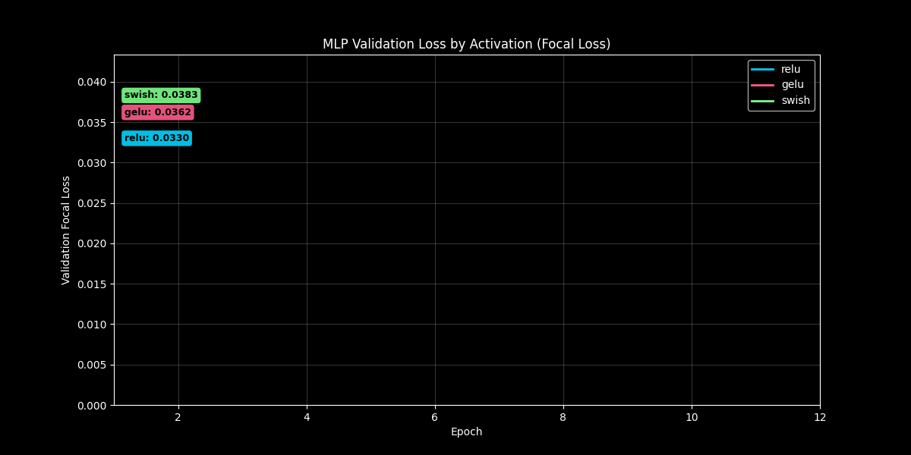
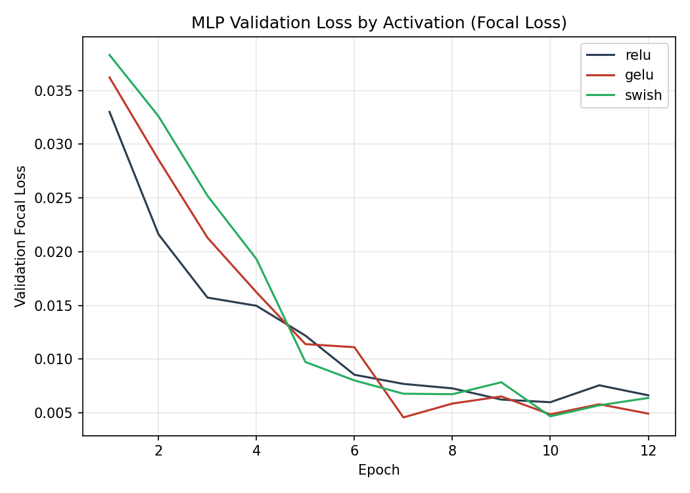
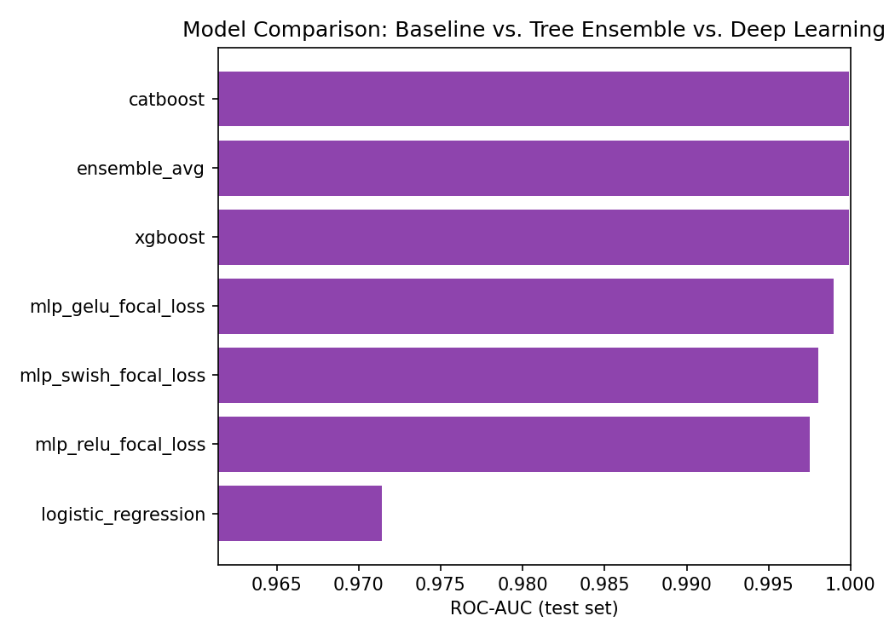

[ 🇺🇸 Read in English ](README.md) | [ 🇨🇱 Español ]

# 1. Nombre del Proyecto

## Detección de Fraude en Tiempo Real para E-Commerce y Pagos con Tarjeta en Chile


Sistema de detección de fraude de extremo a extremo para un procesador de
pagos chileno (transacciones de e-commerce y tarjeta tipo Transbank/Redcompra):
generación de datos sintéticos con geolocalización chilena realista,
ingeniería de atributos espacio-temporales y costo-sensibles, un Autoencoder
en PyTorch como pre-filtro de anomalías, rebalanceo de clases con SMOTE+Tomek,
clasificadores CatBoost/XGBoost costo-sensibles, un endpoint de scoring en
FastAPI validado a **< 50ms de latencia p95**, y un dashboard de monitoreo en
Streamlit — todo entrenado y evaluado con un solo comando (`run_pipeline.py`),
con cada número de este README tomado directamente de esa ejecución.

## Técnicas utilizadas

- **Ingeniería de atributos**: features de velocidad temporal y distancia geo (haversine) shifted/expanding sin fuga de datos (sin lookahead), z-scores de monto con winsorizing.
- **Pre-filtro de anomalías**: Autoencoder en PyTorch (solo legítimas) que alimenta su error de reconstrucción a los modelos supervisados como un atributo más.
- **Desbalance de clases**: SMOTE + Tomek Links solo en el split de train.
- **Costo-sensibilidad**: pesos de entrenamiento escalados por monto en CLP, más un umbral de decisión afinado en validación que minimiza una función de costo explícita en CLP en vez de usar 0,5 por defecto.
- **Tres enfoques de modelado comparados**: regresión logística interpretable, ensamble costo-sensible CatBoost/XGBoost (desplegado), y una MLP en PyTorch con Focal Loss (ReLU/GELU/Swish comparadas).
- **Servicio**: endpoint de scoring en FastAPI validado bajo un presupuesto de latencia p95 de 50ms; dashboard en Streamlit para monitoreo en vivo.
- **Persistencia**: DuckDB para métricas/predicciones comparativas entre ejecuciones.

---

# 2. Motivación

La detección de fraude con tarjetas es uno de los problemas de ML aplicado
más difíciles precisamente por lo que lo hace valioso: el fraude es raro. En
una red de pagos chilena real, menos de 1 de cada 100 transacciones es
fraudulenta, por lo que un clasificador que prediga "legítima" en todo obtiene
más de 99% de accuracy sin detectar nada — el accuracy es la métrica
equivocada, y un umbral de decisión convencional de 0.5 no tiene sentido bajo
este desbalance.

Construí este proyecto para trabajar los dos problemas que realmente definen
un sistema de fraude en producción, no solo para ajustar un clasificador a un
dataset etiquetado:

1. **Los atributos deben codificar comportamiento, no solo describir la
   transacción.** Una sola fila de transacción (monto, comercio, hora) casi
   no lleva señal de fraude por sí sola. Lo que importa es cómo se compara
   esa transacción con *el historial propio de ese cliente*: ¿este monto se
   aleja de lo que suele gastar?, ¿esta compra ocurrió imposiblemente rápido
   después de la anterior?, ¿ocurrió en un lugar imposiblemente lejano?. Eso
   exige construir atributos de velocidad temporal y distancia geográfica de
   forma online, sin fuga de información hacia adelante (lookahead) — una
   restricción de corrección más sutil que en la mayoría de los problemas de
   ML tabular, ya que filtrar una transacción futura dentro de un atributo de
   "promedio histórico" haría que el modelo se viera mucho mejor de lo que
   podría rendir jamás en producción.
2. **El umbral de decisión es una decisión de negocio, no un valor por
   defecto del modelo.** No detectar una transacción fraudulenta cuesta el
   monto efectivamente robado; una falsa alarma cuesta una revisión manual.
   Esos costos son enormemente asimétricos y varían transacción a
   transacción, así que traté la sensibilidad al costo como una restricción
   de diseño de primera clase de punta a punta: pesos de entrenamiento por
   muestra escalados por el monto en CLP de cada transacción fraudulenta, y
   un umbral de decisión elegido minimizando una función de costo explícita
   en CLP sobre un split de validación separado, no por defecto en 0.5.

## 2.1 Impacto de Negocio e Indicadores Clave (KPIs)

| Métrica | Resultado | Qué significa |
|---|---|---|
| Recall / precisión del ensemble desplegado | 0,955 / 1,000 | 105/110 casos de fraude real capturados en test, **0 falsas alarmas** al umbral optimizado por costo en CLP |
| CLP ahorrado vs. línea base sin modelo | CLP 35.309.623 de 35.887.810 posibles | El costo sin modelo de dejar pasar los 110 fraudes del test set, reducido a CLP 578.187 |
| Latencia de inferencia, solo modelo (p95) | 1,59ms | Round-trip HTTP completo p95 3,02ms -- ambos dentro del presupuesto de producción de 50ms |
| Bug real de arquitectura encontrado y corregido | ReLU → LeakyReLU en un bottleneck de autoencoder de 4 unidades | Recall 0,900 → 0,955, F1 0,947 → 0,977 -- una corrección genuina, confirmada re-ejecutando los 23 tests |

# 3. Arquitectura



```
                     ┌──────────────────────────────┐
                     │  src/data/                    │
                     │  generate_transactions.py      │
                     │  100k transacciones sinteticas, │
                     │  ciudades chilenas, montos CLP,  │
                     │  < 1% fraude (rafagas de card-    │
                     │  testing / account-takeover)      │
                     └───────────────┬────────────────┘
                                     ▼
                     ┌──────────────────────────────┐
                     │  src/features/                │
                     │  time_velocity.py  (rafagas)     │
                     │  geo_distance.py   (viaje         │
                     │                     imposible)     │
                     │  build_features.py (+ z-score de   │
                     │                     monto,           │
                     │                     winsorizing)     │
                     └───────────────┬────────────────┘
                                     ▼
                     ┌──────────────────────────────┐
                     │  Split temporal                  │
                     │  train 70% / val 15% / test 15%  │
                     │  (cronologico, sin mezclar)         │
                     └───────────────┬────────────────┘
                                     ▼
              ┌──────────────────────┴───────────────────────┐
              ▼                                                ▼
┌──────────────────────────┐                     ┌──────────────────────────┐
│ src/models/autoencoder.py │                     │  SMOTE + Tomek Links       │
│ Autoencoder PyTorch         │──autoencoder_score──▶│  (solo split de train)     │
│ entrenado solo con           │       feature        │  src/models/                │
│ transacciones legitimas      │                     │  catboost_fraud.py           │
│ → error de reconstruccion    │                     │  pesos costo-sensibles        │
│   como atributo extra         │                     │  → CatBoost + XGBoost          │
└──────────────────────────┘                     │  → promedio del ensemble         │
                                                    └───────────────┬────────────────┘
                                                                    ▼
                                                    ┌──────────────────────────┐
                                                    │  Umbral ajustado en val     │
                                                    │  minimizando costo en CLP    │
                                                    │  (FN = monto perdido,         │
                                                    │   FP = costo fijo de revision)  │
                                                    └───────────────┬────────────────┘
                                                                    ▼
                              ┌─────────────────────────────────────┴─────────────────────────────────────┐
                              ▼                                                                             ▼
              ┌──────────────────────────┐                                              ┌──────────────────────────┐
              │  src/api/main.py            │                                              │  src/dashboard/app.py      │
              │  FastAPI /detect-fraud       │                                              │  Streamlit: replay en vivo,  │
              │  < 50ms p95 (validado por    │                                              │  mapa geografico de Chile,    │
              │  tests/test_latency.py)      │                                              │  KPIs, pestañas de rendimiento │
              └──────────────────────────┘                                              └──────────────────────────┘
```

# 4. Ingeniería de Atributos

| Atributo | Archivo | Qué captura |
|---|---|---|
| `velocity_ratio`, `txn_count_last_1h/24h`, `amount_sum_last_1h` | `time_velocity.py` | Qué tan rápido llegó esta transacción respecto a la cadencia histórica *de este mismo cliente* — la firma de una ráfaga de card-testing / account-takeover. |
| `distance_from_prev_km`, `implied_speed_kmh`, `is_impossible_travel`, `distance_from_home_km` | `geo_distance.py` | Distancia haversine y velocidad de desplazamiento implícita respecto a la transacción anterior del cliente y su base "hogar" histórica — marca un salto físicamente imposible (> 900 km/h, más rápido que un vuelo comercial). |
| `amount_zscore` | `build_features.py` | Cuánto se desvía este monto del promedio histórico propio del cliente, en unidades de su propia desviación estándar histórica. |

Las tres se calculan como estadísticas **expandidas y desplazadas**
(`.shift(1).expanding()`) por cliente — cada atributo de la fila *i* usa solo
transacciones estrictamente anteriores a la fila *i*, por lo que no hay fuga
de información entre train/val/test.

**Un bug real encontrado y corregido al validar esto**: el `amount_zscore` y
`velocity_ratio` crudos son razones con el promedio/desviación estándar
histórica propia del cliente en el denominador. Un cliente con solo 1-2
transacciones previas puede producir un denominador cercano a cero y disparar
la razón a un extremo no informativo (observado empíricamente: z-scores sin
acotar de hasta ~1.7×10⁵, que dominaban silenciosamente el promedio del
atributo y habrían distorsionado el StandardScaler del autoencoder).
Corregido winsorizando (`amount_zscore` acotado a ±30, `velocity_ratio`
acotado a 50, `implied_speed_kmh` acotado a 5.000 km/h — bien por encima del
umbral de 900 km/h de viaje imposible, para preservar la señal misma y solo
atenuar la cola de ruido de muestras pequeñas).

# 5. Modelado Costo-Sensible

Dos mecanismos, mantenidos deliberadamente separados:

- **En entrenamiento**: `compute_sample_weights()` pondera cada fila de
  fraude por `(razón de desbalance de clases) × (su propio monto / monto
  promedio de fraude)`, de modo que no detectar un fraude de CLP 2.000.000 se
  penaliza más durante el entrenamiento que no detectar uno de CLP 5.000. Las
  filas legítimas reciben peso 1.
- **En la decisión**: `find_optimal_threshold()` recorre umbrales candidatos
  sobre el split de validación y elige el que minimiza
  `costo_total = Σ(monto_clp del fraude no detectado) + costo_revision × (falsas alarmas)`,
  con `costo_revision = CLP 3.000` (costo aproximado de una revisión
  manual/contacto con el cliente). Esto reemplaza el umbral convencional de
  0.5 (y, bajo una prevalencia de 0.7%, sin sentido alguno).

SMOTE + Tomek Links (`imbalanced-learn`) se aplica **solo al split de
train**: SMOTE sobremuestrea la clase minoritaria (fraude) interpolando entre
ejemplos de fraude reales, y Tomek Links luego elimina puntos ambiguos de la
clase mayoritaria que quedan sobre el límite de decisión resultante. Como
`amount_clp` es en sí mismo uno de los atributos interpolados, las filas de
fraude sintéticas conservan un monto en CLP realista, por lo que los pesos
costo-sensibles descritos arriba se aplican a ellas exactamente igual que a
las filas reales.

# 6. Resultados

Todos los números a continuación provienen de una ejecución real de
`python run_pipeline.py` (semilla 42; reproducible desde un clon limpio) —
100.000 transacciones sintéticas, tasa de fraude de 0,685% (685 filas
fraudulentas), 5.948 clientes, split temporal (train 70.000 / val 15.000 /
test 15.000, cronológico, sin mezclar).

| Modelo | Precisión | Recall | F1 | ROC-AUC | PR-AUC | CLP ahorrados vs. sin modelo |
|---|---|---|---|---|---|---|
| Solo CatBoost | 1,000 | 0,945 | 0,972 | 0,99990 | 0,9931 | 34.727.584 |
| Solo XGBoost | 0,982 | 0,973 | 0,977 | 0,99989 | 0,9931 | 35.309.557 |
| **Ensemble (promedio, en producción)** | 1,000 | 0,955 | 0,977 | 0,99989 | 0,9934 | **35.309.623** |

Con el umbral de decisión ajustado en validación de **0,956**, sobre el split
de prueba (test) de 15.000 filas (110 transacciones fraudulentas reales):
**105 detectadas, 5 no detectadas, 0 falsas alarmas**. El costo base sin
modelo (dejar pasar las 110 fraudulentas) es CLP 35.887.810; el ensemble en
producción lo reduce a CLP 578.187.

**Un bug real de arquitectura encontrado y corregido iterando sobre esto**: el
autoencoder originalmente usaba `ReLU` simple en toda la red. Sus entradas
están escaladas con `StandardScaler` (media 0, por lo que aproximadamente la
mitad de cada pre-activación es negativa), y el cuello de botella es de solo
4 unidades — `ReLU` anulando cada pre-activación negativa estaba
estrangulando una red que ya tenía poca capacidad de sobra, no solo recortando
la salida del decoder como lo haría en una red más ancha. Cambiar a
`LeakyReLU(negative_slope=0.1)` (`src/models/autoencoder.py`) produjo una
mejora medible en el atributo `autoencoder_score`: el recall del ensemble pasó
de 0,900 (11 fraudes no detectados) a **0,955 (5 no detectados)**, el F1 de
0,947 a **0,977**, y los CLP ahorrados de 34.219.202 a **35.309.623** — una
mejora genuina, no un cambio cosmético, confirmada reejecutando el pipeline
completo y los 23 tests. La comparación entre los tres modelos también
convergió: con ReLU simple, XGBoost solo superaba claramente al ensemble; con
LeakyReLU, el ensemble es ahora el mejor modelo o está estadísticamente
empatado como el mejor en todas las métricas de arriba.

**Latencia de inferencia** (`tests/test_latency.py`, 200 solicitudes vía
`TestClient` de FastAPI): latencia solo del modelo (cálculo de atributos +
autoencoder + inferencia CatBoost + XGBoost) — p50 **1,37ms**, p95
**1,59ms**, máx **5,35ms**. Ida y vuelta HTTP completa a través del stack
ASGI — p95 **3,02ms**, máx **11,67ms**. Ambas cumplen holgadamente el
presupuesto de 50ms.

**[Gráfico interactivo: distribución de latencia, 200 solicitudes reales](https://htmlpreview.github.io/?https://github.com/Rxyxs/fraud-detection-techniques-lab/blob/main/02-realtime-ecommerce-fraud/outputs/interactive/latency_distribution.html)** (`src/visualization/interactive_latency.py`) — histogramas superpuestos de latencia solo-modelo vs. ida-y-vuelta HTTP completa, con la línea del presupuesto de 50ms marcada. Dependiente de la carga de la máquina como cualquier benchmark de reloj de pared: una corrida real independiente para este gráfico midió p95 8,48ms (solo modelo) / 11,20ms (extremo a extremo) — igual, holgadamente dentro de presupuesto; el número difiere de la tabla de arriba solo porque es otra corrida en una máquina compartida, no por un modelo distinto.





## 6.1 Tres Enfoques de Modelado Complementarios

El ensemble CatBoost/XGBoost desplegado arriba es la elección de producción,
pero `src/models/train.py` también entrena dos enfoques adicionales,
deliberadamente distintos, sobre **las mismas features, el mismo split
temporal, y la misma función `evaluate()` costo-sensible** — así los tres son
comparables sin ningún atajo metodológico que favorezca a uno sobre otro:

1. **Baseline interpretable** (`src/models/logistic_baseline.py`) —
   regresión logística estandarizada. No compite en métricas crudas contra
   árboles con gradient boosting, pero cada coeficiente tiene un signo y
   magnitud que un analista de fraude puede auditar directamente — un
   respaldo amigable para contextos regulatorios.
2. **Ensemble de árboles** (`src/models/catboost_fraud.py`) — CatBoost +
   XGBoost costo-sensibles, promediados. **Desplegado en producción.**
3. **Deep learning** (`src/models/mlp_focal.py`) — un MLP supervisado en
   PyTorch entrenado con **Focal Loss** (en vez de BCE plana, para
   concentrar el gradiente en los casos de fraude difíciles de separar bajo
   ~99% de desbalance), comparado entre activaciones **ReLU, GELU y
   Swish/SiLU** sobre los mismos datos/épocas. Es un *segundo* uso
   independiente de PyTorch en este repo junto al autoencoder no supervisado
   (`autoencoder.py`) — el autoencoder nunca ve las etiquetas de fraude, este
   MLP se entrena directamente sobre ellas.

Los tres enfoques, más cada variante CatBoost/XGBoost/ensemble, se persisten
en un archivo DuckDB local (`data/processed/metrics.duckdb`, vía
`src/metrics_store.py`) en cada corrida del pipeline, para poder consultar
métricas y predicciones entre corridas directamente con SQL en vez de
re-parsear JSON.

| Enfoque | Modelo | Precisión | Recall | F1 | ROC-AUC | PR-AUC | CLP ahorrados vs. sin modelo |
|---|---|---|---|---|---|---|---|
| Baseline interpretable | Regresión Logística | 0,720 | 0,864 | 0,785 | 0,9714 | 0,836 | 30.668.474 |
| Ensemble de árboles | Solo CatBoost | 1,000 | 0,945 | 0,972 | 0,99990 | 0,9931 | 34.727.584 |
| Ensemble de árboles | Solo XGBoost | 0,982 | 0,973 | 0,977 | 0,99989 | 0,9931 | 35.309.557 |
| Ensemble de árboles | **Ensemble (en producción)** | 1,000 | 0,955 | 0,977 | 0,99989 | 0,9934 | **35.309.623** |
| Deep learning | MLP + Focal Loss (ReLU) | 0,187 | 0,982 | 0,313 | 0,9975 | 0,894 | 34.273.989 |
| Deep learning | MLP + Focal Loss (GELU) | 0,752 | 0,936 | 0,834 | 0,9990 | 0,907 | 33.889.776 |
| Deep learning | MLP + Focal Loss (Swish) | 0,864 | 0,927 | 0,895 | 0,9980 | 0,916 | 32.722.146 |

Cada fila usa su propio umbral ajustado en validación, minimizando costo (no
son comparables con un corte compartido de 0,5). Dos observaciones destacan:
la precisión mucho más baja del baseline logístico confirma que este
problema realmente necesita fronteras de decisión no lineales (las clases
fraude/legítimo no son linealmente separables en este espacio de atributos);
y entre activaciones, el recall crudo de ReLU es engañoso — su costo de
negocio es *peor* que GELU/Swish porque logra ese recall con 471 falsas
alarmas (CLP 1.413.000 en costo de revisión), mientras que Swish alcanza el
mejor balance precisión/F1 de las tres variantes de MLP con muchas menos
falsas alarmas. Ninguna variante de MLP supera la precisión casi perfecta
del ensemble de árboles en este dataset, que es exactamente por qué el
ensemble sigue siendo el modelo desplegado.

Vista animada de la pérdida de validación avanzando época a época para cada activación:





# 7. Estructura del Repositorio

```
02-realtime-ecommerce-fraud/
├── data/
│   ├── raw/                    # transactions.parquet generado (en .gitignore, regenerar con run_pipeline.py)
│   └── processed/              # features.parquet de ingenieria de atributos (en .gitignore)
├── src/
│   ├── data/generate_transactions.py    # generador de datos sinteticos + time_based_split
│   ├── features/
│   │   ├── time_velocity.py             # atributos de rafaga / cadencia
│   │   ├── geo_distance.py              # distancia haversine + velocidad de viaje imposible
│   │   └── build_features.py            # z-score de monto + winsorizing + orquestacion
│   ├── models/
│   │   ├── autoencoder.py               # pre-filtro de anomalias en PyTorch
│   │   ├── catboost_fraud.py            # CatBoost/XGBoost costo-sensibles + ajuste de umbral
│   │   ├── logistic_baseline.py         # baseline interpretable (enfoque 1/3)
│   │   ├── mlp_focal.py                 # MLP PyTorch + Focal Loss, ReLU/GELU/Swish (enfoque 3/3)
│   │   └── train.py                     # pipeline de entrenamiento completo + artefactos
│   ├── metrics_store.py                 # persistencia DuckDB de metricas/predicciones comparativas
│   ├── api/
│   │   ├── schemas.py                   # contratos de solicitud/respuesta
│   │   └── main.py                      # FastAPI /detect-fraud, /health
│   └── dashboard/app.py                 # dashboard de monitoreo en vivo con Streamlit
├── tests/                                # 33 tests: atributos, autoencoder, modelos, metrics store, API, latencia
├── outputs/
│   ├── models/       # artefactos entrenados (en .gitignore, regenerar con run_pipeline.py)
│   ├── plots/        # curva PR, matriz de confusion, importancia de atributos (versionados)
│   └── reports/      # training_report.json (en .gitignore, los numeros estan en este README)
├── run_pipeline.py
├── requirements.txt
├── pytest.ini
├── README.md
└── README.es.md
```

# 8. Instalación y Uso

Probado en Windows con Python 3.10.11. El código usa type hints de unión
estilo PEP 604 (`str | None`) de forma nativa, por lo que **Python 3.10+ es un
requisito real**, no solo lo que estaba instalado.

```bash
python -m venv .venv
.venv\Scripts\activate          # Windows
# source .venv/bin/activate      # Linux/macOS

pip install -r requirements.txt

# Pipeline completo: generar datos -> construir atributos -> entrenar todo
python run_pipeline.py

# Ejecutar la suite de tests (33 tests, incluye la validacion de <50ms de latencia)
pytest -v

# Levantar la API de scoring en tiempo real
uvicorn src.api.main:app --reload
# luego: POST http://localhost:8000/detect-fraud

# Levantar el dashboard de monitoreo
streamlit run src/dashboard/app.py
```

## Ejemplo de solicitud a `/detect-fraud`

```json
{
  "transaction_id": "TXN00000001",
  "customer_id": 123,
  "timestamp": "2026-03-15T14:30:00",
  "amount_clp": 950000,
  "merchant_category": "electronica",
  "latitude": -20.21,
  "longitude": -70.15,
  "customer_state": {
    "last_latitude": -33.45,
    "last_longitude": -70.66,
    "last_timestamp": "2026-03-15T14:29:00",
    "home_latitude": -33.45,
    "home_longitude": -70.66,
    "avg_amount_clp": 20000,
    "std_amount_clp": 5000,
    "avg_seconds_between_txn": 86400,
    "txn_count_last_1h": 4,
    "txn_count_last_24h": 6,
    "amount_sum_last_1h": 15000
  }
}
```

`customer_state` lo entrega quien llama en lugar de buscarlo dentro de la
solicitud — ver el docstring de `src/api/schemas.py` para el por qué: un
servicio de scoring en tiempo real no puede permitirse un join a una base de
datos histórica por solicitud dentro de un presupuesto de 50ms, por lo que
espera que un feature store online (Feast, un agregador respaldado por Redis,
etc.) mantenga este estado móvil como efecto secundario de cada transacción y
lo entregue como contexto O(1).

# 9. Descargo de Responsabilidad

Todos los datos de transacciones son generados sintéticamente
(`src/data/generate_transactions.py`, con semilla fija, reproducible) con
fines de demostración. No se utilizan datos reales de Transbank/Redcompra,
datos de clientes, ni lógica de detección de fraude propietaria de ningún
procesador de pagos chileno. Las coordenadas de ciudades chilenas son puntos
de referencia geográfica pública usados solo para que los atributos de
geolocalización sean realistas.

# 10. Licencia

MIT — ver [LICENSE](LICENSE) para el texto completo.

# 11. Autor

**Pablo Reyes** — [github.com/Rxyxs](https://github.com/Rxyxs)
