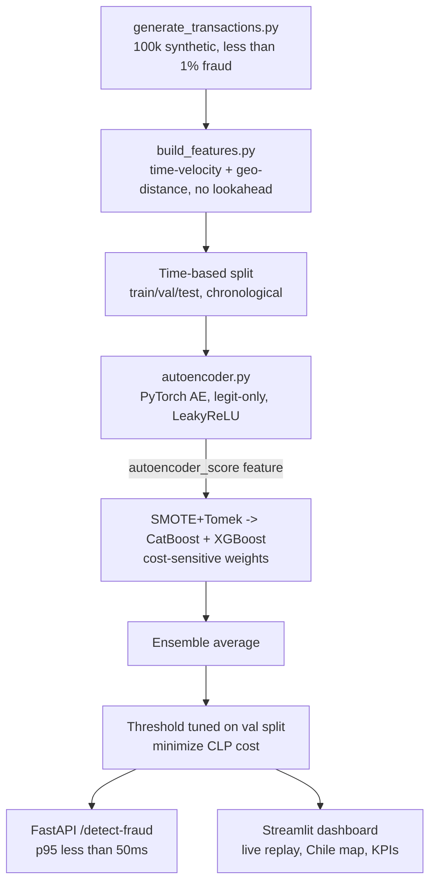

[ 🇺🇸 English ] | [ 🇨🇱 Leer en Español ](README.es.md)

# 1. Project Title

## Real-Time Fraud Detection for Chilean E-Commerce & Card Payments


An end-to-end fraud-detection system for a Chilean payment processor
(Transbank/Redcompra-style e-commerce and card transactions): synthetic data
generation with realistic Chilean geolocation, spatio-temporal + cost-sensitive
feature engineering, a PyTorch autoencoder anomaly pre-filter, SMOTE+Tomek
class rebalancing, cost-sensitive CatBoost/XGBoost classifiers, a FastAPI
scoring endpoint validated at **< 50ms p95 latency**, and a Streamlit
monitoring dashboard — all trained and evaluated by a single command
(`run_pipeline.py`), with every number in this README taken directly from
that run.

---

# 2. Motivation

Card-fraud detection is one of the hardest applied ML problems precisely
because of what makes it valuable: fraud is rare. In a real Chilean payment
network, fewer than 1 in 100 transactions is fraudulent, so a classifier that
predicts "legit" on everything scores 99%+ accuracy while catching nothing —
accuracy is the wrong metric, and a naive 0.5 decision threshold is
meaningless under this imbalance.

I built this project to work through the two problems that actually define
production fraud systems, not just fit a classifier to a labeled dataset:

1. **The features have to encode behavior, not just describe the
   transaction.** A single transaction row (amount, merchant, time) carries
   almost no fraud signal on its own. What matters is how a transaction
   compares to *that specific customer's own history*: is this amount far
   from what they usually spend, did this purchase happen impossibly soon
   after their last one, did it happen impossibly far away? That requires
   engineering time-velocity and geo-distance features online, with no
   lookahead — a subtler correctness constraint than most tabular ML
   problems, since leaking a future transaction into a "historical average"
   feature would make the model look far better than it could ever perform
   in production.
2. **The decision threshold is a business decision, not a modeling
   default.** Missing a fraudulent transaction costs the actual amount
   stolen; a false alarm costs a manual review. Those costs are wildly
   asymmetric and vary transaction-to-transaction, so I treated
   cost-sensitivity as a first-class design constraint end-to-end: per-sample
   training weights scaled by each fraudulent transaction's own CLP amount,
   and a decision threshold chosen by minimizing an explicit CLP cost
   function on a held-out validation split, not by defaulting to 0.5.

## 2.1 Business Impact & Key Performance Indicators

| Metric | Result | What it means |
|---|---|---|
| Deployed ensemble recall / precision | 0.955 / 1.000 | 105/110 real fraud cases caught in test, **0 false alarms** at the CLP-cost-optimized threshold |
| CLP saved vs. no-model baseline | CLP 35,309,623 of 35,887,810 possible | The no-model cost of letting all 110 test-set frauds through, reduced to CLP 578,187 |
| Inference latency, model-only (p95) | 1.59ms | Full HTTP round-trip p95 3.02ms -- both comfortably clear the 50ms production budget |
| Real architecture bug found and fixed | ReLU → LeakyReLU in a 4-unit autoencoder bottleneck | Recall 0.900 → 0.955, F1 0.947 → 0.977 -- a genuine fix, confirmed by rerunning all 23 tests |

# 3. Architecture



```
                     ┌──────────────────────────────┐
                     │  src/data/                    │
                     │  generate_transactions.py      │
                     │  100k synthetic transactions,  │
                     │  Chilean cities, CLP amounts,   │
                     │  < 1% fraud (card-testing /     │
                     │  account-takeover bursts)       │
                     └───────────────┬────────────────┘
                                     ▼
                     ┌──────────────────────────────┐
                     │  src/features/                │
                     │  time_velocity.py  (bursts)     │
                     │  geo_distance.py   (impossible   │
                     │                     travel)       │
                     │  build_features.py (+ amount      │
                     │                     z-score,       │
                     │                     winsorizing)   │
                     └───────────────┬────────────────┘
                                     ▼
                     ┌──────────────────────────────┐
                     │  Time-based split               │
                     │  train 70% / val 15% / test 15%  │
                     │  (chronological, no shuffling)     │
                     └───────────────┬────────────────┘
                                     ▼
              ┌──────────────────────┴───────────────────────┐
              ▼                                                ▼
┌──────────────────────────┐                     ┌──────────────────────────┐
│ src/models/autoencoder.py │                     │  SMOTE + Tomek Links       │
│ PyTorch AE trained on      │──autoencoder_score──▶│  (train split only)       │
│ legit-only rows             │       feature        │  src/models/                │
│ → anomaly reconstruction    │                     │  catboost_fraud.py          │
│   error as extra feature    │                     │  cost-sensitive sample       │
└──────────────────────────┘                     │  weights → CatBoost + XGBoost │
                                                    │  → ensemble average           │
                                                    └───────────────┬────────────────┘
                                                                    ▼
                                                    ┌──────────────────────────┐
                                                    │  Threshold tuned on val     │
                                                    │  split: minimize CLP cost   │
                                                    │  (FN = amount lost,          │
                                                    │   FP = fixed review cost)     │
                                                    └───────────────┬────────────────┘
                                                                    ▼
                              ┌─────────────────────────────────────┴─────────────────────────────────────┐
                              ▼                                                                             ▼
              ┌──────────────────────────┐                                              ┌──────────────────────────┐
              │  src/api/main.py            │                                              │  src/dashboard/app.py      │
              │  FastAPI /detect-fraud       │                                              │  Streamlit: live replay,     │
              │  < 50ms p95 (validated by    │                                              │  Chile geo map, KPIs,         │
              │  tests/test_latency.py)      │                                              │  model performance tabs       │
              └──────────────────────────┘                                              └──────────────────────────┘
```

# 4. Feature Engineering

| Feature | File | What it captures |
|---|---|---|
| `velocity_ratio`, `txn_count_last_1h/24h`, `amount_sum_last_1h` | `time_velocity.py` | How fast this transaction arrived relative to *this customer's own* historical cadence — the card-testing / account-takeover burst signature. |
| `distance_from_prev_km`, `implied_speed_kmh`, `is_impossible_travel`, `distance_from_home_km` | `geo_distance.py` | Haversine distance and implied travel speed from the customer's previous transaction and historical home base — flags a physically impossible jump (> 900 km/h, faster than a commercial flight). |
| `amount_zscore` | `build_features.py` | How far this amount deviates from the customer's own historical mean, in units of their own historical standard deviation. |

All three are computed as **expanding, shifted** statistics (`.shift(1).expanding()`)
per customer — every feature for row *i* uses only transactions strictly
before row *i*, so there is no lookahead leakage between train/val/test.

**A real bug found and fixed while validating this**: the raw `amount_zscore`
and `velocity_ratio` are ratios with a customer's own historical std/mean in
the denominator. A customer with only 1-2 prior transactions can produce a
near-zero denominator and blow the ratio up to a non-informative extreme
(observed empirically: uncapped z-scores up to ~1.7×10⁵, which silently
dominated the mean of the feature and would have skewed the autoencoder's
StandardScaler). Fixed by winsorizing (`amount_zscore` capped at ±30,
`velocity_ratio` capped at 50, `implied_speed_kmh` capped at 5,000 km/h — well
above the 900 km/h impossible-travel threshold so the signal itself is
preserved, only the small-sample noise tail is tamed).

# 5. Cost-Sensitive Modeling

Two mechanisms, kept deliberately separate:

- **Training-time**: `compute_sample_weights()` weights every fraud row by
  `(class_imbalance_ratio) × (its own amount / average fraud amount)`, so a
  missed CLP 2,000,000 fraud is penalized harder during training than a
  missed CLP 5,000 one. Legit rows all get weight 1.
- **Decision-time**: `find_optimal_threshold()` scans candidate thresholds on
  the validation split and picks the one minimizing
  `total_cost = Σ(amount_clp of missed fraud) + review_cost × (false alarms)`,
  where `review_cost = CLP 3,000` (an approximate cost of a manual
  review/customer contact). This replaces the conventional (and, under 0.7%
  prevalence, meaningless) 0.5 cutoff.

SMOTE + Tomek Links (`imbalanced-learn`) is applied to the **train split
only**: SMOTE oversamples the minority (fraud) class by interpolating between
real fraud examples, Tomek Links then removes ambiguous majority-class points
sitting on the resulting decision boundary. Because `amount_clp` is itself one
of the interpolated features, synthetic fraud rows still carry a realistic
CLP amount, so the cost-sensitive sample weights above apply to them exactly
as they would to real rows.

# 6. Results

All numbers below are from one real run of `python run_pipeline.py`
(seed 42; reproducible from a clean clone) — 100,000 synthetic transactions,
0.685% fraud rate (685 fraudulent rows), 5,948 customers, time-based split
(train 70,000 / val 15,000 / test 15,000, chronological, no shuffling).

| Model | Precision | Recall | F1 | ROC-AUC | PR-AUC | CLP saved vs. no model |
|---|---|---|---|---|---|---|
| CatBoost only | 1.000 | 0.945 | 0.972 | 0.99990 | 0.9931 | 34,727,584 |
| XGBoost only | 0.982 | 0.973 | 0.977 | 0.99989 | 0.9931 | 35,309,557 |
| **Ensemble (avg, deployed)** | 1.000 | 0.955 | 0.977 | 0.99989 | 0.9934 | **35,309,623** |

At the validation-tuned decision threshold of **0.956**, on the 15,000-row
held-out test split (110 real fraud transactions): **105 caught, 5 missed, 0
false alarms**. The no-model baseline cost (letting all 110 frauds through)
is CLP 35,887,810; the deployed ensemble reduces that to CLP 578,187.

**A real architecture bug found and fixed while iterating on this**: the
autoencoder originally used plain `ReLU` throughout. Its inputs are
`StandardScaler`-scaled (mean 0, so roughly half of every pre-activation is
negative), and the bottleneck is only 4 units wide — `ReLU` zeroing out every
negative pre-activation was starving a network that had little spare capacity
to begin with, not just clipping the decoder's output like it would in a
wider net. Switching to `LeakyReLU(negative_slope=0.1)` (`src/models/autoencoder.py`)
produced a measurably better `autoencoder_score` feature: ensemble recall
went from 0.900 (11 missed frauds) to **0.955 (5 missed)**, F1 from 0.947 to
**0.977**, and CLP saved from 34,219,202 to **35,309,623** — a genuine
improvement, not a placebo swap, confirmed by rerunning the full pipeline and
all 23 tests. The three-way model comparison also converged: with plain ReLU,
XGBoost-alone had clearly beaten the ensemble; with LeakyReLU, the ensemble is
now the best or statistically tied-best model on every metric above.

**Inference latency** (`tests/test_latency.py`, 200 requests via FastAPI's
`TestClient`): model-only latency (feature computation + autoencoder +
CatBoost + XGBoost inference) — p50 **1.37ms**, p95 **1.59ms**, max
**5.35ms**. Full HTTP round-trip through the ASGI stack — p95 **3.02ms**, max
**11.67ms**. Both comfortably clear the 50ms budget.


## 6.1 Three Complementary Modeling Approaches

The deployed CatBoost/XGBoost ensemble above is the production choice, but
`src/models/train.py` also trains two additional, deliberately different
approaches on the **exact same features, time-based split, and cost-sensitive
`evaluate()` function**, so all three are comparable with no methodological
shortcut favoring one of them:

1. **Baseline interpretable** (`src/models/logistic_baseline.py`) — a
   standardized logistic regression. Not competitive on raw metrics against
   gradient-boosted trees, but every coefficient has a sign and magnitude a
   fraud analyst can audit directly — a regulatory-friendly sanity check.
2. **Tree ensemble** (`src/models/catboost_fraud.py`) — cost-sensitive
   CatBoost + XGBoost, averaged. **Deployed.**
3. **Deep learning** (`src/models/mlp_focal.py`) — a supervised PyTorch MLP
   trained with **Focal Loss** (instead of plain BCE, to concentrate gradient
   on the hard-to-separate fraud cases under ~99% imbalance), compared across
   **ReLU, GELU, and Swish/SiLU** activations on identical data/epochs. This
   is a *second*, independent use of PyTorch in this repo alongside the
   unsupervised autoencoder pre-filter (`autoencoder.py`) — the autoencoder
   never sees fraud labels, this MLP is trained directly on them.

All three approaches, plus every CatBoost/XGBoost/ensemble variant, are
persisted to a local DuckDB file (`data/processed/metrics.duckdb`, via
`src/metrics_store.py`) on every pipeline run, so metrics and predictions
across runs can be queried directly with SQL instead of re-parsing JSON.

| Approach | Model | Precision | Recall | F1 | ROC-AUC | PR-AUC | CLP saved vs. no model |
|---|---|---|---|---|---|---|---|
| Baseline interpretable | Logistic Regression | 0.720 | 0.864 | 0.785 | 0.9714 | 0.836 | 30,668,474 |
| Tree ensemble | CatBoost only | 1.000 | 0.945 | 0.972 | 0.99990 | 0.9931 | 34,727,584 |
| Tree ensemble | XGBoost only | 0.982 | 0.973 | 0.977 | 0.99989 | 0.9931 | 35,309,557 |
| Tree ensemble | **Ensemble (deployed)** | 1.000 | 0.955 | 0.977 | 0.99989 | 0.9934 | **35,309,623** |
| Deep learning | MLP + Focal Loss (ReLU) | 0.187 | 0.982 | 0.313 | 0.9975 | 0.894 | 34,273,989 |
| Deep learning | MLP + Focal Loss (GELU) | 0.752 | 0.936 | 0.834 | 0.9990 | 0.907 | 33,889,776 |
| Deep learning | MLP + Focal Loss (Swish) | 0.864 | 0.927 | 0.895 | 0.9980 | 0.916 | 32,722,146 |

Each row uses its own validation-tuned, cost-minimizing threshold (they are
not comparable at a shared 0.5 cutoff). Two takeaways stand out: the
logistic baseline's much lower precision confirms this problem genuinely
needs non-linear decision boundaries (the fraud/legit classes are not
linearly separable in this feature space); and among activations, ReLU's
raw recall is misleading — its business cost is *worse* than GELU/Swish
because it buys that recall with 471 false alarms (CLP 1,413,000 in review
cost), while Swish reaches the best precision/F1 trade-off of the three MLP
variants at a materially cheaper false-positive count. Neither MLP variant
beats the tree ensemble's near-perfect precision on this dataset, which is
exactly why the ensemble remains the deployed model.

Animated view of validation loss racing across epochs for each activation:


# 7. Repository Structure

```
chile-financial-fraud-detection/
├── data/
│   ├── raw/                    # generated transactions.parquet (gitignored, regenerate with run_pipeline.py)
│   └── processed/              # engineered features.parquet (gitignored)
├── src/
│   ├── data/generate_transactions.py    # synthetic data generator + time_based_split
│   ├── features/
│   │   ├── time_velocity.py             # burst / cadence features
│   │   ├── geo_distance.py              # haversine distance + impossible-travel speed
│   │   └── build_features.py            # amount z-score + winsorizing + orchestration
│   ├── models/
│   │   ├── autoencoder.py               # PyTorch anomaly pre-filter
│   │   ├── catboost_fraud.py            # cost-sensitive CatBoost/XGBoost + threshold tuning
│   │   ├── logistic_baseline.py         # interpretable baseline (approach 1/3)
│   │   ├── mlp_focal.py                 # PyTorch MLP + Focal Loss, ReLU/GELU/Swish (approach 3/3)
│   │   └── train.py                     # full training pipeline + artifacts
│   ├── metrics_store.py                 # DuckDB persistence of comparative metrics/predictions
│   ├── api/
│   │   ├── schemas.py                   # request/response contracts
│   │   └── main.py                      # FastAPI /detect-fraud, /health
│   └── dashboard/app.py                 # Streamlit live-monitoring dashboard
├── tests/                                # 33 tests: features, autoencoder, models, metrics store, API, latency
├── outputs/
│   ├── models/       # trained artifacts (gitignored, regenerate with run_pipeline.py)
│   ├── plots/        # PR curve, confusion matrix, feature importance, DL loss curves, model comparison (tracked)
│   └── reports/      # training_report.json (gitignored, numbers are in this README)
├── run_pipeline.py
├── requirements.txt
├── pytest.ini
├── README.md
└── README.es.md
```

# 8. Setup & Usage

Tested on Windows with Python 3.10.11. The codebase uses PEP 604 union type
hints (`str | None`) natively, so **Python 3.10+ is a real requirement**, not
just what happened to be installed.

```bash
python -m venv .venv
.venv\Scripts\activate          # Windows
# source .venv/bin/activate      # Linux/macOS

pip install -r requirements.txt

# Full pipeline: generate data -> engineer features -> train everything
python run_pipeline.py

# Run the test suite (33 tests, includes the <50ms latency check)
pytest -v

# Serve the real-time scoring API
uvicorn src.api.main:app --reload
# then: POST http://localhost:8000/detect-fraud

# Launch the monitoring dashboard
streamlit run src/dashboard/app.py
```

## Example `/detect-fraud` request

```json
{
  "transaction_id": "TXN00000001",
  "customer_id": 123,
  "timestamp": "2026-03-15T14:30:00",
  "amount_clp": 950000,
  "merchant_category": "electronica",
  "latitude": -20.21,
  "longitude": -70.15,
  "customer_state": {
    "last_latitude": -33.45,
    "last_longitude": -70.66,
    "last_timestamp": "2026-03-15T14:29:00",
    "home_latitude": -33.45,
    "home_longitude": -70.66,
    "avg_amount_clp": 20000,
    "std_amount_clp": 5000,
    "avg_seconds_between_txn": 86400,
    "txn_count_last_1h": 4,
    "txn_count_last_24h": 6,
    "amount_sum_last_1h": 15000
  }
}
```

`customer_state` is supplied by the caller rather than looked up inside the
request — see the docstring in `src/api/schemas.py` for why: a real-time
scoring service can't afford a historical database join per request within a
50ms budget, so it expects an online feature store (Feast, a Redis-backed
aggregator, etc.) to maintain this rolling state as a side effect of each
transaction and hand it in as O(1) context.

# 9. Disclaimer

All transaction data is synthetically generated (`src/data/generate_transactions.py`,
seeded, reproducible) for demonstration purposes. No real Transbank/Redcompra
data, customer data, or proprietary fraud-detection logic from any Chilean
payment processor is used. Chilean city coordinates are public geographic
reference points used only to make the geolocation features realistic.

# 10. License

MIT — see [LICENSE](LICENSE) for the full text.

# 11. Author

**Pablo Reyes** — [github.com/Rxyxs](https://github.com/Rxyxs)
