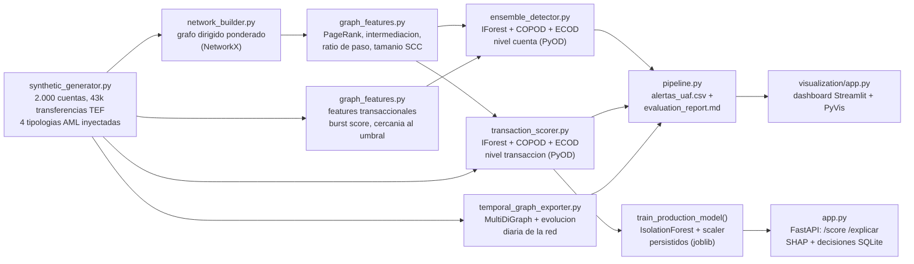

[ 🇺🇸 Read in English ](README.md) | [ 🇨🇱 Español ]

# 1. Título del Proyecto

## Motor de Detección de Anomalías No Supervisado para Tipologías de LA en Transferencias Interbancarias Chilenas


Un motor de detección de anomalías no supervisado, basado en teoría de
grafos, que analiza una red de transferencias electrónicas de fondos (TEF)
interbancarias para identificar cuentas y transacciones individuales
consistentes con tipologías de Lavado de Activos reconocidas por la **UAF
(Unidad de Análisis Financiero de Chile)**: fraccionamiento ("pitufeo"),
cuentas puente/mula, ráfagas de transferencias hacia cuentas recién
abiertas, y montos individuales atípicos. Métricas de teoría de grafos
(NetworkX) y estadísticas transaccionales (Polars) alimentan dos ensambles
no supervisados complementarios — uno por cuenta, otro por transacción
individual (PyOD: Isolation Forest, COPOD, ECOD) — explorables en un
dashboard interactivo Streamlit + PyVis, y servidos en vivo a través de una
API de producción FastAPI con explicabilidad SHAP por transacción y
decisiones de analista persistidas en SQLite. Todo reproducible de punta a
punta con un solo comando (`python -m src.pipeline`).

> ⚠️ **Todos los datos de este repositorio son 100% sintéticos.** Se usan
> nombres reales de bancos chilenos solo para dar realismo a la topología de
> la red; ninguna transacción, cuenta o patrón aquí representa actividad
> real de alguna institución o persona. Ver
> [§8 Aviso regulatorio](#8-aviso-regulatorio).

---

# 2. Motivación y Problema de Negocio

El marco chileno de prevención de LA (**Ley N° 19.913**, que crea la UAF,
reforzada luego por la Ley 20.818 y la Ley 21.121) obliga a bancos y otros
sujetos obligados a monitorear el comportamiento transaccional y presentar
**ROS** (Reportes de Operaciones Sospechosas) cuando la actividad de un
cliente no calza con su perfil declarado. La dificultad estructural de este
problema es que **prácticamente no existen etiquetas confirmadas de
transacciones ilícitas** para entrenar un modelo supervisado: los ROS son
confidenciales, poco frecuentes respecto del volumen total de transacciones,
y para cuando uno se confirma, los fondos ilícitos normalmente ya se
movieron. Esto empuja el problema de ingeniería real hacia la **detección de
anomalías no supervisada** — justamente la restricción que este proyecto
busca demostrar con una respuesta de ingeniería creíble, no evitar.

Cuatro tipologías guían el diseño, todas reconocibles en la literatura de
tipologías de la UAF y del GAFI/FATF:

1. **Fraccionamiento / "pitufeo"** — dividir un monto grande en muchas
   transferencias justo bajo un umbral de monitoreo interno, canalizadas
   por varias cuentas "mula" hacia una o dos cuentas colectoras.
2. **Cuentas puente** — layering: los fondos pasan por una cadena corta de
   cuentas casi de inmediato (el dinero que entra ≈ el dinero que sale en
   pocas horas), diluyendo el vínculo trazable entre el origen y el destino
   final.
3. **Ráfagas hacia cuentas nuevas** — una cuenta recién abierta recibe de
   pronto transferencias de muchos remitentes distintos en una ventana de
   tiempo muy acotada, algo desproporcionado para cualquier perfil legítimo
   plausible de una cuenta nueva.
4. **Montos inusuales** — una transferencia puntual muy alejada del
   comportamiento histórico propio de la cuenta, la anomalía puntual clásica
   que una mirada puramente basada en grafos puede pasar por alto.

## 2.1 Impacto de Negocio e Indicadores Clave (KPIs)

| Métrica | Resultado | Qué significa |
|---|---|---|
| ROC-AUC (ensamble no supervisado) | 0,893 | Discriminación fuerte sin ninguna etiqueta de fraude, sobre 43.009 transferencias sintéticas con forma realista |
| Precisión al presupuesto de alerta por defecto (5%, 100 cuentas) | 43,0%, 28,1% de recall | Un punto de operación realista, no elegido a conveniencia -- se reporta el barrido completo de precision/recall en 8 presupuestos |
| Pico de precisión | Presupuesto 3% (51,7%), no 1% | Un hallazgo honesto: las cuentas mejor rankeadas son unos pocos outliers extremos; ampliar levemente trae más verdaderos positivos antes de que el ruido degrade la precisión |
| Brecha honesta de detección por tipología | Tipologías estructurales rankean top 2,5-3,5%, tipologías puntuales solo top 15-22% | La agregación a nivel de cuenta diluye las anomalías puntuales -- reportado directamente, no suavizado |
| Cuentas AML inyectadas (verdad conocida) | 153 en 4 tipologías | Bit-reproducible: `IForest(n_jobs=1)` + inserción ordenada de aristas del grafo, corrigiendo dos fuentes reales de no-determinismo |

---

# 3. Marco Teórico

## 3.1 Features de teoría de grafos (NetworkX)

La red de transferencias se modela como un grafo dirigido y ponderado —
los nodos son cuentas, las aristas son los flujos de transferencias
agregados. Features por cuenta:

| Feature | Definición | Señal AML |
|---|---|---|
| Grado de entrada/salida, ponderado | Contrapartes distintas y monto total en CLP, en ambas direcciones | Volumen de actividad base |
| **PageRank** | Probabilidad estacionaria de que un caminante aleatorio llegue a la cuenta, ponderado por monto | Importancia dentro de la estructura de flujo de fondos, no solo volumen bruto |
| Coeficiente de agrupamiento | Densidad local del vecindario no dirigido de la cuenta | Distingue comunidades orgánicas de cadenas artificiales |
| Centralidad de intermediación (muestreada) | Fracción de caminos más cortos entre otros pares de nodos que pasan por esta cuenta | Marca "puentes" estructurales — sello distintivo del layering |
| Reciprocidad local | `2·(vecinos mutuos) / grado total` | Distingue relaciones de ida y vuelta de cadenas de un solo sentido |
| Tamaño de componente fuertemente conexa | Tamaño de la SCC que contiene a la cuenta | Detecta ciclos de fondos que retornan al origen |
| **Ratio de paso ("pass-through")** | `min(monto_entrada, monto_salida) / max(monto_entrada, monto_salida)` | Cercano a 1 en una cuenta mula que reenvía casi todo lo que recibe |

## 3.2 Features transaccionales (Polars)

Conteos y estadísticas de monto enviado/recibido, conteo de transferencias
que caen entre 0.85 y 1.0 del umbral de fraccionamiento, un **burst score**
móvil de 24 horas (máximo de transferencias recibidas en cualquier ventana
de 24h — la señal de ráfaga/fan-in), antigüedad de la cuenta, y proporción
de transferencias fuera de horario hábil.

## 3.3 Ensamble no supervisado (PyOD)

Tres detectores complementarios, con pocos hiperparámetros, cada uno
ajustado **sin ninguna etiqueta**, sobre la misma matriz de features por
cuenta:

- **Isolation Forest** — aísla puntos mediante particionamiento recursivo
  aleatorio; efectivo en combinaciones multivariadas (p.ej. alta
  centralidad *y* alto ratio de paso *y* una cuenta muy nueva, a la vez).
- **COPOD** (Copula-Based Outlier Detection) — no paramétrico, fuerte en
  distribuciones de monto con colas pesadas.
- **ECOD** (Empirical Cumulative Distribution) — sin hiperparámetros,
  robusto ante outliers marginales de una sola variable.

Los scores crudos de cada detector se estandarizan
(`pyod.utils.standardizer`) y se combinan con
`pyod.models.combination.average` en un score de ensamble único. La
etiqueta de tipología de verdad terreno inyectada por el generador sintético
**nunca se usa para ajustar ningún detector** — se une a los scores recién
después, dentro de `evaluate_against_ground_truth`, únicamente para evaluar
el resultado no supervisado, tal como una institución real solo puede
validar su modelo de alertas contra un ROS confirmado que llega mucho
después de que el modelo puntuó la cuenta.

## 3.4 Features a nivel de transacción y modelo de producción

[`src/anomaly/transaction_scorer.py`](src/anomaly/transaction_scorer.py)
corre el mismo patrón de ensamble no supervisado un nivel más abajo — por
**transferencia individual**, no por cuenta — específicamente para atacar
las dos tipologías que la §7.3 muestra como el punto más débil del modelo
por cuenta:

| Feature | Definición | Señal AML |
|---|---|---|
| **Z-score del monto vs. historial propio** | `(monto − promedio enviado por el origen) / desviación estandar enviado por el origen` | Una transferencia que se aleja del patrón *propio* de esa cuenta, sin diluirse al plegarla en un agregado |
| **Monto vs. máximo histórico propio** | `monto / máximo enviado por el origen` | Ataca directamente "monto inusual" — un outlier que la mezcla de máximo/media/std a nivel cuenta puede esconder |
| **Conteo móvil de 24h, mismo origen** | Conteo causal (solo pasado, sin fuga de informacion futura) de transferencias enviadas por esta cuenta en las 24h previas | Ráfaga/fan-out desde una sola fuente |
| **Conteo móvil de 24h, mismo par origen→destino** | Conteo causal de transferencias en este par exacto en las 24h previas | Ataca directamente "pitufeo" — muchas transferencias sub-umbral en el mismo corredor, cada una anodina por sí sola |
| Contexto de grafo (PageRank, ratio de paso, intermediación) | Heredado de las features a nivel de cuenta del origen | Mantiene al score de la transacción consciente del rol estructural más amplio de la cuenta |

El ensamble de evaluación offline (IForest + COPOD + ECOD, igual que en
§3.3) corre una vez por corrida completa del pipeline para el reporte de
evaluación. La **API de scoring en vivo** (§6, §7.5) en cambio entrena y
persiste un único `sklearn.IsolationForest` — el único de los tres modelos
que `shap.TreeExplainer` puede explicar por transacción, ya que COPOD/ECOD
no son modelos de árbol.

---

# 4. Explicación

## Arquitectura del pipeline



## Responsabilidad de cada módulo

| Módulo | Responsabilidad |
|---|---|
| [`data/synthetic_generator.py`](data/synthetic_generator.py) | Genera cuentas y transferencias TEF con las cuatro tipologías AML inyectadas bajo una etiqueta de verdad terreno oculta; también emite una matriz origen-destino a nivel de banco. |
| [`src/graph/network_builder.py`](src/graph/network_builder.py) | Construye el grafo dirigido ponderado (para métricas) y el multigrafo detallado (para visualización). |
| [`src/graph/graph_features.py`](src/graph/graph_features.py) | Calcula todas las features de teoría de grafos y transaccionales por cuenta. |
| [`src/graph/temporal_graph_exporter.py`](src/graph/temporal_graph_exporter.py) | Exporta la red de transferencias conservando el eje temporal: un `MultiDiGraph` por transferencia (GraphML) y una tabla de evolución diaria de la red (cuentas activas, volumen, grado promedio). |
| [`src/anomaly/ensemble_detector.py`](src/anomaly/ensemble_detector.py) | Ajusta el ensamble PyOD no supervisado a nivel cuenta, genera alertas y evalúa contra la verdad terreno (reservada para evaluación). |
| [`src/anomaly/transaction_scorer.py`](src/anomaly/transaction_scorer.py) | Mismo patrón de ensamble no supervisado a granularidad de transacción individual; también entrena y persiste el `IsolationForest` de producción que sirve `app.py`. |
| [`src/pipeline.py`](src/pipeline.py) | Orquestador end-to-end: datos → grafo → features cuenta/transaccion → ambos ensambles → alertas + reporte → grafo temporal → modelo de produccion. |
| [`src/api/store.py`](src/api/store.py) | Persistencia SQLite: historial de transacciones scoreadas y decisiones de analista sobre alertas. |
| [`app.py`](app.py) | API de producción FastAPI: scoring en vivo de transacciones, explicabilidad SHAP por transacción, registro de decisiones de analista. |
| [`src/visualization/app.py`](src/visualization/app.py) | Dashboard Streamlit: KPIs, tabla de alertas filtrable, ego-red interactiva con PyVis. |
| [`src/visualization/generar_figuras_reporte.py`](src/visualization/generar_figuras_reporte.py) | Genera las figuras estáticas de este README a partir del resultado real del pipeline. |

---

# 5. Metodología

- **Reproducible por diseño.** Una semilla fija (42) gobierna cada paso
  aleatorio, incluyendo qué cuentas y ventanas de tiempo usa cada caso de
  tipología inyectado. Dos corridas consecutivas de `python -m
  src.pipeline` producen métricas de evaluación idénticas bit a bit —
  verificado durante el desarrollo, no asumido (esto requirió fijar
  `IsolationForest(n_jobs=1)` y ordenar la lista de aristas del grafo antes
  de insertarlas, ya que el orden de la agregación paralela de Polars y el
  muestreo de la centralidad de intermediación de NetworkX eran, de otro
  modo, una fuente de variación mínima entre corridas).
- **La etiqueta de verdad terreno nunca toca el modelo.** `es_ilicito` /
  `tipologia_real` existen únicamente en la salida del generador de datos y
  se unen a los scores del ensamble solo dentro de
  `evaluate_against_ground_truth`, después de que la detección ya terminó —
  reflejando cómo una institución real solo puede validar su modelo de
  alertas contra un resultado de ROS confirmado, que llega mucho después de
  que el modelo puntuó la cuenta.
- **Presupuesto de alertas, no una regla fija.** El parámetro
  `contamination` de `run_ensemble` controla qué fracción de cuentas se
  marca como alerta — una perilla de capacidad analítica, no un corte
  fijo en el código. La sección 7.2 muestra el trade-off precisión/recall
  resultante entre distintos presupuestos.
- **Un resultado honesto, no uniforme entre tipologías.** El ensamble es
  bastante mejor detectando tipologías *estructurales* (cuentas puente,
  ráfagas a cuentas nuevas) que tipologías *puntuales* (montos individuales
  inusuales) — ver la sección 7.3 para el porqué, y por qué eso no es un
  resultado a suavizar en este reporte.

---

# 6. Desarrollo

## Instalación y configuración

```powershell
git clone https://github.com/Rxyxs/chile-aml-anomaly-detection-engine.git
cd chile-aml-anomaly-detection-engine
python -m venv .venv
.venv\Scripts\activate
pip install -r requirements.txt
```

## Pipeline completo (un solo comando)

```powershell
python -m src.pipeline
```

Genera el dataset sintético si aún no existe, construye el grafo, calcula
todas las features, ajusta el ensamble, y escribe las alertas más un
reporte de evaluación en `outputs/`.

```powershell
python -m src.pipeline --regenerar-datos --contaminacion 0.08 --contaminacion-tx 0.01
```

Además de los artefactos a nivel cuenta, esto escribe
`outputs/transacciones_con_score.parquet`, `outputs/red_temporal.graphml`,
`outputs/evolucion_red_diaria.csv`, y entrena + persiste el modelo de
producción en `models/` (usado por el servicio FastAPI a continuación).

## Etapas individuales (para depuración)

```powershell
python data/synthetic_generator.py
python -m src.visualization.generar_figuras_reporte
```

## Dashboard interactivo

```powershell
streamlit run src/visualization/app.py
```

## API de producción (FastAPI)

Requiere haber corrido `python -m src.pipeline` al menos una vez, para que
existan `models/` y `outputs/cuentas_con_score.parquet`.

```powershell
uvicorn app:app --reload
```

| Endpoint | Propósito |
|---|---|
| `POST /score` | Score de anomalía en vivo para una transacción (`origen`, `destino`, `monto_clp`, `timestamp` opcional) |
| `POST /explicar` | Mismo input, retorna la contribución SHAP de cada feature (`shap.TreeExplainer` sobre el `IsolationForest` persistido) |
| `POST /decisiones` | Registra la disposición de un analista (`confirmado_ilicito` / `falso_positivo` / `pendiente_revision`) para un `transfer_id`, persistida en SQLite |
| `GET /alertas` | Lista las alertas scoreadas junto con su última decisión de analista, si existe |
| `GET /health` | Chequeo de estado del modelo cargado |

Documentación interactiva en `http://127.0.0.1:8000/docs` una vez corriendo.

## Pruebas

```powershell
pytest -v
```

## Estructura del repositorio

```
chile-aml-anomaly-detection-engine/
├── data/
│   ├── synthetic_generator.py       # generador de transferencias TEF + tipologias
│   └── synthetic/                   # cuentas/transferencias generadas (parquet, en .gitignore)
├── src/
│   ├── graph/
│   │   ├── network_builder.py
│   │   ├── graph_features.py
│   │   └── temporal_graph_exporter.py
│   ├── anomaly/
│   │   ├── ensemble_detector.py     # ensamble nivel cuenta
│   │   └── transaction_scorer.py    # ensamble nivel transaccion + modelo de produccion
│   ├── api/
│   │   └── store.py                 # SQLite: historial de scoring + decisiones de analista
│   ├── visualization/
│   │   ├── app.py                   # dashboard Streamlit
│   │   └── generar_figuras_reporte.py
│   └── pipeline.py                  # orquestador end-to-end
├── app.py                           # API de produccion FastAPI
├── models/                          # modelo de produccion persistido (joblib, en .gitignore)
├── outputs/
│   └── figures/                     # figuras de resultados (png, versionadas)
├── tests/                           # 24 pruebas, pytest
├── requirements.txt
├── README.md
└── README.es.md
```

---

# 7. Resultados

Cada número y figura de esta sección proviene de una corrida real de
`python -m src.pipeline` (semilla 42, totalmente reproducible — ver §5).

## 7.1 Dataset

| Métrica | Valor |
|---|---|
| Cuentas | 2.000 |
| Transferencias TEF (ventana de 90 días) | 43.009 |
| Nodos del grafo / aristas dirigidas ponderadas | 2.000 / 38.936 |
| Cuentas con tipología AML inyectada (verdad terreno) | 153 (77 pitufeo, 37 cuenta_puente, 21 monto_inusual, 18 rafaga_cuenta_nueva) |

## 7.2 Desempeño del ensamble

En el presupuesto de alertas por defecto (`contamination = 0.05`, es decir,
las 100 cuentas más sospechosas de 2.000):

| Métrica | Valor |
|---|---|
| ROC-AUC | 0.893 |
| Average precision | 0.353 |
| Alertas emitidas | 100 |
| Precisión en alertas | 43,0% |
| Recall sobre verdad terreno | 28,1% |


El score del ensamble separa con claridad a la mayoría de las cuentas
normales (izquierda, azul) de las cuentas con tipología AML inyectada
(derecha, rojo), aunque el traslape en la zona media es justamente lo que
limita la precisión por debajo del 100% — un resultado realista para un
modelo no supervisado que no tiene etiquetas contra las cuales ajustarse.

Trade-off precisión/recall entre distintos presupuestos de alerta (5
ajustes independientes del ensamble, uno por presupuesto):

| Contaminación | Alertas | Precisión | Recall |
|---:|---:|---:|---:|
| 1% | 20 | 0,400 | 0,052 |
| 2% | 40 | 0,475 | 0,124 |
| 3% | 60 | 0,517 | 0,203 |
| **5%** | **100** | **0,430** | **0,281** |
| 8% | 160 | 0,375 | 0,392 |
| 10% | 200 | 0,335 | 0,438 |
| 15% | 300 | 0,317 | 0,621 |
| 20% | 400 | 0,305 | 0,797 |

La version animada de abajo dibuja cada curva progresivamente sobre el mismo sweep real, con una etiqueta flotante que muestra el valor actual en la punta de avance.


La precisión alcanza su máximo cerca de un presupuesto de 3% en vez de 1%
— las cuentas mejor rankeadas están dominadas por unos pocos outliers
estructurales extremos, y ampliar levemente la red suma más verdaderos
positivos antes de que la precisión empiece a degradarse con el ruido
adicional.

## 7.3 La detección no es uniforme entre tipologías — y ese es el hallazgo honesto


Ordenando cada cuenta de verdad terreno según su score de ensamble (de
2.000, menor = más sospechosa) y tomando la **mediana del ranking por
tipología**:

| Tipología | Cuentas verdad terreno | Ranking mediano (de 2.000) | Equivalente a top |
|---|---:|---:|---:|
| Ráfaga a cuenta nueva | 18 | 50 | 2,5% |
| Cuenta puente | 37 | 69 | 3,5% |
| Fraccionamiento ("pitufeo") | 77 | 311 | 15,6% |
| Monto inusual | 21 | 449 | 22,5% |

**Las tipologías estructurales dominan la detección.** Las cuentas puente y
las de ráfaga dejan una huella fuerte y multi-feature (ratio de paso cercano
a 1, burst score extremo, una antigüedad de cuenta recién nacida,
intermediación inusual) en la que varios detectores coinciden
simultáneamente — exactamente el escenario donde Isolation Forest es más
fuerte. **Las tipologías puntuales son estructuralmente más difíciles para
un modelo agregado a nivel de cuenta.** Un monto inusual único se diluye en
cuanto se pliega dentro de las estadísticas de media/desviación/máximo de
una cuenta junto con su historial habitual, y las transferencias
individuales de una cuenta mula de "pitufeo" no son extremas de forma
aislada — solo su *conteo* cerca del umbral lo es, una señal más estrecha
que la convergencia multi-feature que marca puentes y ráfagas. Esta es una
limitación legítima de la agregación a nivel de cuenta, no una falla de
calibración — el modelo a nivel de transacción de la §7.4 se construyó
específicamente para cerrar esta brecha.

## 7.4 El scoring a nivel de transacción cierra la brecha de anomalías puntuales — con un trade-off

Con `contamination = 0.01` (431 de 43.009 transacciones marcadas):

| Métrica | Valor |
|---|---|
| ROC-AUC | 0,908 (vs. 0,893 a nivel cuenta) |
| Average precision | 0,404 |
| Alertas emitidas | 431 |
| Precisión en alertas | 63,8% (vs. 43,0% a nivel cuenta) |
| Recall sobre verdad terreno | 27,3% |

Ordenando cada transacción ilícita según su score a nivel transacción (de
43.009, menor = más sospechosa):

| Tipología | Transacciones ilícitas | Ranking mediano | Equivalente a top |
|---|---:|---:|---:|
| Fraccionamiento ("pitufeo") | 358 | 426 | **0,99%** (vs. 15,6% a nivel cuenta) |
| Cuenta puente | 58 | 227 | 0,53% |
| Monto inusual | 34 | 624 | **1,45%** (vs. 22,5% a nivel cuenta) |
| Ráfaga a cuenta nueva | 559 | 3.962 | 9,21% (vs. 2,5% a nivel cuenta) |

**Las dos tipologías que la §7.3 nombró como el punto débil del modelo por
cuenta son ahora las más fuertes.** Las transacciones de "pitufeo" rankean
en el top 1% en vez del top 15,6%, y los montos inusuales rankean en el top
1,5% en vez del top 22,5% — atribuible directamente a las dos features
construidas justo para esto (`monto_zscore_origen` / `monto_pct_max_origen`,
y el conteo causal móvil de 24h del mismo par). **Esto no es una mejora
estricta, sin embargo**: las ráfagas de fan-in, la mejor tipología del
modelo por cuenta (top 2,5%), son comparativamente más difíciles de
detectar por transacción (top 9,2%) — una ráfaga es fundamentalmente un
patrón a nivel de cuenta (muchos remitentes convergiendo en una cuenta), y
ninguna transferencia individual de esa ráfaga es inusual por sí sola. Las
dos granularidades son complementarias, no un reemplazo estricto de una por
la otra — por eso `pipeline.py` corre y reporta ambas.

## 7.5 Grafo temporal

[`src/graph/temporal_graph_exporter.py`](src/graph/temporal_graph_exporter.py)
conserva el eje temporal que el grafo único agregado de la §3.1 aplana:
`outputs/red_temporal.graphml` guarda una arista por transferencia con su
propio timestamp (cargable en Gephi para reproducir la evolución de la
red), y `outputs/evolucion_red_diaria.csv` registra cuentas activas,
número de transferencias, volumen total en CLP y grado promedio por día
calendario a lo largo de la ventana de 90 días — útil para detectar el
patrón a nivel diario detrás de una cadena "cuenta puente" que un grafo
estático colapsa en una sola instantánea.

## 7.6 Comparativo de modelos: baseline estadístico vs. ensamble de árboles vs. autoencoder

[`src/anomaly/run_model_comparison.py`](src/anomaly/run_model_comparison.py)
(`python -m src.anomaly.run_model_comparison`) corre tres enfoques
complementarios no supervisados sobre **la misma tabla de features a nivel
transacción** (`transaction_scorer.FEATURE_COLUMNS_TX`) y persiste el
comparativo en DuckDB (`outputs/model_comparison.duckdb`):

- **Baseline estadístico** ([`src/anomaly/deep_baseline.py`](src/anomaly/deep_baseline.py))
  — sin entrenamiento ni hiperparámetros más allá del presupuesto de
  alertas: suma de z-scores robustos (mediana/MAD) por feature. El piso
  interpretable que cualquier otro modelo debe superar para justificar su
  complejidad adicional.
- **Ensamble de árboles** — el mismo ensamble `IForest + COPOD + ECOD` de la
  §7.4 (`transaction_scorer.run_transaction_ensemble`), reutilizado aquí
  para comparación, no duplicado.
- **Autoencoder PyTorch** (`deep_baseline.autoencoder_score`) — un MLP
  encoder/decoder simétrico pequeño entrenado sin etiquetas (reconstruye sus
  propias features estandarizadas), usando el error de reconstrucción (MSE)
  como score de anomalía. Entrenado tres veces, misma arquitectura y
  epochs, variando solo la función de activación: **ReLU, GELU, Swish (SiLU)**.

Con `contamination = 0.01` (mismo presupuesto que §7.4), de una corrida real:

| Modelo | ROC-AUC | Average precision | Precisión en alertas | Recall sobre verdad terreno |
|---|---:|---:|---:|---:|
| **Ensamble de árboles (IForest+COPOD+ECOD)** | **0.908** | **0.404** | **0.638** | 0.273 |
| Autoencoder (GELU) | 0.899 | 0.332 | 0.608 | 0.260 |
| Autoencoder (ReLU) | 0.900 | 0.331 | 0.603 | 0.258 |
| Autoencoder (Swish) | 0.899 | 0.329 | 0.603 | 0.258 |
| Baseline estadístico (z-score/MAD) | 0.662 | 0.034 | 0.000 | 0.000 |


**Hallazgos.** El ensamble de árboles sigue siendo el modelo más fuerte
sobre este conjunto de features — le gana al autoencoder en todas las
métricas, y por un margen amplio en precisión (63.8% vs. ~60%). El baseline
estadístico interpretable es un piso real, no un espantapájaros: ROC-AUC
0.662 muestra que las features crudas sí llevan señal, pero una suma
aditiva de z-scores no puede capturar las interacciones multivariadas
(p.ej. ratio de paso alto *combinado con* una cuenta recién abierta) que sí
explotan tanto el ensamble como el autoencoder — precisamente por qué este
proyecto no se detiene en el baseline. **La elección de activación apenas
mueve la aguja del autoencoder** (ROC-AUC dentro de 0.001 entre sí para
ReLU/GELU/Swish): con esta dimensionalidad de features (13 features, cuello
de botella 16→4) domina la arquitectura y el objetivo de reconstrucción, no
la no-linealidad. Es en sí mismo un hallazgo negativo útil — indica que el
techo del autoencoder aquí es de capacidad/features, no de tuning de
activación.

---

# 8. Aviso Regulatorio

Este proyecto es una **demostración metodológica**, no un sistema de
cumplimiento AML en producción. Específicamente:

- **Todas las cuentas, transferencias y casos de tipología son generados
  sintéticamente** por [`data/synthetic_generator.py`](data/synthetic_generator.py)
  con una semilla fija. Ningún cliente, transacción o institución real está
  representado.
- **Los nombres reales de bancos chilenos se usan solo por realismo
  topológico** — su inclusión no implica, sugiere ni representa que alguna
  transacción, patrón o hallazgo de este proyecto involucre datos u
  operaciones reales de esa institución de ninguna forma.
- **`UMBRAL_ESTRUCTURACION_CLP` (umbral de fraccionamiento) es un parámetro
  ilustrativo** elegido para demostrar la tipología de fraccionamiento, no
  una cifra publicada por la UAF como umbral oficial de reporte para
  transferencias electrónicas.
- Las referencias a la Ley N° 19.913, la UAF, los ROS y las tipologías AML
  reconocidas describen el marco regulatorio general de Chile como contexto
  de fondo, no una opinión de cumplimiento. Cualquier implementación real
  requiere acuerdos de datos validados, revisión legal/de cumplimiento, y
  calibración contra el historial transaccional real y las obligaciones
  regulatorias propias de cada institución.

---

# 9. Conclusión

- **Un ensamble no supervisado de tres modelos, alimentado con features de
  teoría de grafos y transaccionales, alcanza un ROC-AUC de 0,893**
  separando cuentas con tipología AML sintética de cuentas normales — sin
  entrenar jamás con un solo ejemplo etiquetado, la restricción realista de
  este problema.
- **Las tipologías estructurales (cuentas puente, ráfagas a cuentas nuevas)
  se detectan con alta efectividad** — ambas caen dentro del top ~2,5-3,5%
  de todas las cuentas según su score, dentro de un presupuesto de revisión
  analítica realista.
- **Las tipologías puntuales son más difíciles para el modelo agregado por
  cuenta pero las más nítidas para el modelo por transacción, y viceversa
  para las ráfagas de fan-in** — la §7.3/§7.4 nombran esto como un
  trade-off genuino y complementario entre granularidades, no un resultado
  suavizado. El modelo a nivel de transacción por sí solo alcanza
  **ROC-AUC 0,908 y 63,8% de precisión** en su presupuesto de alertas,
  impulsado específicamente por las dos features construidas para atacar la
  brecha del modelo por cuenta (z-score de monto vs. historial propio,
  conteo causal móvil de 24h del mismo par).
- **La limitación central a nombrar sin rodeos**: todos los datos son
  sintéticos. Estas métricas validan que el *pipeline* —ingeniería de
  features, combinación del ensamble, metodología de evaluación— es sólido
  y consistente internamente, no que rendiría igual sobre el grafo
  transaccional real de una institución, que tiene una topología,
  estacionalidad y mezcla de tipologías distintas.

## Trabajo futuro

- **Automatizar el loop de retroalimentación.** Las decisiones de analista
  ya se persisten en SQLite (`GET /alertas`), pero todavía nada recalibra
  `contamination` a partir del historial acumulado de confirmados/falsos
  positivos — ese cierre del loop sigue siendo manual.
- **Ingesta por streaming en vez de ventanas rolling por lote.** La API en
  vivo calcula los conteos causales de 24h de cada transacción filtrando
  una instantánea en memoria del histórico cargada al iniciar; un despliegue
  real necesitaría esto alimentado por una fuente de streaming (p.ej.
  Kafka), para que la ventana refleje transacciones scoreadas hace segundos,
  no solo las de la última corrida del pipeline.
- **Una GNN temporal propiamente tal**, no solo la exportación de
  snapshot/GraphML de la §7.5, para que el modelo aprenda la estructura
  ordenada en el tiempo directamente en vez de vía features rolling
  hechas a mano.
- Alimentar las disposiciones confirmadas a una capa supervisada posterior
  una vez que existan suficientes resultados etiquetados, tratando a los
  ensambles no supervisados actuales como el filtro de primera pasada, no
  como la palabra final — ver
  [credit-fraud-autoencoder-detection-engine](https://github.com/Rxyxs/credit-fraud-autoencoder-detection-engine)
  para un ejemplo concreto y cuantificado de exactamente esa transición
  (autoencoder no supervisado vs. XGBoost supervisado sobre el mismo
  dataset real y etiquetado).

---

# 10. Licencia

MIT — ver [LICENSE](LICENSE).

# 11. Autor

**Pablo Reyes** — [github.com/Rxyxs](https://github.com/Rxyxs)
