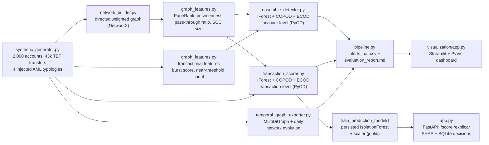
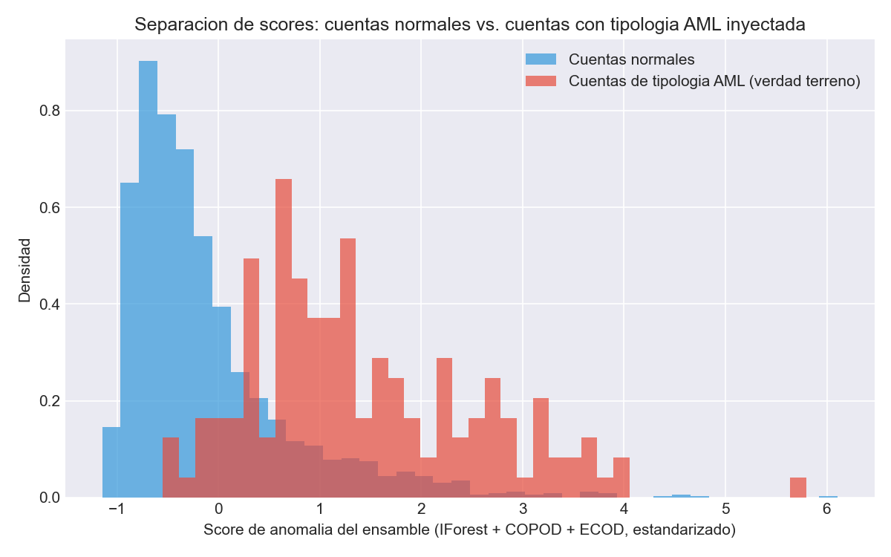
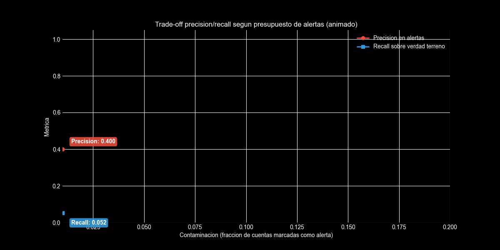
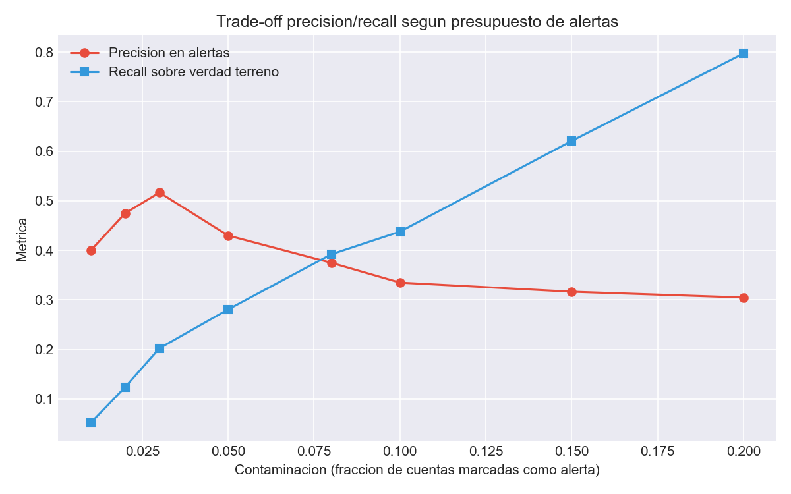
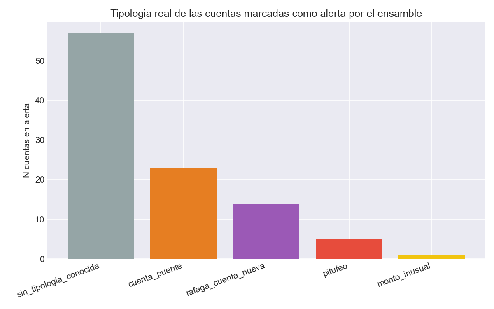
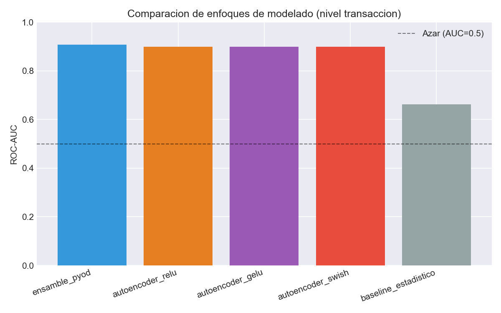
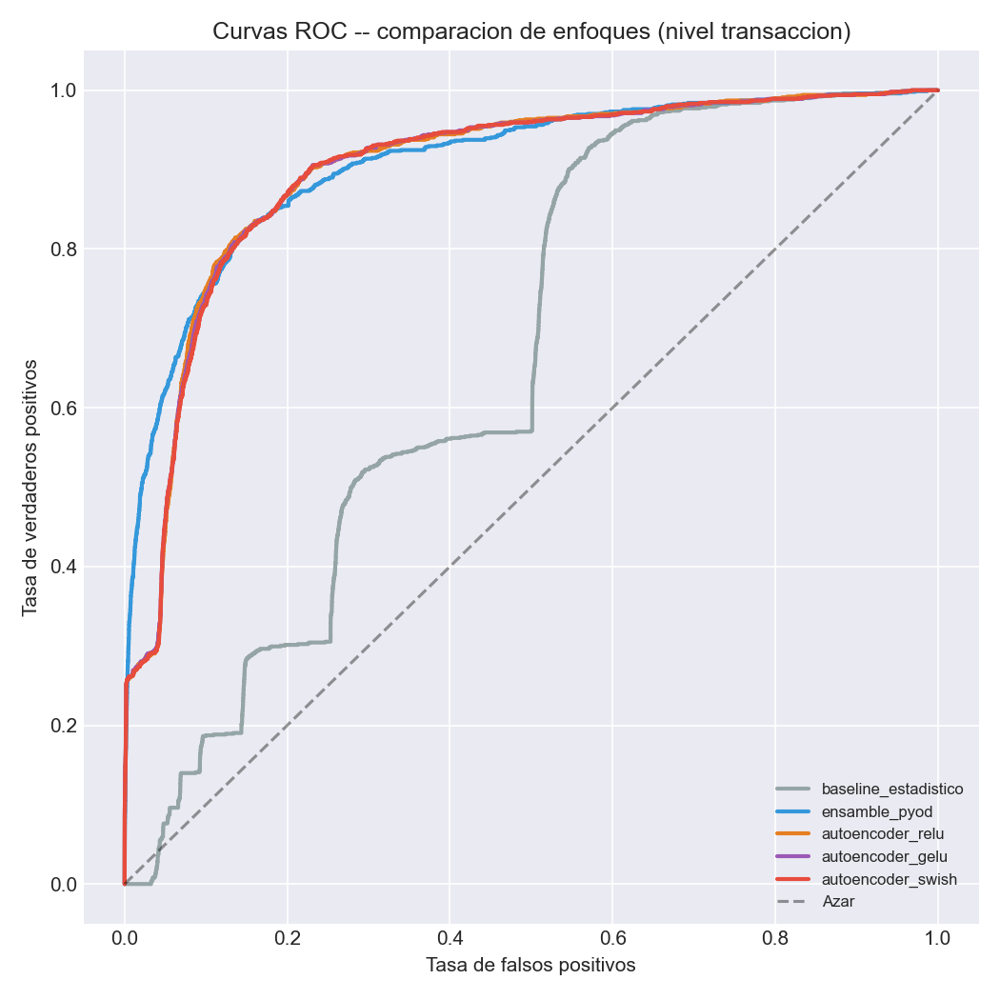
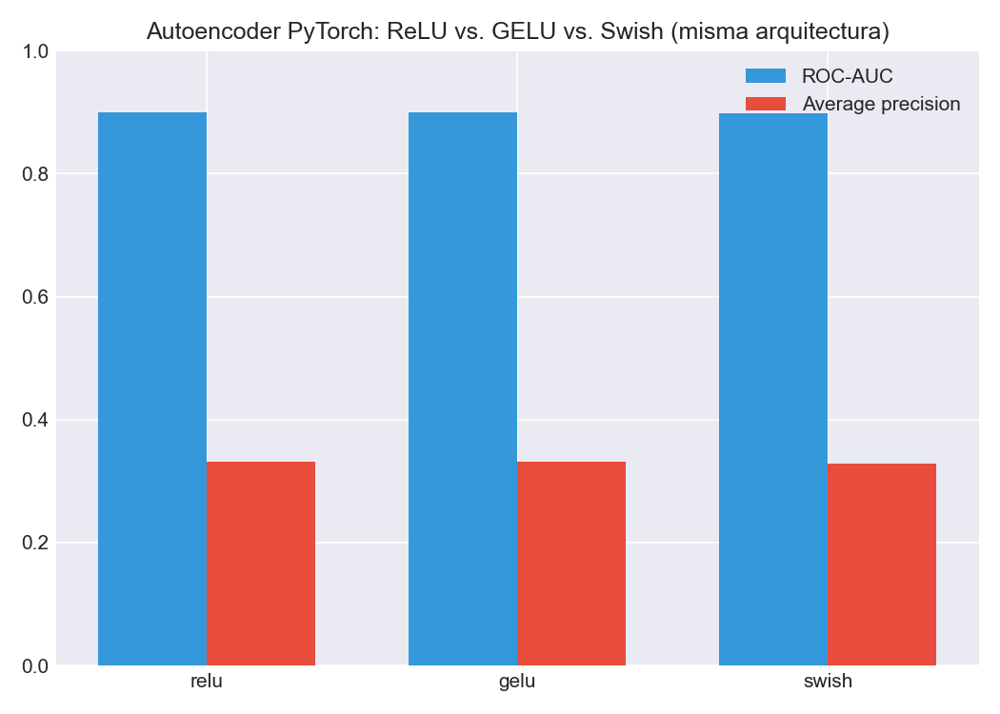

[ 🇺🇸 English ] | [ 🇨🇱 Leer en Español ](README.es.md)

# 1. Project Title

## Unsupervised Anomaly Detection Engine for AML Typologies in Chilean Interbank Transfers


An unsupervised graph-based anomaly detection engine that analyzes a network
of interbank electronic funds transfers (TEF) to surface accounts and
individual transactions consistent with Anti-Money-Laundering (AML)
typologies recognized by Chile's Financial Analysis Unit (**UAF — Unidad de
Análisis Financiero**): structuring ("pitufeo"), bridge/mule accounts,
fan-in bursts to newly opened accounts, and single-transaction amount
outliers. Graph-theory metrics (NetworkX) and transactional statistics
(Polars) feed two complementary unsupervised ensembles — one per account,
one per individual transaction (PyOD: Isolation Forest, COPOD, ECOD) —
explored through an interactive Streamlit + PyVis dashboard, and served live
through a FastAPI production API with per-transaction SHAP explainability
and SQLite-persisted analyst decisions. All reproducible end to end with one
command (`python -m src.pipeline`).

> ⚠️ **All data in this repository is 100% synthetic.** Real bank names are
> used only to make the network topology realistic; no transaction, account,
> or pattern here represents actual activity by any institution or person.
> See [§8 Regulatory disclaimer](#8-regulatory-disclaimer).

---

# 2. Motivation

Chile's AML framework (**Ley N° 19.913**, which created the UAF, later
strengthened by Ley 20.818 and Ley 21.121) obligates banks and other
regulated entities to monitor transactional behavior and file **ROS**
(Reportes de Operaciones Sospechosas) when a client's activity doesn't match
their declared profile. The structural difficulty of this problem is that
**confirmed illicit-transaction labels essentially don't exist** for training
a supervised model: ROS filings are confidential, rare relative to total
transaction volume, and by the time one is confirmed, the illicit funds have
usually already moved on. This pushes the real-world engineering problem
toward **unsupervised anomaly detection** — the same constraint this project
is built to demonstrate a credible engineering answer to, not around.

Four typologies drive the design, all recognizable in UAF and FATF/GAFI
typology literature:

1. **Structuring / "pitufeo"** — fractioning a large amount into many
   transfers just under an internal monitoring threshold, run through
   several "mule" source accounts into one or two collector accounts.
2. **Bridge accounts ("cuentas puente")** — layering: funds pass through a
   short chain of accounts almost immediately (money in ≈ money out within
   hours), diluting the traceable link between origin and final destination.
3. **Fan-in bursts to new accounts** — a just-opened account suddenly
   receives transfers from many distinct senders in a tight time window,
   disproportionate to any plausible legitimate profile for a new account.
4. **Unusual amounts** — a single transfer far outside an account's own
   historical behavior, the classic point anomaly a purely graph-based view
   can miss.

## 2.1 Business Impact & Key Performance Indicators

| Metric | Result | What it means |
|---|---|---|
| ROC-AUC (unsupervised ensemble) | 0.893 | Strong discrimination with zero labeled fraud, on 43,009 real-shaped synthetic transfers |
| Precision at default alert budget (5%, 100 accounts) | 43.0%, 28.1% recall | A realistic operating point, not a cherry-picked one -- full precision/recall sweep reported across 8 budgets |
| Precision peak | 3% budget (51.7%), not 1% | An honest finding: the very top-ranked accounts are a few extreme outliers; widening slightly brings in more true positives before noise degrades it |
| Honest detection gap by typology | Structural typologies rank top 2.5-3.5%, point typologies only top 15-22% | Account-level aggregation dilutes point anomalies -- reported plainly, not smoothed over |
| Injected AML accounts (ground truth) | 153 across 4 typologies | Bit-reproducible: `IForest(n_jobs=1)` + sorted graph-edge insertion, fixing two real nondeterminism sources |

---

# 3. Theoretical Framework

## 3.1 Graph-theory features (NetworkX)

The transfer network is modeled as a directed, weighted graph — nodes are
accounts, edges are aggregated transfer flows. Per-account features:

| Feature | Definition | AML signal |
|---|---|---|
| In/out degree, weighted degree | Distinct counterparties and total CLP flow, in and out | Basic activity volume |
| **PageRank** | Stationary probability of a random walker landing on the account, weighted by amount | Importance within the fund-flow structure, not just raw volume |
| Clustering coefficient | Local density of the account's undirected neighborhood | Distinguishes organic communities from artificial chains |
| Betweenness centrality (k-sampled) | Fraction of shortest paths between other node pairs passing through this account | Flags structural "bridges" — a hallmark of layering |
| Local reciprocity | `2·(mutual neighbors) / total degree` | Distinguishes back-and-forth relationships from one-way chains |
| Strongly-connected-component size | Size of the SCC containing the account | Detects round-tripping cycles of funds |
| **Pass-through ratio** | `min(in_amount, out_amount) / max(in_amount, out_amount)` | Close to 1 for a mule account that forwards almost everything it receives |

## 3.2 Transactional features (Polars)

Sent/received counts and amount statistics, count of transfers landing
within 0.85–1.0 of the structuring threshold, a 24-hour rolling **burst
score** (max transfers received in any 24h window — the fan-in signal),
account age, and the share of transfers occurring outside business hours.

## 3.3 Unsupervised ensemble (PyOD)

Three complementary, hyperparameter-light detectors, each fit **without any
label**, on the same per-account feature matrix:

- **Isolation Forest** — isolates points via random recursive partitioning;
  effective on multivariate combinations (e.g., high centrality *and* high
  pass-through ratio *and* a very young account, together).
- **COPOD** (Copula-Based Outlier Detection) — non-parametric, strong on
  heavy-tailed amount distributions.
- **ECOD** (Empirical Cumulative Distribution) — hyperparameter-free,
  robust to marginal, single-variable outliers.

Each detector's raw scores are standardized (`pyod.utils.standardizer`) and
combined with `pyod.models.combination.average` into one ensemble score.
The ground-truth typology label injected by the synthetic generator is
**never used to fit any detector** — it is joined back in only afterward,
purely to evaluate the unsupervised result, exactly as a real deployment
would validate against a delayed batch of confirmed ROS outcomes.

## 3.4 Transaction-level features and production model

[`src/anomaly/transaction_scorer.py`](src/anomaly/transaction_scorer.py)
runs the same unsupervised-ensemble pattern one level down — per
**individual transfer**, not per account — specifically to attack the two
typologies §7.3 shows the account-level model is weakest at:

| Feature | Definition | AML signal |
|---|---|---|
| **Amount z-score vs. own history** | `(amount − sender's mean sent) / sender's std sent` | A single transfer that stands out from *that account's own* pattern, undiluted by folding it into an aggregate |
| **Amount vs. own historical max** | `amount / sender's max sent` | Directly targets "unusual amount" — an outlier the account-level max/mean/std blend can hide |
| **Rolling 24h count, same sender** | Causal count (past only, no lookahead) of transfers sent by this account in the preceding 24h | Burst/fan-out from a single source |
| **Rolling 24h count, same origin→destination pair** | Causal count of transfers on this exact pair in the preceding 24h | Directly targets "pitufeo" — many sub-threshold transfers on the same corridor, each unremarkable alone |
| Graph context (PageRank, pass-through ratio, betweenness) | Inherited from the sender's account-level features | Keeps the transaction score aware of the account's broader structural role |

The offline evaluation ensemble (IForest + COPOD + ECOD, same as §3.3) runs
once per full pipeline run for the evaluation report. The **live-scoring API**
(§6, §7.5) instead trains and persists a single `sklearn.IsolationForest` —
the only one of the three detector families `shap.TreeExplainer` can explain
per transaction, since COPOD/ECOD aren't tree-based models.

---

# 4. Explanation

## Pipeline architecture



## Module responsibilities

| Module | Responsibility |
|---|---|
| [`data/synthetic_generator.py`](data/synthetic_generator.py) | Generates accounts and TEF transfers with the four AML typologies injected under a hidden ground-truth label; also emits a bank-to-bank origin-destination matrix. |
| [`src/graph/network_builder.py`](src/graph/network_builder.py) | Builds the directed weighted graph (for metrics) and the detailed multigraph (for visualization). |
| [`src/graph/graph_features.py`](src/graph/graph_features.py) | Computes all graph-theory and transactional features per account. |
| [`src/graph/temporal_graph_exporter.py`](src/graph/temporal_graph_exporter.py) | Exports the transfer network with its time axis preserved: a per-transfer `MultiDiGraph` (GraphML) and a day-by-day network evolution table (active accounts, volume, average degree). |
| [`src/anomaly/ensemble_detector.py`](src/anomaly/ensemble_detector.py) | Fits the unsupervised PyOD ensemble at account level, produces alerts, and evaluates against the (held-out) ground truth. |
| [`src/anomaly/transaction_scorer.py`](src/anomaly/transaction_scorer.py) | Same unsupervised-ensemble pattern at individual-transaction granularity; also trains and persists the production `IsolationForest` served by `app.py`. |
| [`src/pipeline.py`](src/pipeline.py) | End-to-end orchestrator: data → graph → account/transaction features → both ensembles → alerts + report → temporal graph → production model. |
| [`src/api/store.py`](src/api/store.py) | SQLite persistence: scored-transaction history and analyst decisions on alerts. |
| [`app.py`](app.py) | FastAPI production API: live transaction scoring, per-transaction SHAP explainability, analyst decision logging. |
| [`src/visualization/app.py`](src/visualization/app.py) | Streamlit dashboard: KPIs, filterable alert table, interactive PyVis ego-network. |
| [`src/visualization/generar_figuras_reporte.py`](src/visualization/generar_figuras_reporte.py) | Renders the static result figures used in this README from the real pipeline output. |

---

# 5. Methodology

- **Reproducible by construction.** A fixed seed (42) drives every random
  step, including which accounts and time windows each injected typology
  case uses. Two consecutive runs of `python -m src.pipeline` produce
  byte-identical evaluation metrics — verified during development, not
  assumed (this required pinning `IsolationForest(n_jobs=1)` and sorting the
  graph's edge list before insertion, since Polars' parallel aggregation
  order and NetworkX's k-sampled betweenness centrality were a source of
  tiny run-to-run jitter otherwise).
- **The ground-truth label never touches the model.** `es_ilicito` /
  `tipologia_real` exist purely in the data generator's output and are
  joined back onto the ensemble's scores only inside
  `evaluate_against_ground_truth`, after detection is complete — mirroring
  how a real institution can only validate its alerting model against a
  confirmed ROS/SAR outcome that arrives long after the model scored the
  account.
- **Alert budget, not a fixed rule.** `contamination` in `run_ensemble`
  controls what fraction of accounts get flagged — an analyst-capacity
  knob, not a hardcoded cutoff. §7.2 shows the resulting precision/recall
  trade-off across budgets.
- **An honest, not-uniform result across typologies.** The ensemble is far
  better at catching *structural* typologies (bridge accounts, new-account
  bursts) than *point* typologies (single unusual amounts) — see §7.3 for
  why, and why that isn't a bug to be smoothed over in this write-up.

---

# 6. Development

## Installation and setup

```powershell
git clone https://github.com/Rxyxs/chile-aml-anomaly-detection-engine.git
cd chile-aml-anomaly-detection-engine
python -m venv .venv
.venv\Scripts\activate
pip install -r requirements.txt
```

## Full pipeline (one command)

```powershell
python -m src.pipeline
```

Generates the synthetic dataset if it doesn't already exist, builds the
graph, computes all features, fits the ensemble, and writes alerts plus an
evaluation report to `outputs/`.

```powershell
python -m src.pipeline --regenerar-datos --contaminacion 0.08 --contaminacion-tx 0.01
```

In addition to the account-level artifacts, this also writes
`outputs/transacciones_con_score.parquet`, `outputs/red_temporal.graphml`,
`outputs/evolucion_red_diaria.csv`, and trains + persists the production
model to `models/` (used by the FastAPI service below).

## Individual stages (for debugging)

```powershell
python data/synthetic_generator.py
python -m src.visualization.generar_figuras_reporte
```

## Interactive dashboard

```powershell
streamlit run src/visualization/app.py
```

## Production API (FastAPI)

Requires having run `python -m src.pipeline` at least once, so `models/` and
`outputs/cuentas_con_score.parquet` exist.

```powershell
uvicorn app:app --reload
```

| Endpoint | Purpose |
|---|---|
| `POST /score` | Live anomaly score for one transaction (`origen`, `destino`, `monto_clp`, optional `timestamp`) |
| `POST /explicar` | Same input, returns per-feature SHAP contributions (`shap.TreeExplainer` on the persisted `IsolationForest`) |
| `POST /decisiones` | Records an analyst's disposition (`confirmado_ilicito` / `falso_positivo` / `pendiente_revision`) for a `transfer_id`, persisted to SQLite |
| `GET /alertas` | Lists scored alerts joined with their latest analyst decision, if any |
| `GET /health` | Model-loaded status check |

Interactive docs at `http://127.0.0.1:8000/docs` once running.

## Tests

```powershell
pytest -v
```

## Project structure

```
chile-aml-anomaly-detection-engine/
├── data/
│   ├── synthetic_generator.py       # TEF transfer + typology generator
│   └── synthetic/                   # generated accounts/transfers (parquet, gitignored)
├── src/
│   ├── graph/
│   │   ├── network_builder.py
│   │   ├── graph_features.py
│   │   └── temporal_graph_exporter.py
│   ├── anomaly/
│   │   ├── ensemble_detector.py     # account-level ensemble
│   │   └── transaction_scorer.py    # transaction-level ensemble + production model
│   ├── api/
│   │   └── store.py                 # SQLite: scoring history + analyst decisions
│   ├── visualization/
│   │   ├── app.py                   # Streamlit dashboard
│   │   └── generar_figuras_reporte.py
│   └── pipeline.py                  # end-to-end orchestrator
├── app.py                           # FastAPI production API
├── models/                          # persisted production model (joblib, gitignored)
├── outputs/
│   └── figures/                     # result figures (png, version-controlled)
├── tests/                           # 24 tests, pytest
├── requirements.txt
├── README.md
└── README.es.md
```

---

# 7. Results

Every number and figure in this section comes from an actual run of
`python -m src.pipeline` (seed 42, fully reproducible — see §5).

## 7.1 Dataset

| Metric | Value |
|---|---|
| Accounts | 2,000 |
| TEF transfers (90-day window) | 43,009 |
| Graph nodes / directed weighted edges | 2,000 / 38,936 |
| Accounts with an injected AML typology (ground truth) | 153 (77 pitufeo, 37 cuenta_puente, 21 monto_inusual, 18 rafaga_cuenta_nueva) |

## 7.2 Ensemble performance

At the default alert budget (`contamination = 0.05`, i.e., the top 100 of
2,000 accounts):

| Metric | Value |
|---|---|
| ROC-AUC | 0.893 |
| Average precision | 0.353 |
| Alerts emitted | 100 |
| Precision on alerts | 43.0% |
| Recall on ground truth | 28.1% |



The ensemble score cleanly separates the bulk of normal accounts (left,
blue) from injected AML-typology accounts (right, red), though the overlap
in the middle is exactly what caps precision below 100% — a realistic
outcome for an unsupervised model with no labels to fit against.

Precision/recall trade-off across alert budgets (5 independent ensemble
fits, one per budget):

| Contamination | Alerts | Precision | Recall |
|---:|---:|---:|---:|
| 1% | 20 | 0.400 | 0.052 |
| 2% | 40 | 0.475 | 0.124 |
| 3% | 60 | 0.517 | 0.203 |
| **5%** | **100** | **0.430** | **0.281** |
| 8% | 160 | 0.375 | 0.392 |
| 10% | 200 | 0.335 | 0.438 |
| 15% | 300 | 0.317 | 0.621 |
| 20% | 400 | 0.305 | 0.797 |

The animated version below draws each curve progressively across the same real sweep, with a floating label tracking the current value at the advancing tip.




Precision peaks around a 3% budget rather than 1% — the very top-ranked
accounts are dominated by a few extreme structural outliers, and widening
the net slightly brings in more true positives before precision starts
degrading with the added noise.

## 7.3 Detection is not uniform across typologies — and that's the honest finding



Ranking each ground-truth account by its ensemble score (out of 2,000,
lower = more suspicious) and taking the **median rank per typology**:

| Typology | Ground-truth accounts | Median rank (of 2,000) | Effectively top |
|---|---:|---:|---:|
| Fan-in burst to new account | 18 | 50 | 2.5% |
| Bridge account | 37 | 69 | 3.5% |
| Structuring ("pitufeo") | 77 | 311 | 15.6% |
| Unusual amount | 21 | 449 | 22.5% |

**Structural typologies dominate detection.** Bridge accounts and burst
accounts leave a strong, multi-feature fingerprint (pass-through ratio near
1, extreme burst score, a brand-new account age, unusual betweenness) that
several detectors agree on simultaneously — exactly the setting Isolation
Forest is strongest in. **Point typologies are structurally harder for a
per-account aggregate model.** A single unusual amount gets diluted the
moment it's folded into an account's mean/std/max statistics alongside its
ordinary transaction history, and a "pitufeo" mule account's individual
sub-threshold transfers aren't extreme in isolation — only their *count*
near the threshold is, a narrower signal than the multi-feature convergence
that flags bridges and bursts. This is a legitimate limitation of
account-level aggregation, not a tuning failure — the transaction-level
model in §7.4 was built specifically to close this gap.

## 7.4 Transaction-level scoring closes the point-anomaly gap — with a trade-off

At `contamination = 0.01` (431 of 43,009 transactions flagged):

| Metric | Value |
|---|---|
| ROC-AUC | 0.908 (vs. 0.893 account-level) |
| Average precision | 0.404 |
| Alerts emitted | 431 |
| Precision on alerts | 63.8% (vs. 43.0% account-level) |
| Recall on ground truth | 27.3% |

Ranking each illicit transaction by its transaction-level score (out of
43,009, lower = more suspicious):

| Typology | Illicit transactions | Median rank | Effectively top |
|---|---:|---:|---:|
| Structuring ("pitufeo") | 358 | 426 | **0.99%** (vs. 15.6% account-level) |
| Bridge account | 58 | 227 | 0.53% |
| Unusual amount | 34 | 624 | **1.45%** (vs. 22.5% account-level) |
| Fan-in burst to new account | 559 | 3,962 | 9.21% (vs. 2.5% account-level) |

**The two typologies §7.3 named as the account-level model's weak point are
now its strongest.** "Pitufeo" transactions rank in the top 1% instead of
top 15.6%, and unusual amounts rank in the top 1.5% instead of top 22.5% —
directly attributable to the two features built for exactly this
(`monto_zscore_origen` / `monto_pct_max_origen`, and the causal 24h
same-pair rolling count). **This isn't a strict upgrade, though**: fan-in
bursts, the account-level model's *best* typology (top 2.5%), are
comparatively harder to catch per-transaction (top 9.2%) — a burst is
fundamentally an account-level pattern (many senders converging on one
account), and no single incoming transfer in that burst is unusual on its
own. The two granularities are complementary, not a strict replacement of
one by the other — which is why `pipeline.py` runs and reports both.

## 7.5 Temporal graph

[`src/graph/temporal_graph_exporter.py`](src/graph/temporal_graph_exporter.py)
preserves the time axis that §3.1's single aggregated graph flattens:
`outputs/red_temporal.graphml` keeps one edge per transfer with its own
timestamp (loadable in Gephi to replay the network's evolution), and
`outputs/evolucion_red_diaria.csv` tracks active accounts, transfer count,
total CLP volume, and average degree per calendar day across the 90-day
window — useful for spotting the day-level pattern behind a "cuenta puente"
chain that a static graph collapses into one snapshot.

## 7.6 Model comparison: statistical baseline vs. tree ensemble vs. autoencoder

[`src/anomaly/run_model_comparison.py`](src/anomaly/run_model_comparison.py)
(`python -m src.anomaly.run_model_comparison`) runs three complementary
unsupervised approaches on the **same transaction-level feature table**
(`transaction_scorer.FEATURE_COLUMNS_TX`) and persists the comparison in
DuckDB (`outputs/model_comparison.duckdb`):

- **Statistical baseline** ([`src/anomaly/deep_baseline.py`](src/anomaly/deep_baseline.py))
  — no training, no hyperparameters beyond the alert budget: sum of
  median/MAD-robust z-scores per feature. The interpretable floor every
  other model has to beat to justify its extra complexity.
- **Tree ensemble** — the same `IForest + COPOD + ECOD` ensemble from §7.4
  (`transaction_scorer.run_transaction_ensemble`), reused here for
  comparison rather than duplicated.
- **PyTorch autoencoder** (`deep_baseline.autoencoder_score`) — a small
  symmetric MLP encoder/decoder trained with no labels (reconstructs its own
  standardized features), using reconstruction MSE as the anomaly score.
  Trained three times, identical architecture and epochs, varying only the
  activation function: **ReLU, GELU, Swish (SiLU)**.

At `contamination = 0.01` (same budget as §7.4), from an actual run:

| Model | ROC-AUC | Average precision | Precision on alerts | Recall on ground truth |
|---|---:|---:|---:|---:|
| **Tree ensemble (IForest+COPOD+ECOD)** | **0.908** | **0.404** | **0.638** | 0.273 |
| Autoencoder (GELU) | 0.899 | 0.332 | 0.608 | 0.260 |
| Autoencoder (ReLU) | 0.900 | 0.331 | 0.603 | 0.258 |
| Autoencoder (Swish) | 0.899 | 0.329 | 0.603 | 0.258 |
| Statistical baseline (z-score/MAD) | 0.662 | 0.034 | 0.000 | 0.000 |





**Findings.** The tree ensemble remains the strongest model on this feature
set — it still edges out the autoencoder on every metric, and by a wide
margin on precision (63.8% vs. ~60%). The interpretable statistical baseline
is a real floor, not a strawman: ROC-AUC 0.662 shows the raw features do
carry signal, but naive additive z-scores can't capture the multivariate
interactions (e.g., high pass-through ratio *combined with* a brand-new
account) that both the ensemble and the autoencoder exploit — precisely why
this project doesn't stop at the baseline. **Activation choice barely moves
the autoencoder's needle** (ROC-AUC within 0.001 of each other across
ReLU/GELU/Swish): at this feature dimensionality (13 features, a 16→4
bottleneck) the architecture and reconstruction objective dominate, not the
nonlinearity. This is itself a useful negative result — it says the
autoencoder's ceiling here is capacity/features, not activation tuning.

---

# 8. Regulatory disclaimer

This project is a **methodology demonstration**, not a production AML
compliance system. Specifically:

- **All accounts, transfers, and typology cases are synthetically
  generated** by [`data/synthetic_generator.py`](data/synthetic_generator.py)
  with a fixed seed. No real customer, transaction, or institution is
  represented.
- **Real Chilean bank names are used only for topological realism** — their
  inclusion does not imply, suggest, or represent that any transaction,
  pattern, or finding here involves that institution's actual data or
  operations in any way.
- **`UMBRAL_ESTRUCTURACION_CLP` (structuring threshold) is an illustrative
  parameter** chosen to demonstrate the structuring typology, not a figure
  published by the UAF as an official reporting threshold for electronic
  transfers.
- References to Ley N° 19.913, the UAF, ROS, and recognized AML typologies
  describe Chile's general regulatory framework as background context, not
  a compliance opinion. Any real deployment requires validated data
  agreements, legal/compliance review, and calibration against an
  institution's actual transaction history and regulatory obligations.

---

# 9. Conclusion

- **A three-model unsupervised ensemble, fed by graph-theory and
  transactional features, reaches ROC-AUC 0.893** at separating synthetic
  AML-typology accounts from normal ones — without ever training on a
  single labeled example, the realistic constraint for this problem.
- **Structural typologies (bridge accounts, new-account fan-in bursts) are
  detected with high effectiveness** — both land in the top ~2.5–3.5% of
  all accounts by score, well within a realistic analyst review budget.
- **Point-anomaly typologies are harder for an account-level aggregate
  model but the sharpest for a transaction-level one, and vice versa for
  fan-in bursts** — §7.3/§7.4 name this as a genuine, complementary
  trade-off between granularities, not a smoothed-over result. The
  transaction-level model alone reaches **ROC-AUC 0.908 and 63.8% precision**
  at its alert budget, driven specifically by the two features built to
  attack the account-level gap (amount-vs-own-history z-score, causal 24h
  same-pair rolling count).
- **The central limitation to name plainly**: all data is synthetic. These
  metrics validate that the *pipeline* — feature engineering, ensemble
  combination, evaluation methodology — is sound and internally consistent,
  not that it would perform identically on a real institution's transaction
  graph, which has different topology, seasonality, and typology mix.

## Future work

- **Automate the feedback loop.** Analyst decisions are now persisted in
  SQLite (`GET /alertas`), but nothing yet recalibrates `contamination`
  from the accumulating confirmed/false-positive history — that closing
  step is still manual.
- **Streaming ingestion instead of batch rolling windows.** The live API
  computes each transaction's 24h causal counts by filtering an
  in-memory snapshot of historical transfers loaded at startup; a real
  deployment would need this fed by a streaming source (e.g. Kafka) so the
  window reflects transactions scored seconds ago, not just the last
  pipeline run.
- **A proper temporal-GNN**, not just the snapshot/GraphML export in §7.5,
  to let the model learn time-ordered structure directly instead of via
  hand-built rolling-window features.
- Feed confirmed dispositions into a downstream supervised layer once
  enough labeled outcomes exist, treating the current unsupervised ensembles
  as the first-pass filter, not the final word — see
  [credit-fraud-autoencoder-detection-engine](https://github.com/Rxyxs/credit-fraud-autoencoder-detection-engine)
  for a worked, quantified example of exactly that transition (unsupervised
  autoencoder vs. supervised XGBoost on the same real, labeled dataset).

---

# 10. License

MIT — see [LICENSE](LICENSE).

# 11. Author

**Pablo Reyes** — [github.com/Rxyxs](https://github.com/Rxyxs)
