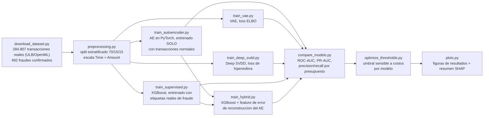

[ 🇺🇸 Read in English ](README.md) | [ 🇨🇱 Español ]

# 1. Título del Proyecto

## Autoencoder Profundo vs. XGBoost Supervisado para Detección de Fraude con Tarjetas de Crédito


Una respuesta cuantificada a una pregunta que todo equipo de fraude/LA
termina haciéndose: *¿cuánto estamos perdiendo por no tener todavía
etiquetas confirmadas?* Este proyecto entrena tres **arquitecturas no
supervisadas en PyTorch** — un **autoencoder estándar**, un **Variational
Autoencoder (VAE)** y **Deep SVDD** — usando **solo transacciones
legítimas** — el escenario realista del primer día, sin ningún fraude
confirmado del cual aprender — y compara las tres contra un **XGBoost
supervisado** entrenado con el mismo dataset real y etiquetado una vez que
existen confirmaciones de fraude, más un **híbrido** que alimenta el score
de anomalía del autoencoder a XGBoost como feature adicional. Los cinco se
evalúan sobre el mismo test set nunca visto, usando el dataset real y
ampliamente estudiado de **transacciones con tarjeta de crédito europeas de
ULB/Worldline** (284.807 transacciones, septiembre de 2013, 492 fraudes
confirmados). Un **optimizador de umbral sensible a costos** transforma
luego el score crudo de cada modelo en una decisión de alerta real,
minimizando la pérdida financiera esperada — los falsos positivos cuestan
una tarifa fija de revisión, los falsos negativos cuestan el monto real en
dólares del fraude no detectado — en vez de un corte por percentil
arbitrario.

> Este es un proyecto complementario y contrastante a
> [chile-aml-anomaly-detection-engine](https://github.com/Rxyxs/chile-aml-anomaly-detection-engine):
> ese proyecto usa un grafo sintético donde las etiquetas confirmadas nunca
> existen por diseño; este usa un dataset real y etiquetado
> específicamente para medir *qué tan grande es realmente la brecha* entre
> detectar anomalías a ciegas y detectarlas una vez que hay verdad
> terreno disponible.

---

# 2. Motivación

Todo sistema de detección de fraude vive en algún punto de una curva de
madurez. El primer día, una institución tiene datos transaccionales pero
ninguna etiqueta de fraude confirmada — los contracargos y confirmaciones
tardan semanas en llegar, y todavía no se puede entrenar ningún modelo
supervisado. Meses después, una vez que suficientes disputas se resuelven,
se acumulan etiquetas reales y un modelo supervisado se vuelve posible. La
mayoría de los análisis públicos eligen un lado de esta curva y reportan un
solo número; este proyecto **mide la transición** entrenando ambos tipos de
modelo sobre los mismos datos reales y el mismo test set reservado:

1. **Arranque en frío (sin etiquetas)** — un autoencoder profundo aprende
   la geometría de las transacciones *normales* únicamente. Una
   transacción se marca cuando el modelo falla en reconstruirla bien,
   bajo el supuesto de que el fraude es estructuralmente distinto del
   comportamiento normal al punto de que esa reconstrucción se rompe.
2. **Sistema maduro (existen etiquetas confirmadas)** — un clasificador
   XGBoost entrenado directamente con las etiquetas reales de fraude, con
   `scale_pos_weight` manejando el desbalance extremo de 0.172% en vez de
   sobremuestreo sintético.
3. **Híbrido** — ¿ayuda alimentar el score de anomalía del autoencoder
   (que no usa etiquetas) al modelo XGBoost (que sí las usa) como una
   feature más, una vez que las etiquetas existen? Se prueba directamente,
   no se asume.

El dataset en sí es real, no simulado: transacciones de tarjetahabientes
europeos procesadas por Worldline y estudiadas por el Machine Learning
Group de la Université Libre de Bruxelles (ULB), publicado abiertamente
para investigación de detección de fraude, con `V1`–`V28` ya transformadas
via PCA por los autores originales específicamente para que ninguna
identidad de tarjetahabiente o dato crudo de comercio sea recuperable —
estadísticas transaccionales reales, anonimizadas por construcción, no
fabricadas.

## 2.1 Impacto de Negocio e Indicadores Clave (KPIs)

| Métrica | Resultado | Qué significa |
|---|---|---|
| Salto arranque en frío → sistema maduro (PR-AUC) | 0,242 → **0,834** (3,4x) | Cuantifica la brecha real de madurez que el ROC-AUC solo esconde (0,931 vs. 0,965 se ve "casi tan bueno") |
| Recall de XGBoost a presupuesto de 100 alertas | **85,1%** del fraude total del test set, 63% precisión | El recall se estanca en el presupuesto 100-200 -- revisar más alertas mayormente agrega falsos positivos |
| Recall del autoencoder al mismo presupuesto | 39,2% a 29% de precisión | El techo honesto solo-no-supervisado antes de que existan etiquetas |
| Resultado del híbrido (XGBoost + feature del AE) | PR-AUC 0,829 vs. 0,834 (levemente peor) | Reportado como resultado negativo a propósito -- XGBoost ya extrae lo que el número único del AE resume |
| Dataset real | 284.807 transacciones, 492 fraudes confirmados (0,172%) | ULB/Worldline, publicado abiertamente, anonimizado vía PCA por los autores originales |

---

# 3. Marco Teórico

## 3.1 Detección de anomalías basada en autoencoder

Un autoencoder se entrena para comprimir cada transacción a un cuello de
botella de baja dimensión y reconstruirla de vuelta, minimizando el error
cuadrático medio de reconstrucción **solo sobre transacciones normales**.
Una vez entrenado, aprendió la variedad ("manifold") del comportamiento
legítimo; una transacción cuyo error de reconstrucción es inusualmente alto
no encaja bien en esa variedad — ese es el score de anomalía, sin que el
modelo haya visto jamás un ejemplo de fraude durante el entrenamiento.

Arquitectura usada aquí: `30 → 24 → 16 → 8 (cuello de botella) → 16 → 24 →
30`, activaciones ReLU, loss MSE, optimizador Adam, early stopping sobre un
**set de validación de solo transacciones normales** (nunca sobre fraude,
lo cual filtraría informacion de la etiqueta a un modelo supuestamente no
supervisado).

## 3.2 Gradient boosting supervisado bajo desbalance extremo

XGBoost con `scale_pos_weight = n_normal / n_fraude` (≈578 en el split de
entrenamiento) repondera la clase minoritaria (fraude) directamente en la
funcion de perdida, evitando la distorsion distribucional que el
sobremuestreo sintetico (p.ej. SMOTE) puede introducir en un espacio donde
la clase minoritaria es tan rara y tan dispersa.

## 3.3 Evaluación bajo desbalance de clases extremo

Con el fraude en 0.172% de las transacciones, **el ROC-AUC es una métrica
engañosamente generosa** — un modelo puede marcar 0.95+ y seguir siendo casi
inútil operacionalmente, porque la tasa de falsos positivos que el ROC-AUC
tolera se traduce en una cantidad enorme de alertas falsas a esta
prevalencia. **PR-AUC (average precision)** y **precisión/recall a un
presupuesto de alertas fijo** (cuántas transacciones puede revisar
realmente un equipo de fraude por período) son las métricas que importan
aquí, y ambas se reportan en todo el proyecto.

## 3.4 SHAP para el modelo supervisado

`shap.TreeExplainer` sobre el XGBoost ajustado cuantifica, por transacción,
cuánto empujó cada una de las 30 features el score de fraude hacia arriba o
hacia abajo — lo más cercano a un rastro de auditoría que tiene un analista
de fraude cuando un conjunto de features anonimizado via PCA significa que
el "por qué" no puede responderse en términos de negocio (no hay una
"categoría de comercio" o "distancia del hogar" a la cual apuntar, solo
`V4`, `V14`, etc.).

## 3.5 Variational Autoencoder (VAE)

Un VAE (`src/models/vae.py`) reemplaza el vector latente único del
autoencoder estándar por una distribución Gaussiana sobre el espacio
latente: el encoder produce `(mu, logvar)`, y una muestra
`z = mu + sigma * eps` (`eps ~ N(0, I)`, el truco de reparametrización) se
decodifica de vuelta — manteniendo todo diferenciable de punta a punta. El
entrenamiento minimiza el ELBO negativo:

```
loss = MSE_reconstruccion + kld_weight * KL( N(mu, sigma^2) || N(0, I) )
```

El término KL regulariza el espacio latente hacia una Gaussiana estándar:
el modelo no puede simplemente memorizar cada entrada en un código latente
arbitrario, tiene que "pagar" en divergencia KL por cada bit de información
codificado, lo que en la práctica produce un espacio latente más suave y
estructurado que el de un autoencoder simple — a costo de una
reconstrucción cruda algo peor. El score de anomalía usado aguas abajo es
el error de reconstrucción **determinista** (decodificando `mu`
directamente, sin muestrear), para que quede en las mismas unidades que el
score del autoencoder estándar y ambos sean directamente comparables.

## 3.6 Deep SVDD

Deep SVDD (Ruff et al., 2018; `src/models/deep_svdd.py`) prescinde por
completo de la reconstrucción. Es el análogo profundo de One-Class SVM /
Support Vector Data Description: una red `phi` se entrena para mapear las
transacciones normales a la hiperesfera más pequeña posible en el espacio
latente, centrada en un punto fijo `c`:

```
loss = promedio( || phi(x) - c ||^2 )
```

El score de anomalía es la distancia al cuadrado entre `phi(x)` y `c` —
una transacción que no se parece a los patrones normales vistos durante el
entrenamiento cae lejos del centro. Dos detalles de implementación
importan, ambos del paper original: las capas de la red **no llevan
términos de bias**, y el centro `c` **se fija antes de entrenar** (el
promedio de las salidas de la red sin entrenar sobre el set de
entrenamiento, con las dimensiones cercanas a cero desplazadas) en vez de
aprenderse — ambos existen específicamente para evitar el "colapso de la
hiperesfera", una solución trivial degenerada donde la red mapea toda
entrada a un punto constante y reporta loss cero sin haber aprendido nada.

## 3.7 Optimización de umbral sensible a costos

Cada modelo anterior produce un score continuo; convertir eso en una
decisión real de "marcar esta transacción" requiere un umbral, y los
umbrales por percentil calibrados en `train_*.py` (p95, p99, ...) son un
punto de partida razonable pero financieramente arbitrario.
`src/evaluation/cost_sensitive_threshold.py` reemplaza eso con un umbral
elegido para minimizar la pérdida financiera esperada, bajo una matriz de
costo explícitamente asimétrica:

- **Costo de un Falso Positivo**: no el monto de la transacción (el
  cliente no pierde nada), sino el costo *operativo* de investigar una
  alerta falsa — tiempo de analista, y fricción con el cliente si se
  bloquea la tarjeta. Modelado como una tarifa fija por alerta
  (`DEFAULT_COST_FALSE_POSITIVE`, USD 5).
- **Costo de un Falso Negativo**: el monto real en dólares de esa
  transacción fraudulenta específica no detectada (`Amount`) — no un
  promedio, el monto real, así que un fraude no detectado de $2.000 pesa
  mucho más que uno de $20 en la optimización, que es lo que "sensible a
  costos" debería significar realmente.

El umbral óptimo minimiza `costo_total = costo_FP + costo_FN`, barrido
sobre la distribución de scores observada como candidatos a umbral.

---

# 4. Explicación

## Arquitectura del pipeline



Además del pipeline central, `02_VAE_DeepSVDD_Cost_Optimization.ipynb`
compara las tres arquitecturas no supervisadas cara a cara y recorre en
detalle la optimización de umbral sensible a costos (ver §6).

## Responsabilidad de cada módulo

| Módulo | Responsabilidad |
|---|---|
| [`data/download_dataset.py`](data/download_dataset.py) | Descarga reproducible del dataset real desde OpenML (espejo de los datos ULB/Worldline), con verificacion de integridad por conteo de filas. |
| [`src/data/preprocessing.py`](src/data/preprocessing.py) | Split estratificado 70/15/15, escalado de `Time`/`Amount`, y el filtrado solo-normal que necesitan los modelos no supervisados. |
| [`src/models/autoencoder.py`](src/models/autoencoder.py) | La arquitectura `FraudAutoencoder` y la funcion de score por error de reconstruccion. |
| [`src/models/train_autoencoder.py`](src/models/train_autoencoder.py) | Entrena el autoencoder solo con datos normales, hace early-stopping sobre validacion solo-normal, calibra percentiles de umbral. |
| [`src/models/vae.py`](src/models/vae.py) | La arquitectura `FraudVAE`, el loss ELBO, y el score determinista de error de reconstruccion. |
| [`src/models/train_vae.py`](src/models/train_vae.py) | Entrena el VAE con el mismo protocolo solo-normal que el autoencoder estandar. |
| [`src/models/deep_svdd.py`](src/models/deep_svdd.py) | La arquitectura `DeepSVDDNet`, la inicializacion de centro fijo, y el score por distancia al centro. |
| [`src/models/train_deep_svdd.py`](src/models/train_deep_svdd.py) | Entrena Deep SVDD con el mismo protocolo solo-normal que los otros dos. |
| [`src/models/train_supervised.py`](src/models/train_supervised.py) | Entrena el XGBoost baseline con etiquetas reales y calcula importancia de features via SHAP. |
| [`src/models/train_hybrid.py`](src/models/train_hybrid.py) | Reentrena XGBoost agregando el error de reconstruccion del autoencoder como feature; reporta el delta honestamente en cualquier direccion. |
| [`src/evaluation/compare_models.py`](src/evaluation/compare_models.py) | Evalua los cinco modelos sobre el mismo test set: ROC-AUC, PR-AUC, precision/recall a presupuestos de alerta fijos. |
| [`src/evaluation/cost_sensitive_threshold.py`](src/evaluation/cost_sensitive_threshold.py) | La busqueda de umbral sensible a costos en si (§3.7): barre umbrales candidatos, minimiza la perdida financiera esperada. |
| [`src/evaluation/optimize_thresholds.py`](src/evaluation/optimize_thresholds.py) | Aplica el optimizador sensible a costos a los scores de test de cada modelo, usando montos reales de transaccion. |
| [`src/visualization/plots.py`](src/visualization/plots.py) | Genera cada figura de este README a partir del resultado real del pipeline. |
| [`src/pipeline.py`](src/pipeline.py) | Orquestador end-to-end de todo lo anterior. |

---

# 5. Metodología

- **Cero fuga de etiquetas hacia el modelo no supervisado, en ningún
  punto.** El set de entrenamiento, el de validación y la calibración de
  umbral del autoencoder usan exclusivamente transacciones con `Class ==
  0`. Los ejemplos de fraude se introducen por primera vez solo en el test
  set compartido, al momento de evaluar.
- **El mismo test set para los tres modelos.** El mismo split
  estratificado del 15% (42.722 transacciones, 74 fraudes confirmados) se
  usa para puntuar al autoencoder, a XGBoost y al modelo híbrido —
  verificado programáticamente (`compare_models.py` afirma que los tres
  arreglos de etiquetas del test set son idénticos antes de comparar
  scores).
- **PR-AUC y precisión/recall por presupuesto de alerta son las métricas
  principales, no el ROC-AUC**, por la razón en §3.3 — la tasa de fraude de
  0.172% de este dataset es exactamente el régimen donde el ROC-AUC y la
  utilidad operacional real divergen.
- **El experimento híbrido es una prueba real, no una conclusión
  predeterminada.** Alimentar el score del autoencoder a XGBoost
  genuinamente podía haber ayudado o perjudicado; la sección 7.5 reporta lo
  que realmente ocurrió, no lo que haría la narrativa más prolija.
- **VAE y Deep SVDD siguen exactamente el mismo protocolo sin fuga que el
  autoencoder estándar** — entrenamiento solo-normal, validación y early
  stopping solo-normal, evaluados por primera vez sobre el test set
  compartido — así que la comparación de tres vías en §7.7 aísla la
  elección de arquitectura, no una diferencia en qué tan justamente se
  evaluó cada uno.
- **El umbral sensible a costos usa montos reales de transacción, no una
  matriz de costo sintética.** `Amount` del dataset real es el costo de
  falso negativo para cada modelo en §7.8; el único parámetro asumido es el
  costo fijo de revisión por falso positivo (USD 5), declarado
  explícitamente en vez de escondido en una constante.

---

# 6. Desarrollo

## Instalación y configuración

```powershell
git clone https://github.com/Rxyxs/credit-fraud-autoencoder-detection-engine.git
cd credit-fraud-autoencoder-detection-engine
python -m venv .venv
.venv\Scripts\activate
pip install -r requirements.txt
```

## Pipeline completo (un solo comando)

```powershell
python -m src.pipeline
```

Descarga el dataset real si no está presente (~150 MB, una sola vez),
entrena el autoencoder, entrena XGBoost, corre el experimento híbrido,
compara los tres sobre el test set compartido, y genera todas las figuras.

## Etapas individuales (para depuración)

```powershell
python data/download_dataset.py
python -m src.models.train_autoencoder
python -m src.models.train_vae
python -m src.models.train_deep_svdd
python -m src.models.train_supervised
python -m src.models.train_hybrid
python -m src.evaluation.compare_models
python -m src.evaluation.optimize_thresholds
python -m src.visualization.plots
```

## Notebook: AE vs. VAE vs. Deep SVDD + optimización de costos

```powershell
jupyter nbconvert --to notebook --execute --inplace 02_VAE_DeepSVDD_Cost_Optimization.ipynb
```

Requiere que los tres modelos no supervisados y `optimize_thresholds.py`
ya hayan corrido (ver arriba); recorre en detalle la comparación de curvas
Precision-Recall de las tres vías y el barrido de umbral sensible a costos.

## Pruebas

```powershell
pytest -v
```

## Estructura del repositorio

```
credit-fraud-autoencoder-detection-engine/
├── data/
│   ├── download_dataset.py      # descarga reproducible desde OpenML (espejo ULB/Worldline)
│   └── raw/                     # creditcard.csv (real, ~150 MB, en .gitignore)
├── src/
│   ├── data/
│   │   └── preprocessing.py
│   ├── models/
│   │   ├── autoencoder.py / train_autoencoder.py
│   │   ├── vae.py / train_vae.py
│   │   ├── deep_svdd.py / train_deep_svdd.py
│   │   ├── train_supervised.py
│   │   └── train_hybrid.py
│   ├── evaluation/
│   │   ├── compare_models.py
│   │   ├── cost_sensitive_threshold.py
│   │   └── optimize_thresholds.py
│   ├── visualization/
│   │   └── plots.py
│   └── pipeline.py              # orquestador end-to-end
├── 02_VAE_DeepSVDD_Cost_Optimization.ipynb   # AE vs VAE vs Deep SVDD + optimizacion de costos
├── outputs/
│   ├── models/                  # autoencoder/vae/deep_svdd .pt, xgboost .joblib (generados)
│   ├── reports/                 # metricas json/csv/parquet, barridos de costo (generados)
│   └── figures/                 # figuras de resultados (png, versionadas)
├── tests/                       # 31 pruebas, pytest
├── requirements.txt
├── README.md
└── README.es.md
```

---

# 7. Resultados

Cada número y figura a continuación proviene de una corrida real de
`python -m src.pipeline` (semilla 42) sobre el dataset real — nada aquí es
estimado.

## 7.1 Dataset

| Métrica | Valor |
|---|---|
| Transacciones totales | 284.807 |
| Fraudes confirmados | 492 (0,172%) |
| Split train / val / test (estratificado) | 199.364 / 42.721 / 42.722 |
| Fraudes en el test set (nunca vistos por ningún modelo al ajustar) | 74 |

## 7.2 Comparación principal

| Modelo | ROC-AUC | PR-AUC |
|---|---:|---:|
| Autoencoder (no supervisado, cero etiquetas usadas) | 0,931 | 0,242 |
| **XGBoost (supervisado, etiquetas reales)** | **0,965** | **0,834** |
| Híbrido (XGBoost + feature del autoencoder) | 0,969 | 0,829 |


El ROC-AUC por sí solo sugeriría que el autoencoder es "casi tan bueno"
(0,931 vs. 0,965) — exactamente la lectura engañosa que advierte la §3.3.
El PR-AUC cuenta la historia real: **pasar de cero etiquetas a etiquetas
confirmadas reales es un salto de 3,4x en precisión promedio** (0,242 →
0,834).

## 7.3 Precisión/recall a un presupuesto de alerta realista

Un equipo de analistas solo puede revisar una cantidad fija de alertas por
período. Esto es lo que entrega realmente cada modelo a presupuestos
equivalentes sobre el mismo test set:

| Presupuesto de alerta | Autoencoder precisión / recall | XGBoost precisión / recall |
|---:|---:|---:|
| 20 | 0,350 / 0,095 | **1,000 / 0,270** |
| 50 | 0,380 / 0,257 | **0,960 / 0,649** |
| 100 | 0,290 / 0,392 | **0,630 / 0,851** |
| 200 | 0,190 / 0,514 | **0,315 / 0,851** |
| 500 | 0,102 / 0,689 | 0,128 / 0,865 |

Con un presupuesto de 100 transacciones revisadas por período, el modelo
supervisado captura el **85,1% de todo el fraude del test set** con 63% de
precisión; el modelo no supervisado, con el mismo presupuesto de revisión,
captura 39,2% con 29% de precisión. El recall de XGBoost **se estanca en
85,1% ya desde el presupuesto 100-200** — esencialmente todo el fraude
recuperable en este test set ya está expuesto para entonces, y revisar más
alertas mayormente suma falsos positivos.


## 7.4 Qué ve realmente el autoencoder


Las distribuciones de error de reconstrucción se traslapan fuertemente en
error bajo (la mayoría del fraude, como la mayoría de la actividad normal,
se reconstruye "bien") pero el fraude tiene una cola derecha
marcadamente más pesada — una señal real y utilizable, solo que mucho más
débil que la supervisión directa una vez que existen etiquetas.

## 7.5 ¿Ayuda el híbrido? — una prueba real, reportada con honestidad

Agregar el error de reconstrucción del autoencoder como feature extra de
XGBoost subió el ROC-AUC marginalmente (0,965 → 0,969) pero **bajó
levemente el PR-AUC** (0,834 → 0,829, Δ = −0,0047) — un empate técnico, no
una mejora. La explicación probable: XGBoost, con las 30 features PCA
crudas disponibles directamente, ya extrae cualquier señal que el único
número de error de reconstrucción del autoencoder resume; los dos enfoques
no son complementarios una vez que el modelo supervisado tiene acceso
completo a las features subyacentes. **Este resultado negativo se reporta
a propósito** — la alternativa habría sido descartar el experimento en
silencio porque no confirmó la historia que uno esperaría.

## 7.6 Qué explica las decisiones del modelo supervisado (SHAP)


`V4`, `V14`, `V12` y `V10` dominan el score de fraude, consistente con los
análisis públicos ya bien establecidos de este dataset — una verificación
de consistencia interna tranquilizadora de que el modelo aprendió una señal
genuina en vez de memorizar correlaciones incidentales específicas de esta
corrida.

## 7.7 Autoencoder estándar vs. VAE vs. Deep SVDD — mismo protocolo, distinta arquitectura

Los tres entrenados sobre el mismo split solo-normal, evaluados sobre el
mismo test set (detalle completo y curvas PR en
`02_VAE_DeepSVDD_Cost_Optimization.ipynb`):

| Modelo | ROC-AUC | PR-AUC |
|---|---:|---:|
| Autoencoder (estándar) | 0,931 | 0,242 |
| VAE | 0,947 | 0,515 |
| **Deep SVDD** | 0,946 | **0,743** |

Ninguno de los dos resultados se asumió de antemano. **El PR-AUC de Deep
SVDD (0,743) es aproximadamente 3x el del autoencoder estándar (0,242)** y
se acerca notablemente al 0,834 supervisado de XGBoost (§7.2) *sin ver
jamás una etiqueta de fraude* — abandonar por completo la reconstrucción y
concentrar las transacciones normales en una hiperesfera resulta separar
sustancialmente mejor el patrón de fraude de este dataset que aprender a
reconstruirlo. El VAE queda entre ambos: su regularización KL produce una
señal de anomalía más utilizable que el autoencoder simple (PR-AUC 0,515
vs. 0,242), consistente con lo esperado en §3.5 (un espacio latente más
suave y estructurado debería generalizar mejor a entradas atípicas), pero
sin igualar el objetivo más ajustado y libre de reconstrucción de Deep
SVDD.


## 7.8 Optimización de umbral sensible a costos — impacto financiero real

Usando la matriz de costo de §3.7 (USD 5 fijos por revisión de falso
positivo; costo de falso negativo = el monto real en dólares de ese fraude
no detectado) sobre el test set (74 fraudes confirmados, USD 8.483,36 de
monto total de fraude — el costo de **no usar ningún modelo**):

| Modelo | Umbral óptimo | Alertas | TP / FP / FN | Costo total (USD) | Reducción vs. sin modelo |
|---|---:|---:|---|---:|---:|
| Autoencoder (estándar) | 1,1716 | 286 | 47 / 239 / 27 | $5.731,99 | 32,4% |
| VAE | 2,4435 | 143 | 55 / 88 / 19 | $4.683,26 | 44,8% |
| Deep SVDD | 0,000103 | 143 | 58 / 85 / 16 | $4.808,88 | 43,3% |
| XGBoost (supervisado, referencia) | 0,2089 | 143 | 63 / 80 / 11 | $4.636,08 | **45,4%** |
| Híbrido (referencia) | 0,2290 | 143 | 63 / 80 / 11 | $4.636,08 | 45,4% |


El ranking por costo financiero refleja el ranking por PR-AUC — Deep SVDD
y el VAE quedan ambos dentro de un ~4-6% de la reducción de costo de
XGBoost, usando cero etiquetas de fraude, mientras el autoencoder estándar
queda claramente atrás de ambos. Un detalle que vale la pena nombrar con
honestidad: el presupuesto de alertas óptimo por costo cayó en
**exactamente 143 alertas** para cuatro de los cinco modelos (VAE, Deep
SVDD, XGBoost y el híbrido) — no fue diseñado así, es una consecuencia
emergente de optimizar la misma matriz de costo real contra la misma
distribución real de montos de fraude, entre modelos que rankean de forma
similarmente buena los fraudes más grandes.

---

# 8. Conclusión

- **La brecha entre "sin etiquetas" y "etiquetas confirmadas" es grande y
  ahora está cuantificada, no solo afirmada**: PR-AUC 0,242 → 0,834, un
  salto de 3,4x; a un presupuesto fijo de 100 alertas, la tasa de captura
  pasa de 39,2% a 85,1%.
- **El ROC-AUC habría escondido esta brecha** (0,931 vs. 0,965 parece una
  diferencia menor) — una ilustración directa, trabajada, de por qué el
  PR-AUC y la precisión/recall por presupuesto son las métricas que
  importan bajo desbalance de clases extremo, no una advertencia abstracta.
- **El autoencoder no supervisado no es inútil — es el punto de partida
  realista.** Todo sistema de fraude/LA empieza aquí, antes de que existan
  suficientes casos confirmados para entrenar algo supervisado; un PR-AUC
  de 0,242 con una tasa base de fraude de 0,172% es una señal genuina y
  utilizable (un ranking aleatorio puntuaría ≈0,0017), solo que mucho más
  débil que la supervisión.
- **Combinar ambos no ayudó una vez que existen etiquetas** (§7.5) — un
  resultado negativo legítimo, reportado tal cual se encontró: las features
  crudas ya contienen lo que el score resumen del autoencoder agregaría.
- **Este proyecto y
  [chile-aml-anomaly-detection-engine](https://github.com/Rxyxs/chile-aml-anomaly-detection-engine)
  son dos mitades honestas del mismo problema real**: ese proyecto muestra
  cómo se ve la detección no supervisada cuando las etiquetas *nunca*
  llegan (la realidad efectiva del LA); este muestra exactamente cuánto
  mejoran las cosas en el momento en que sí llegan.
- **El techo de PR-AUC de 0,242 del autoencoder estándar era una elección
  de modelado, no un límite duro para este conjunto de features**: Deep
  SVDD por sí solo eleva el PR-AUC no supervisado a 0,743 — aproximadamente
  3x — solo cambiando el objetivo de entrenamiento de reconstrucción a
  compacidad de hiperesfera, sin datos ni etiquetas adicionales (§7.7).
- **Un umbral por percentil arbitrario deja dinero real sobre la mesa.**
  Optimizar el umbral de alerta contra una matriz de costo financiero
  explícita (§3.7, §7.8) en vez de una regla genérica tipo "marcar el 1%
  superior" es lo que convierte la capacidad de ranking cruda de cada
  modelo en un punto de operación real y costeado — y los mejores modelos
  no supervisados (VAE, Deep SVDD) quedan a un solo dígito porcentual de la
  reducción de costo de XGBoost sin ninguna etiqueta de fraude confirmada.

## Trabajo futuro

- Seguir esta misma comparación en función de **cuántas etiquetas
  confirmadas hay disponibles** (10, 50, 344, todo el train) — la
  trayectoria realista que una institución efectivamente recorre, mes a
  mes, en vez de los dos extremos mostrados aquí.
- Servir el modelo supervisado detrás de un endpoint FastAPI con
  explicaciones SHAP por transacción adjuntas, siguiendo el mismo patrón de
  explicabilidad-como-servicio usado en
  [chile-credit-risk-scoring-engine](https://github.com/Rxyxs/chile-credit-risk-scoring-engine)
  — y exponer el optimizador de umbral sensible a costos junto a él, para
  poder recalibrar el punto de operación a medida que cambie la matriz de
  costo.
- Probar un ensamble de los tres scores no supervisados (AE, VAE, Deep
  SVDD) en vez de elegir un único ganador, y probar si ese ensamble cierra
  más de la brecha restante hacia XGBoost que cualquier arquitectura sola.
- Extender la matriz de costo más allá de una tarifa fija por falso
  positivo — ej. un costo que escale según cuántas alertas puede procesar
  realmente un equipo finito de analistas por turno, capturando efectos de
  cola que un costo estático por alerta no ve.

---

# 9. Fuente de datos y licencia

Datos transaccionales: transacciones reales y anonimizadas de
tarjetahabientes europeos (septiembre de 2013), recolectadas por Worldline
y el Machine Learning Group de la Université Libre de Bruxelles (ULB),
publicadas para investigación de detección de fraude. Accedidas vía el
[dataset OpenML #1597](https://www.openml.org/d/1597), un espejo del
dataset también distribuido en
[Kaggle](https://www.kaggle.com/datasets/mlg-ulb/creditcardfraud). Las
features `V1`–`V28` son componentes PCA publicados por los autores
originales específicamente para eliminar cualquier información que
identifique al tarjetahabiente; este proyecto no realiza ninguna
re-identificación ni agrega datos externos a ellas.

Código: MIT — ver [LICENSE](LICENSE).

# 10. Autor

**Pablo Reyes** — [github.com/Rxyxs](https://github.com/Rxyxs)
