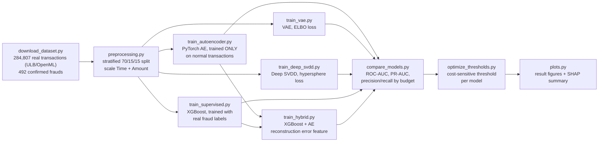
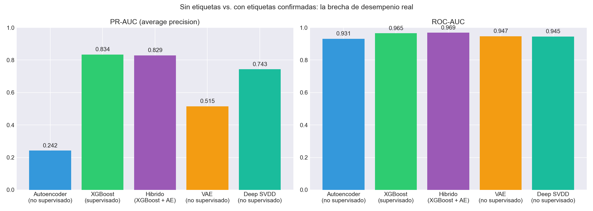
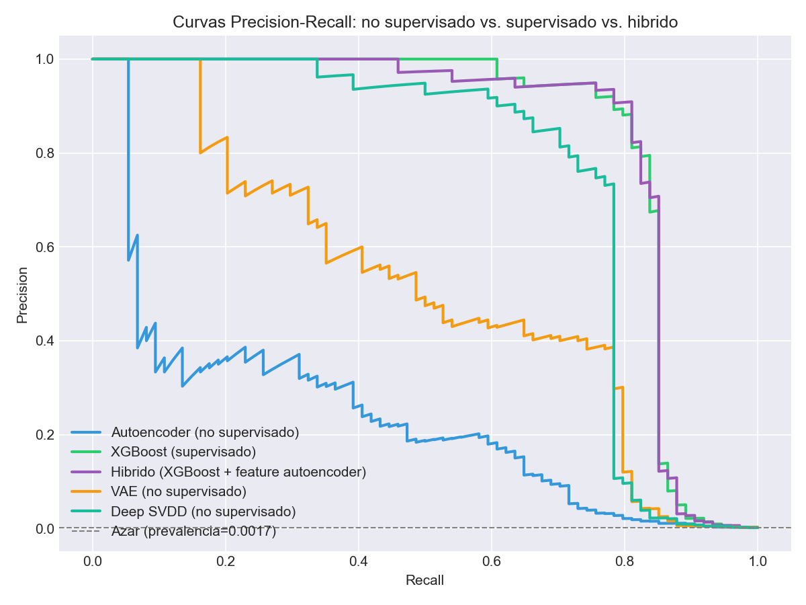
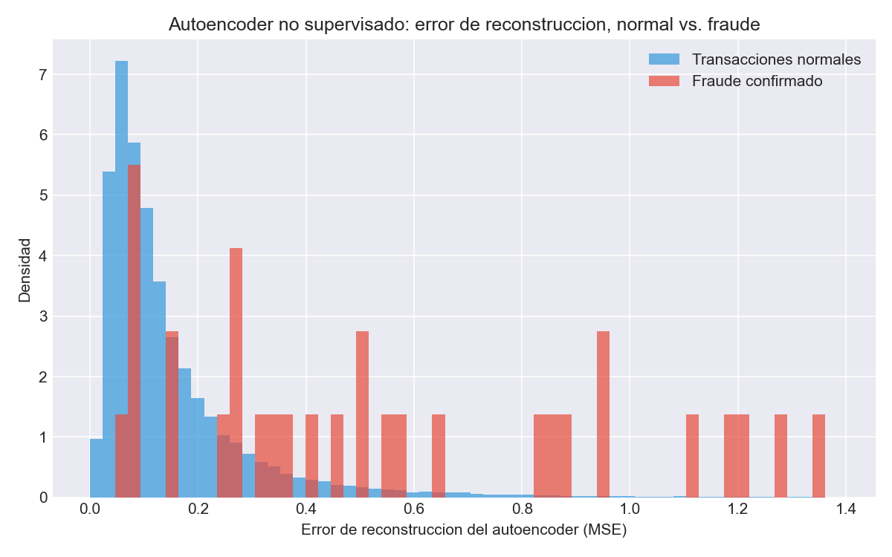
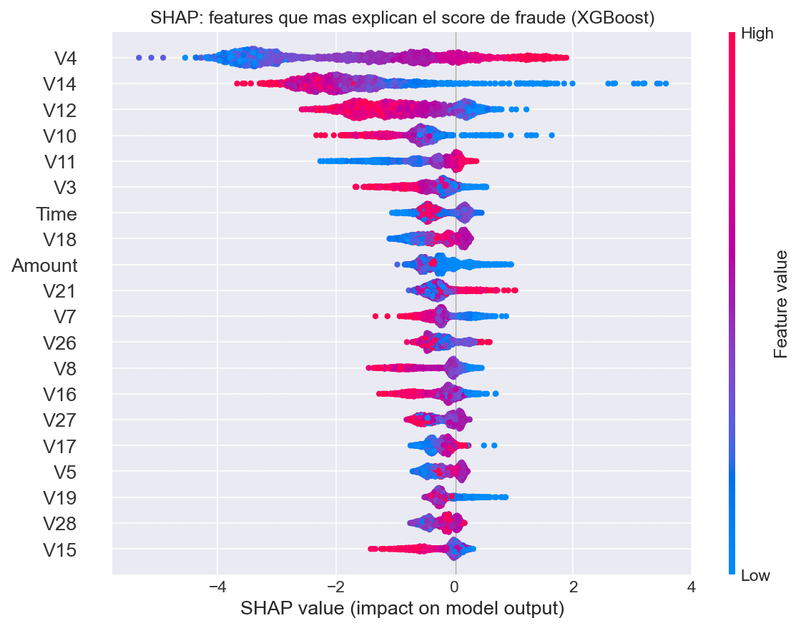
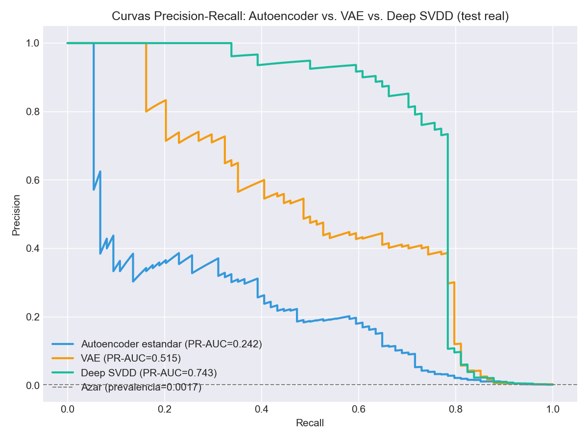
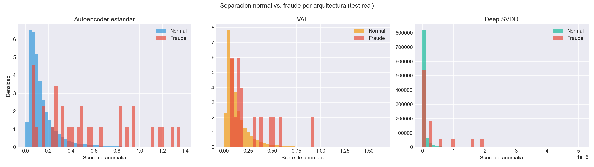
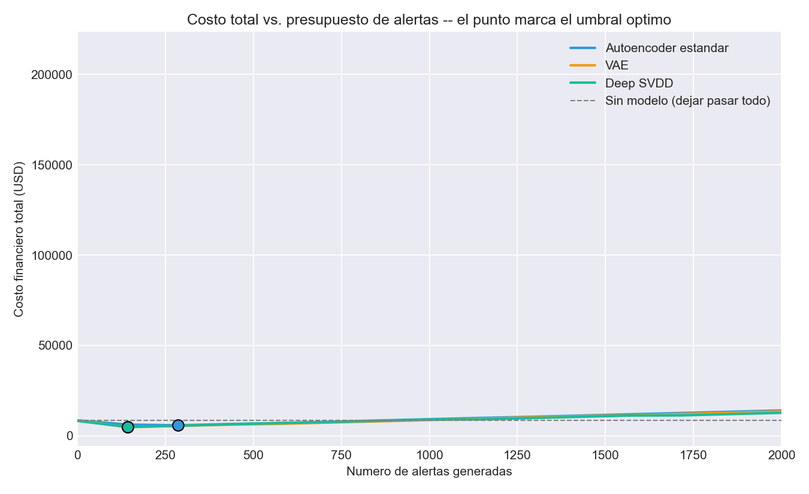

[ 🇺🇸 English ] | [ 🇨🇱 Leer en Español ](README.es.md)

# 1. Project Title

## Deep Autoencoder vs. Supervised XGBoost for Credit Card Fraud Detection


A quantified answer to a question every fraud/AML team eventually asks:
*"how much are we losing by not having confirmed labels yet?"* This project
trains three **unsupervised PyTorch architectures** — a standard
**autoencoder**, a **Variational Autoencoder (VAE)**, and **Deep SVDD** — on
**only legitimate transactions** — the realistic day-one scenario, with zero
confirmed fraud to learn from — and benchmarks all three against a
**supervised XGBoost** model trained on the same real, labeled dataset once
fraud confirmations exist, plus a **hybrid** that feeds the autoencoder's
anomaly score into XGBoost as an extra feature. All five are evaluated on
the identical held-out test set, using the real, widely-studied
**ULB/Worldline European credit card transactions dataset** (284,807
transactions, September 2013, 492 confirmed frauds). A **cost-sensitive
threshold optimizer** then turns each model's raw score into an actual
alerting decision by minimizing expected financial loss — false positives
cost a fixed review fee, false negatives cost the real dollar amount of the
missed fraud — rather than an arbitrary percentile cutoff.

> This is a companion, contrasting project to
> [chile-aml-anomaly-detection-engine](https://github.com/Rxyxs/chile-aml-anomaly-detection-engine):
> that project uses a synthetic graph where confirmed labels never exist by
> design; this one uses a real, labeled dataset specifically to measure
> *how large the gap actually is* between detecting anomalies blind and
> detecting them once ground truth is available.

---

# 2. Motivation

Every fraud detection system lives somewhere on a maturity curve. On day
one, an institution has transaction data but no confirmed fraud
labels — chargebacks and confirmations take weeks to arrive, and no
supervised model can be trained yet. Months later, once enough disputes
resolve, real labels accumulate and a supervised model becomes possible.
Most public write-ups pick one side of this curve and report a single
number; this project **measures the transition** by training both kinds of
model on the same real data and same held-out test set:

1. **Cold start (no labels)** — a deep autoencoder learns the geometry of
   *normal* transactions only. A transaction is flagged when the model
   fails to reconstruct it well, on the assumption that fraud looks
   structurally different enough from normal behavior for that
   reconstruction to break down.
2. **Mature system (confirmed labels exist)** — an XGBoost classifier
   trained directly on the real fraud labels, with `scale_pos_weight`
   handling the extreme 0.172% imbalance instead of synthetic oversampling.
3. **Hybrid** — does feeding the label-free autoencoder's anomaly score
   into the label-aware XGBoost model as one more feature help, once labels
   exist? Tested directly, not assumed.

The dataset itself is real, not simulated: transactions from European
cardholders processed by Worldline and studied by the Machine Learning
Group of Université Libre de Bruxelles (ULB), publicly released for fraud
detection research with `V1`–`V28` already PCA-transformed by the original
authors specifically so no cardholder identity or raw merchant data is
recoverable — real transactional statistics, anonymized by construction,
not fabricated.

## 2.1 Business Impact & Key Performance Indicators

| Metric | Result | What it means |
|---|---|---|
| Cold-start → mature system jump (PR-AUC) | 0.242 → **0.834** (3.4x) | Quantifies the real maturity gap ROC-AUC alone hides (0.931 vs. 0.965 looks "almost as good") |
| XGBoost recall at a 100-alert review budget | **85.1%** of all test-set fraud, 63% precision | Recall plateaus by budget 100-200 -- reviewing further alerts mostly adds false positives |
| Autoencoder recall at the same budget | 39.2% at 29% precision | The honest unsupervised-only ceiling before any labels exist |
| Hybrid (XGBoost + AE feature) result | PR-AUC 0.829 vs. 0.834 (slightly worse) | Reported as a negative result on purpose -- XGBoost already extracts what the AE's single number summarizes |
| Real dataset | 284,807 transactions, 492 confirmed frauds (0.172%) | ULB/Worldline, publicly released, PCA-anonymized by the original authors |

---

# 3. Theoretical Framework

## 3.1 Autoencoder-based anomaly detection

An autoencoder is trained to compress each transaction to a low-dimensional
bottleneck and reconstruct it back, minimizing mean squared reconstruction
error **on normal transactions only**. Once trained, it has learned the
manifold of legitimate behavior; a transaction whose reconstruction error
is unusually high doesn't fit that manifold well — the anomaly score, with
no fraud example ever shown to the model during training.

Architecture used here: `30 → 24 → 16 → 8 (bottleneck) → 16 → 24 → 30`,
ReLU activations, MSE loss, Adam optimizer, early stopping on a **validation
set of normal-only transactions** (never on fraud, which would leak label
information into a supposedly unsupervised model).

## 3.2 Supervised gradient boosting under extreme imbalance

XGBoost with `scale_pos_weight = n_normal / n_fraud` (≈578 in the training
split) reweights the minority (fraud) class in the loss function directly,
avoiding the distributional distortion synthetic oversampling (e.g. SMOTE)
can introduce in a space where the minority class is this rare and this
spread out.

## 3.3 Evaluation under extreme class imbalance

With fraud at 0.172% of transactions, **ROC-AUC is a misleadingly generous
metric** — a model can score 0.95+ while still being nearly useless
operationally, because the false-positive rate that ROC-AUC tolerates
translates into an enormous number of false alerts at this prevalence.
**PR-AUC (average precision)** and **precision/recall at a fixed alert
budget** (how many transactions a fraud team can actually review per day)
are the metrics that matter here, and both are reported throughout.

## 3.4 SHAP for the supervised model

`shap.TreeExplainer` on the fitted XGBoost model quantifies, per
transaction, how much each of the 30 features pushed the fraud score up or
down — the closest thing to an audit trail a fraud analyst gets when a PCA-
anonymized feature set means "why" can't be answered in business terms
(there's no "merchant category" or "distance from home" to point to, only
`V4`, `V14`, etc.).

## 3.5 Variational Autoencoder (VAE)

A VAE (`src/models/vae.py`) replaces the standard autoencoder's single
latent vector with a Gaussian distribution over the latent space: the
encoder outputs `(mu, logvar)`, and a sample `z = mu + sigma * eps`
(`eps ~ N(0, I)`, the reparameterization trick) is decoded back — kept
differentiable end to end. Training minimizes the negative ELBO:

```
loss = reconstruction_MSE + kld_weight * KL( N(mu, sigma^2) || N(0, I) )
```

The KL term regularizes the latent space toward a standard Gaussian: the
model can't simply memorize each input into an arbitrary latent code, it
has to "pay" in KL divergence for every bit of information encoded, which
in practice yields a smoother, more structured latent space than a plain
autoencoder — at the cost of a somewhat worse raw reconstruction. The
anomaly score used downstream is the **deterministic** reconstruction
error (decoding `mu` directly, without sampling), so it stays in the same
units as the standard autoencoder's score and the two remain directly
comparable.

## 3.6 Deep SVDD

Deep SVDD (Ruff et al., 2018; `src/models/deep_svdd.py`) drops
reconstruction entirely. It's the deep-learning analogue of One-Class SVM
/ Support Vector Data Description: a network `phi` is trained to map
normal transactions into the smallest possible hypersphere in latent
space, centered at a fixed point `c`:

```
loss = mean( || phi(x) - c ||^2 )
```

The anomaly score is the squared distance from `phi(x)` to `c` — a
transaction that doesn't resemble the normal patterns the network saw
during training lands far from the center. Two implementation details
matter, both from the original paper: the network's layers carry **no
bias terms**, and the center `c` is **fixed before training** (the mean of
the network's untrained outputs over the training set, with near-zero
dimensions nudged away from zero) rather than learned — both are there
specifically to prevent "hypersphere collapse," a degenerate trivial
solution where the network maps every input to a constant point and
reports zero loss without having learned anything.

## 3.7 Cost-sensitive threshold optimization

Every model above outputs a continuous score; turning that into an actual
"flag this transaction" decision requires a threshold, and the percentile
thresholds calibrated in `train_*.py` (p95, p99, ...) are a reasonable
starting point but financially arbitrary. `src/evaluation/cost_sensitive_threshold.py`
replaces that with a threshold chosen to minimize expected financial loss,
under an explicitly asymmetric cost matrix:

- **Cost of a False Positive**: not the transaction amount (the customer
  loses nothing), but the *operational* cost of investigating a false
  alarm — analyst time, and customer friction if the card gets blocked.
  Modeled as a fixed fee per alert (`DEFAULT_COST_FALSE_POSITIVE`, USD 5).
- **Cost of a False Negative**: the real dollar amount of that specific
  missed fraudulent transaction (`Amount`) — not an average, the actual
  amount, so a missed $2,000 fraud counts far more than a missed $20 one in
  the optimization, which is what "cost-sensitive" should actually mean.

The optimal threshold minimizes `total_cost = cost_FP + cost_FN`, swept
over the observed score distribution as candidate thresholds.

---

# 4. Explanation

## Pipeline architecture



Beyond the core pipeline, `02_VAE_DeepSVDD_Cost_Optimization.ipynb`
compares the three unsupervised architectures head to head and walks
through the cost-sensitive threshold optimization in detail (see §6).

## Module responsibilities

| Module | Responsibility |
|---|---|
| [`data/download_dataset.py`](data/download_dataset.py) | Reproducibly fetches the real dataset from OpenML (mirror of the ULB/Worldline data), with a row-count integrity check. |
| [`src/data/preprocessing.py`](src/data/preprocessing.py) | Stratified 70/15/15 split, `Time`/`Amount` scaling, and the normal-only filtering the unsupervised models need. |
| [`src/models/autoencoder.py`](src/models/autoencoder.py) | The `FraudAutoencoder` architecture and reconstruction-error scoring function. |
| [`src/models/train_autoencoder.py`](src/models/train_autoencoder.py) | Trains the autoencoder on normal-only data, early-stops on normal-only validation loss, calibrates threshold percentiles. |
| [`src/models/vae.py`](src/models/vae.py) | The `FraudVAE` architecture, ELBO loss, and deterministic reconstruction-error scoring. |
| [`src/models/train_vae.py`](src/models/train_vae.py) | Trains the VAE with the same normal-only protocol as the standard autoencoder. |
| [`src/models/deep_svdd.py`](src/models/deep_svdd.py) | The `DeepSVDDNet` architecture, fixed-center initialization, and distance-to-center scoring. |
| [`src/models/train_deep_svdd.py`](src/models/train_deep_svdd.py) | Trains Deep SVDD with the same normal-only protocol as the other two. |
| [`src/models/train_supervised.py`](src/models/train_supervised.py) | Trains the XGBoost baseline on real labels and computes SHAP feature importance. |
| [`src/models/train_hybrid.py`](src/models/train_hybrid.py) | Retrains XGBoost with the autoencoder's reconstruction error as an added feature; reports the delta honestly either way. |
| [`src/evaluation/compare_models.py`](src/evaluation/compare_models.py) | Evaluates all five models on the identical test set: ROC-AUC, PR-AUC, precision/recall at fixed alert budgets. |
| [`src/evaluation/cost_sensitive_threshold.py`](src/evaluation/cost_sensitive_threshold.py) | The cost-sensitive threshold search itself (§3.7): sweeps candidate thresholds, minimizes expected financial loss. |
| [`src/evaluation/optimize_thresholds.py`](src/evaluation/optimize_thresholds.py) | Applies the cost-sensitive optimizer to every model's test scores using real transaction amounts. |
| [`src/visualization/plots.py`](src/visualization/plots.py) | Renders every figure in this README from the real pipeline output. |
| [`src/pipeline.py`](src/pipeline.py) | End-to-end orchestrator for all of the above. |

---

# 5. Methodology

- **No label leakage into the unsupervised model, anywhere.** The
  autoencoder's training set, validation set, and threshold calibration all
  use exclusively `Class == 0` transactions. Fraud examples are introduced
  for the first time only in the shared test set, at evaluation.
- **Identical test set for all three models.** The same stratified 15% test
  split (42,722 transactions, 74 confirmed frauds) is used to score the
  autoencoder, XGBoost, and the hybrid model — verified programmatically
  (`compare_models.py` asserts the three test label arrays are identical
  before comparing scores).
- **PR-AUC and alert-budget precision/recall are the headline metrics, not
  ROC-AUC**, for the reason in §3.3 — this dataset's 0.172% fraud rate is
  exactly the regime where ROC-AUC and real-world operational usefulness
  diverge.
- **The hybrid experiment is a real test, not a foregone conclusion.**
  Feeding the autoencoder's score into XGBoost genuinely could have helped
  or hurt; §7.3 reports what actually happened, not what would make the
  narrative cleaner.
- **VAE and Deep SVDD follow the exact same no-leakage protocol as the
  standard autoencoder** — normal-only training, normal-only validation and
  early stopping, evaluated for the first time on the shared test set — so
  the three-way comparison in §7.7 isolates the architecture choice, not a
  difference in how fairly each was evaluated.
- **The cost-sensitive threshold uses real transaction amounts, not a
  synthetic cost matrix.** `Amount` from the actual dataset is the
  false-negative cost for every model in §7.8; the only assumed parameter
  is the fixed false-positive review cost (USD 5), stated explicitly rather
  than buried in a constant.

---

# 6. Development

## Installation and setup

```powershell
git clone https://github.com/Rxyxs/credit-fraud-autoencoder-detection-engine.git
cd credit-fraud-autoencoder-detection-engine
python -m venv .venv
.venv\Scripts\activate
pip install -r requirements.txt
```

## Full pipeline (one command)

```powershell
python -m src.pipeline
```

Downloads the real dataset if it isn't already present (~150 MB, one-time),
trains the autoencoder, trains XGBoost, runs the hybrid experiment,
compares all three on the shared test set, and renders every figure.

## Individual stages (for debugging)

```powershell
python data/download_dataset.py
python -m src.models.train_autoencoder
python -m src.models.train_vae
python -m src.models.train_deep_svdd
python -m src.models.train_supervised
python -m src.models.train_hybrid
python -m src.evaluation.compare_models
python -m src.evaluation.optimize_thresholds
python -m src.visualization.plots
```

## Notebook: AE vs. VAE vs. Deep SVDD + cost optimization

```powershell
jupyter nbconvert --to notebook --execute --inplace 02_VAE_DeepSVDD_Cost_Optimization.ipynb
```

Requires the three unsupervised models and `optimize_thresholds.py` to have
already run (see above); walks through the three-way PR-curve comparison
and the cost-sensitive threshold sweep in full detail.

## Tests

```powershell
pytest -v
```

## Project structure

```
credit-fraud-autoencoder-detection-engine/
├── data/
│   ├── download_dataset.py      # reproducible fetch from OpenML (ULB/Worldline mirror)
│   └── raw/                     # creditcard.csv (real, ~150 MB, gitignored)
├── src/
│   ├── data/
│   │   └── preprocessing.py
│   ├── models/
│   │   ├── autoencoder.py / train_autoencoder.py
│   │   ├── vae.py / train_vae.py
│   │   ├── deep_svdd.py / train_deep_svdd.py
│   │   ├── train_supervised.py
│   │   └── train_hybrid.py
│   ├── evaluation/
│   │   ├── compare_models.py
│   │   ├── cost_sensitive_threshold.py
│   │   └── optimize_thresholds.py
│   ├── visualization/
│   │   └── plots.py
│   └── pipeline.py              # end-to-end orchestrator
├── 02_VAE_DeepSVDD_Cost_Optimization.ipynb   # AE vs VAE vs Deep SVDD + cost optimization
├── outputs/
│   ├── models/                  # autoencoder/vae/deep_svdd .pt, xgboost .joblib (generated)
│   ├── reports/                 # metrics json/csv/parquet, cost sweeps (generated)
│   └── figures/                 # result figures (png, version-controlled)
├── tests/                       # 31 tests, pytest
├── requirements.txt
├── README.md
└── README.es.md
```

---

# 7. Results

Every number and figure below comes from an actual run of
`python -m src.pipeline` (seed 42) on the real dataset — nothing here is
estimated.

## 7.1 Dataset

| Metric | Value |
|---|---|
| Total transactions | 284,807 |
| Confirmed frauds | 492 (0.172%) |
| Train / Val / Test split (stratified) | 199,364 / 42,721 / 42,722 |
| Test set frauds (never seen by any model during fitting) | 74 |

## 7.2 Headline comparison

| Model | ROC-AUC | PR-AUC |
|---|---:|---:|
| Autoencoder (unsupervised, zero labels used) | 0.931 | 0.242 |
| **XGBoost (supervised, real labels)** | **0.965** | **0.834** |
| Hybrid (XGBoost + autoencoder feature) | 0.969 | 0.829 |



ROC-AUC alone would suggest the autoencoder is "almost as good" (0.931 vs.
0.965) — exactly the misleading read §3.3 warns about. PR-AUC tells the
real story: **going from zero labels to real confirmed labels is a 3.4x
jump in average precision** (0.242 → 0.834).

## 7.3 Precision/recall at a realistic alert budget

An analyst team can only review a fixed number of alerts per period. Here
is what each model actually delivers at matched budgets on the same test
set:

| Alert budget | Autoencoder precision / recall | XGBoost precision / recall |
|---:|---:|---:|
| 20 | 0.350 / 0.095 | **1.000 / 0.270** |
| 50 | 0.380 / 0.257 | **0.960 / 0.649** |
| 100 | 0.290 / 0.392 | **0.630 / 0.851** |
| 200 | 0.190 / 0.514 | **0.315 / 0.851** |
| 500 | 0.102 / 0.689 | 0.128 / 0.865 |

At a budget of 100 reviewed transactions per period, the supervised model
catches **85.1% of all fraud in the test set** at 63% precision; the
unsupervised model, with the same review budget, catches 39.2% at 29%
precision. Recall for XGBoost **plateaus at 85.1% already by budget 100–200**
— essentially all recoverable fraud in this test set is already surfaced
by then, and reviewing further alerts mostly adds false positives.



## 7.4 What the autoencoder actually sees



The reconstruction-error distributions overlap heavily at low error (most
fraud, like most normal activity, reconstructs "fine") but fraud has a
distinctly heavier right tail — a real, usable signal, just a much weaker
one than direct supervision once labels exist.

## 7.5 Does the hybrid help? — a real test, reported honestly

Adding the autoencoder's reconstruction error as an extra XGBoost feature
moved ROC-AUC up marginally (0.965 → 0.969) but **PR-AUC down slightly**
(0.834 → 0.829, Δ = −0.0047) — a wash, not an improvement. The likely
explanation: XGBoost, given the raw 30 PCA features directly, already
extracts whatever signal the autoencoder's single reconstruction-error
number summarizes; the two aren't complementary once the supervised model
has full access to the underlying features. **This is reported as a
negative result on purpose** — the alternative would have been to quietly
drop the experiment because it didn't confirm the hoped-for story.

## 7.6 What explains the supervised model's decisions (SHAP)



`V4`, `V14`, `V12`, and `V10` dominate the fraud score, consistent with
this dataset's well-established public analyses — a reassuring internal
consistency check that the model learned genuine signal rather than
memorizing incidental correlations specific to this run.

## 7.7 Standard AE vs. VAE vs. Deep SVDD — same protocol, different architecture

All three trained on the identical normal-only split, evaluated on the
identical test set (full detail and PR curves in
`02_VAE_DeepSVDD_Cost_Optimization.ipynb`):

| Model | ROC-AUC | PR-AUC |
|---|---:|---:|
| Autoencoder (standard) | 0.931 | 0.242 |
| VAE | 0.947 | 0.515 |
| **Deep SVDD** | 0.946 | **0.743** |

Neither result was assumed going in. **Deep SVDD's PR-AUC (0.743) is
roughly 3x the standard autoencoder's (0.242)** and approaches XGBoost's
supervised 0.834 (§7.2) *without ever seeing a fraud label* — dropping
reconstruction entirely and concentrating normal transactions into a
hypersphere turns out to separate this dataset's fraud pattern
substantially better than learning to reconstruct it. The VAE lands
between the two: its KL regularization produces a more usable anomaly
signal than the plain autoencoder (PR-AUC 0.515 vs. 0.242), consistent
with §3.5's expectation that a smoother, more structured latent space
should generalize better to atypical inputs, but without matching Deep
SVDD's tighter, reconstruction-free objective.





## 7.8 Cost-sensitive threshold optimization — real financial impact

Using the cost matrix from §3.7 (fixed USD 5 per false-positive review;
false-negative cost = the real dollar amount of that missed fraud) on the
test set (74 confirmed frauds, USD 8,483.36 total fraud amount — the cost
of using **no model at all**):

| Model | Optimal threshold | Alerts | TP / FP / FN | Total cost (USD) | Reduction vs. no model |
|---|---:|---:|---|---:|---:|
| Autoencoder (standard) | 1.1716 | 286 | 47 / 239 / 27 | $5,731.99 | 32.4% |
| VAE | 2.4435 | 143 | 55 / 88 / 19 | $4,683.26 | 44.8% |
| Deep SVDD | 0.000103 | 143 | 58 / 85 / 16 | $4,808.88 | 43.3% |
| XGBoost (supervised, reference) | 0.2089 | 143 | 63 / 80 / 11 | $4,636.08 | **45.4%** |
| Hybrid (reference) | 0.2290 | 143 | 63 / 80 / 11 | $4,636.08 | 45.4% |



The ranking by financial cost mirrors the ranking by PR-AUC — Deep SVDD
and the VAE both land within ~4-6% of XGBoost's cost reduction, using zero
fraud labels, while the standard autoencoder trails meaningfully behind
both. A detail worth naming honestly: the cost-optimal alert budget landed
at **exactly 143 alerts** for four of the five models (VAE, Deep SVDD,
XGBoost, and the hybrid) — not engineered, an emergent consequence of
optimizing the same real cost matrix against the same real fraud-amount
distribution across models that all rank the top frauds similarly well.

---

# 8. Conclusion

- **The gap between "no labels" and "confirmed labels" is large and now
  quantified, not just asserted**: PR-AUC 0.242 → 0.834, a 3.4x jump; at a
  fixed 100-alert review budget, catch rate goes from 39.2% to 85.1%.
- **ROC-AUC would have hidden this gap** (0.931 vs. 0.965 looks like a
  minor difference) — a direct, worked illustration of why PR-AUC and
  budget-based precision/recall are the metrics that matter under extreme
  class imbalance, not an abstract warning.
- **The unsupervised autoencoder is not useless — it's the realistic
  starting point.** Every fraud/AML system begins here, before enough
  confirmed cases exist to train anything supervised; PR-AUC 0.242 at
  0.172% base-rate fraud is a genuine, usable signal (a random ranking
  would score ≈0.0017), just a far weaker one than supervision.
- **Combining both did not help once labels exist** (§7.5) — a legitimate,
  reported-as-found negative result: the raw features already contain what
  the autoencoder's summary score would add.
- **This project and
  [chile-aml-anomaly-detection-engine](https://github.com/Rxyxs/chile-aml-anomaly-detection-engine)
  are two honest halves of the same real-world problem**: that project
  shows what unsupervised detection looks like when labels *never* arrive
  (the actual AML reality); this one shows exactly how much better things
  get the moment they do.
- **The 0.242 PR-AUC ceiling from the standard autoencoder was a modeling
  choice, not a hard limit for this feature set**: Deep SVDD alone lifts
  unsupervised PR-AUC to 0.743 — roughly 3x — just by changing the training
  objective from reconstruction to hypersphere compactness, with zero
  additional data or labels (§7.7).
- **An arbitrary percentile threshold leaves real money on the table.**
  Optimizing the alert threshold against an explicit financial cost matrix
  (§3.7, §7.8) rather than a generic "flag the top 1%" rule is what turns
  each model's raw ranking ability into an actual, costed operating point —
  and the best unsupervised models (VAE, Deep SVDD) get within single
  digits of XGBoost's cost reduction without any confirmed fraud label.

## Future work

- Track this same comparison as a function of **how many confirmed labels
  are available** (10, 50, 344, all of train) — the realistic trajectory an
  institution actually walks, month by month, rather than the two
  endpoints shown here.
- Serve the supervised model behind a FastAPI endpoint with per-transaction
  SHAP explanations attached, following the same explainability-as-a-
  service pattern used in
  [chile-credit-risk-scoring-engine](https://github.com/Rxyxs/chile-credit-risk-scoring-engine)
  — and expose the cost-sensitive threshold optimizer alongside it, so the
  operating point can be recalibrated as the cost matrix changes.
- Try an ensemble of the three unsupervised scores (AE, VAE, Deep SVDD)
  instead of picking a single winner, and test whether that ensemble closes
  more of the remaining gap to XGBoost than any one architecture alone.
- Extend the cost matrix beyond a flat false-positive fee — e.g. a cost
  that scales with how many alerts a finite analyst team can actually clear
  per shift, capturing queueing effects a static per-alert cost misses.

---

# 9. Data source & license

Transaction data: real, anonymized European cardholder transactions
(September 2013), collected by Worldline and the Machine Learning Group of
Université Libre de Bruxelles (ULB), released for fraud-detection research.
Accessed via [OpenML dataset #1597](https://www.openml.org/d/1597), a
mirror of the dataset also distributed on
[Kaggle](https://www.kaggle.com/datasets/mlg-ulb/creditcardfraud). Features
`V1`–`V28` are PCA components published by the original authors
specifically to remove any cardholder-identifying information; this
project performs no re-identification and adds no external data to them.

Code: MIT — see [LICENSE](LICENSE).

# 10. Author

**Pablo Reyes** — [github.com/Rxyxs](https://github.com/Rxyxs)
