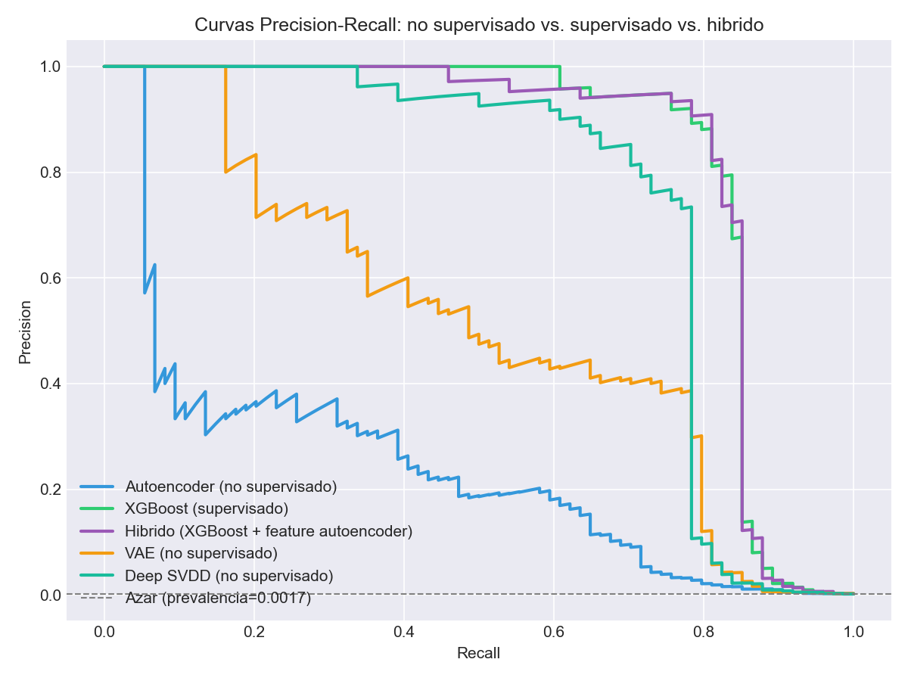
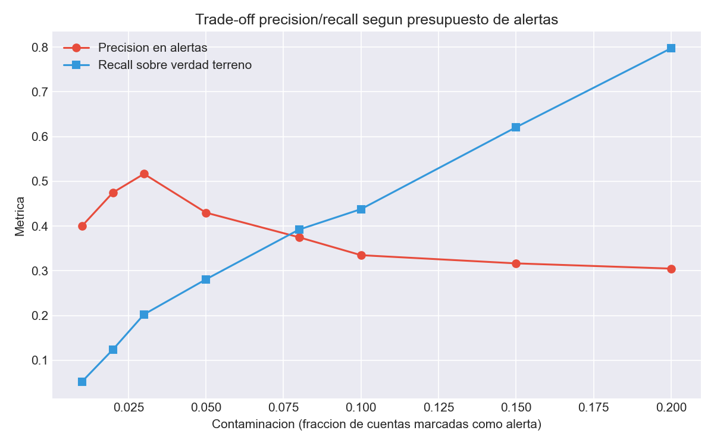
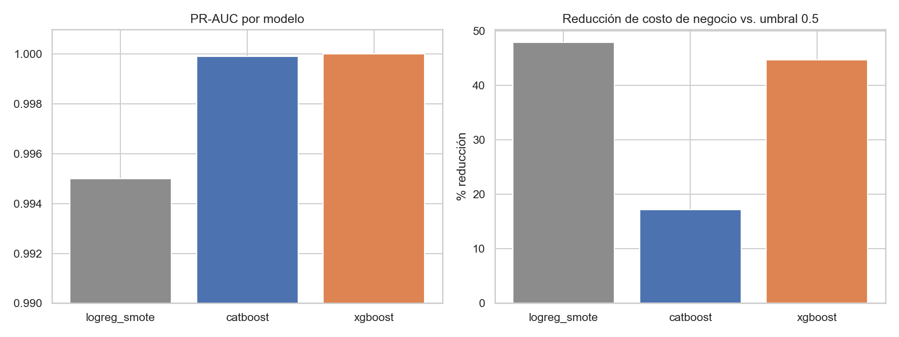

[ 🇺🇸 [Read in English](README.md) ] | [ 🇨🇱 Español ]

# Laboratorio de Técnicas de Detección de Fraude

[](https://github.com/Rxyxs/fraud-detection-techniques-lab/actions/workflows/tests.yml)


Cuatro enfoques de detección de fraude y AML en un solo laboratorio, cada uno aislando una técnica distinta sobre un perfil de datos distinto — fraude con tarjeta sobre datos reales, detección en tiempo real, tipologías AML interbancarias, y una comparación directa entre autoencoder y modelo supervisado. Cada carpeta es autocontenida, con su propio README, dependencias, tests y figuras.

---

## Qué encontró cada técnica

Todos los números de abajo provienen de una corrida real del pipeline de esa carpeta, no de una versión anterior ni de un benchmark citado.

| # | Técnica | Resultado principal | El hallazgo que vale la pena leer |
|---|---|---|---|
| **01** | [Pipeline multi-lenguaje sobre datos reales](01-credit-card-fraud-multilang) | Costo de negocio **260 → 180** tras ajustar con Optuna | El PR-AUC ya estaba saturado en 1.0000 y *bajó* (0.999988). **La mejora del ajuste apareció en el umbral calibrado por costo, no en la métrica de ranking** — reportado exactamente como ocurrió |
| **02** | [Detección en tiempo real](02-realtime-ecommerce-fraud) | Recall **0.955** con precisión **1.000** — 105/110 fraudes atrapados, **0 falsas alarmas**, puntuando en **1,59ms p95** | Un bug real de arquitectura: ReLU moribunda en un cuello de botella de 4 unidades — las preactivaciones negativas mataban de hambre a una red sin capacidad de sobra. LeakyReLU subió el recall de 0.900 a 0.955 (de 11 fraudes perdidos a 5) y el F1 de 0.947 a 0.977 |
| **03** | [AML no supervisado sobre grafo](03-graph-based-aml-detection) | ROC-AUC **0.893** con **cero etiquetas**, sobre 43.009 transferencias | La precisión alcanza su máximo con un presupuesto de alertas del **3% (51,7%), no del 1% (40,0%)** — la punta del ranking son unos pocos outliers extremos, y ampliar un poco encuentra más positivos reales |
| **04** | [Autoencoder contra supervisado](04-autoencoder-vs-supervised) | Arranque en frío → sistema maduro: PR-AUC **0.242 → 0.834 (3,4x)** | El ROC-AUC oculta eso por completo (0.931 contra 0.965 se lee como "casi igual de bueno"). El **híbrido resultó levemente peor** que XGBoost solo (0.829 contra 0.834) y se reporta como el resultado negativo que es |

### Datos

| Carpeta | Datos | Tamaño | Tasa de fraude |
|---|---|---|---|
| 01 | Reales — Credit Card Fraud 2023 (Kaggle) | 568.629 transacciones | balanceado por construcción |
| 02 | Sintéticos — e-commerce chileno / estilo Redcompra | generados por corrida | configurable |
| 03 | Sintéticos — red de transferencias interbancarias chilenas | 43.009 transferencias | sin etiquetar (tipologías UAF como verdad terreno) |
| 04 | Reales — tarjetas europeas ULB/Worldline | 284.807 transacciones | 492 fraudes (**0,172%**) |

---

## Evidencia

### Cuánto se pierde por no tener etiquetas



**Cómo leerla.** Cinco modelos sobre el mismo conjunto de prueba del dataset real ULB. La línea punteada de abajo es el azar (prevalencia 0,0017). Los tres modelos no supervisados vieron **cero etiquetas de fraude** durante el entrenamiento — el escenario realista del día uno.

La distancia vertical entre la curva azul (autoencoder simple) y la verde (XGBoost supervisado) es el costo de no tener todavía etiquetas confirmadas, y es grande: PR-AUC 0.242 contra 0.834. Vale notar además lo lejos que están los tres no supervisados entre sí: **Deep SVDD (turquesa) se mantiene a menos de ~0,1 de precisión del XGBoost supervisado en casi todo el rango**, el VAE (naranja) queda bastante por debajo, y el autoencoder simple (azul) es el peor por mucho. La elección del objetivo no supervisado pesa más que el hecho de ser no supervisado.

### Por qué la punta de la cola de alertas no es el mejor lugar para cortar



**Cómo leerla.** El eje x es la fracción de cuentas marcadas para revisión — la capacidad del equipo de analistas. En rojo la precisión sobre esas alertas, en azul el recall contra las tipologías UAF inyectadas.

La intuición dice que la precisión debería ser máxima en la punta del ranking y caer desde ahí. **No es así.** Sube de 0,400 con un presupuesto del 1% hasta un máximo de **0,517 en el 3%**, y recién ahí decae. Las cuentas mejor puntuadas son outliers extremos que no todos son lavado; ampliar un poco el presupuesto incorpora tipologías genuinas antes de que el ruido se imponga. Un equipo que solo revisara su 1% superior estaría operando del lado equivocado de ese máximo.

### Decisiones calibradas por costo, no un corte en 0,5



**Cómo leerla — incluida una trampa en el panel derecho.** A la izquierda, el PR-AUC de los tres modelos principales sobre un eje ampliado (0,990–1,000): están empatados en la práctica, lo que vuelve inútil la métrica de ranking para elegir entre ellos. A la derecha, el porcentaje en que la calibración del umbral redujo el costo de negocio respecto de la línea base *del propio modelo* en 0,5.

Leído de forma ingenua, el panel derecho dice que **LogReg + SMOTE es el mejor modelo** — 47,9% de reducción, por delante del 44,7% de XGBoost. Esa lectura es incorrecta, y la razón vale la pena interiorizarla: el porcentaje es relativo al punto de partida de cada modelo. En términos absolutos el costo calibrado de LogReg es **134.440** contra **260** de XGBoost — un factor de 517. Un modelo malo con una línea base pésima puede exhibir una "mejora" excelente.

La tabla absoluta está en [el README de la carpeta](01-credit-card-fraud-multilang/README.es.md): 134.440 para LogReg + SMOTE, 1.150 para el MLP, 770 para CatBoost, 260 para XGBoost, y **180** para el XGBoost ajustado con Optuna.

---

## El patrón que cruza las cuatro

Las cuatro técnicas se construyeron por separado, sobre datos distintos y para contextos operativos distintos. Convergen en la misma lección:

> **La métrica que se optimiza no es la métrica que decide.**

- En **01**, el PR-AUC se satura en 1.0000 y deja de distinguir entre modelos — mientras el umbral calibrado por costo los sigue separando por un factor de 700x.
- En **04**, el ROC-AUC dice que el autoencoder no supervisado es "casi tan bueno" como el XGBoost supervisado (0.931 contra 0.965). El PR-AUC dice que recupera menos de un tercio (0.242 contra 0.834). Los dos son correctos; solo uno sirve con una tasa de fraude del 0,172%.
- En **03**, el ranking es bueno (ROC-AUC 0.893) pero el punto de operación que maximiza la precisión no está donde nadie lo buscaría.
- En **02**, el umbral desplegado minimiza una función de costo explícita en pesos chilenos en vez de quedarse en 0,5 — y eso es lo que produce 0 falsas alarmas con recall 0,955.

Un segundo hilo que vale nombrar: **los resultados negativos se reportan como hallazgos.** El híbrido de 04 resultó levemente peor que XGBoost solo y se quedó. El MLP de 01 alcanza el mismo nivel de métricas que los árboles con gradiente pero a un costo de negocio mayor, y se quedó. En 03, las tipologías de anomalía puntual quedan recién en el 15,6–22,5% superior mientras las estructurales aparecen en el 2,5–3,5%, porque la agregación por cuenta diluye los outliers de una sola transacción — dicho de frente en vez de suavizado.

---

## Por qué un repo en vez de cuatro

Cada técnica es real, ejecutable y testeada de forma independiente — no se trata de esconder alcance sino de representarlo con precisión. Cuatro repos con descripciones superpuestas de "detección de fraude" se leen como repetición; un laboratorio con cuatro técnicas claramente diferenciadas (trabajo de sistemas multi-lenguaje, serving en tiempo real, AML no supervisado sobre grafos, y una comparación directa entre supervisado y no supervisado) se lee como lo que realmente es: un estudio sistemático del mismo problema desde ángulos distintos.

Trabajo relacionado en este perfil: [`paysim-anomaly-detection-benchmark`](https://github.com/Rxyxs/paysim-anomaly-detection-benchmark) lleva el ángulo no supervisado mucho más lejos — 16 familias de detectores comparadas sobre el mismo split, garantías de cobertura conformes, y una capa operativa que convierte scores en umbrales y en dinero. Su resultado de Deep SVDD reproduce de forma independiente lo que encuentra la carpeta 04 de acá.

## Cómo correr una técnica

Cada carpeta es autocontenida:

```bash
cd 0N-nombre-tecnica
python -m venv venv
venv/Scripts/pip install -r requirements.txt   # Windows
python <punto_de_entrada>.py
```

Ver el README de la carpeta para el punto de entrada exacto, la tabla completa de resultados de una corrida real, el diagrama de arquitectura y los hallazgos negativos.

## Autor

Pablo Reyes — [github.com/Rxyxs](https://github.com/Rxyxs)
Código: MIT — ver [LICENSE](LICENSE)
